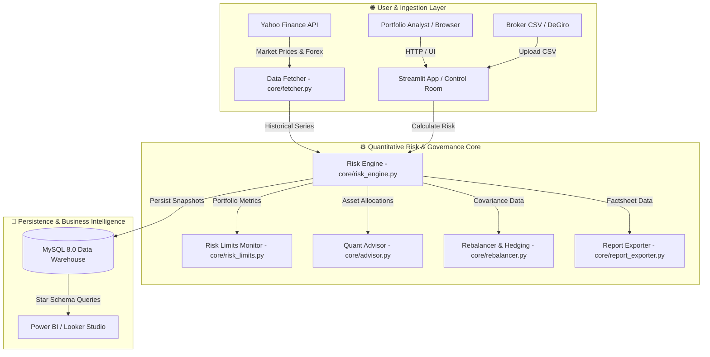

# ARGUS — Risk Analytics Platform


## 📌 Panoramica del Progetto
**ARGUS** (dalla figura mitologica dell'osservatore che vede tutto e non dorme mai) è una piattaforma di Business Intelligence e Risk Management con estetica high-tech e quantitativa, progettata per l'analisi avanzata e la protezione di portafogli finanziari multi-asset (Azioni, ETF, Obbligazioni, Criptovalute, Cash). 

Sviluppata come *Capstone Project* per un Master in Data Analytics, **ARGUS** trasforma uno storico transazioni grezzo (CSV generico o export dal broker DeGiro) in un framework quantitativo completo con supporto per la multi-valuta (EUR, USD, GBP, CHF), la storicizzazione su Data Warehouse MySQL, l'ottimizzazione matematicamente esatta di portafoglio (Markowitz & Ledoit-Wolf Shrinkage) e la simulazione stocastica predittiva (Monte Carlo, Stress Testing storico).

L'applicazione non fa uso di dati sintetici ma è testata e validata su dati reali di mercato, gestendo scenari edge come dividendi frazionati, cambi valuta storici, inserimenti Parziali di capitale e conversioni ISIN-Ticker automatiche.

---

## 🏛️ Caratteristiche Principali & Moduli Quantitativi

- **Executive Risk Cockpit & Centro Esportazione Report (`src/pages/1_📈_Dashboard_Generale.py`)**:
  - Badge esecutivi di salute del portafoglio ed Impronta di Rischio 360° (Radar Fattoriale).
  - **🚨 Controllo Limiti di Rischio & Early Warning (`core/risk_limits.py`)**: Monitoraggio automatico di 6 limiti di rischio istituzionali (Peso max singola posizione ≤ 20%, Concentrazione settoriale ≤ 35%, VaR 95% ≤ 3%, Beta ≤ 1.25, Diversification Ratio ≥ 1.20, HHI ≤ 0.25) con calcolo del tasso di conformità.
  - **🌍 Esposizione Geografica & Settoriale (Sunburst Chart)**: Grafico gerarchico multilivello *Paese ➔ Settore GICS ➔ Ticker* con mappa di colore dinamica PnL.
  - **Centro Esportazione Report & Dati (in fondo alla Dashboard)** per il download istantaneo con 1-click di **PDF Executive Factsheet (2 Pagine)**, **Excel Report Multi-Tab (.xlsx)** con schede separate per *Executive Summary*, *Posizioni Dettaglio*, *Rendimenti Storici* e *Stress Testing*, e dataset in **CSV per Power BI / Looker Studio**.

- **ARGUS Quant Advisor & Diagnostica Automatizzata (`core/advisor.py`)**:
  - **Health Score Quantitativo (0-100)** con scansione automatica di anomalie di concentrazione (HHI e Top 3 Asset), contributi al rischio di perdita extreme (Component VaR > 25%), multipli di valutazione elevati (P/E > 45x) e guadagno potenziale di Sharpe Ratio (+Δ Sharpe).

- **Simulatore di Copertura & Hedging Tattico (`core/hedging.py`)**:
  - **Beta-Neutral Hedging Calculator**: Calcola la quantità esatta di **ETF Inversi** (es. `SH` Short S&P 500, `PSQ` Short Nasdaq) o Micro-Futures per ridurre o azzerare la sensibilità del portafoglio ai crolli di mercato (β = 0.00) senza liquidare gli asset.
  - **Protezione Tail Risk (VaR 99%)**: Stima dell'assicurazione necessaria per scenari di panico estremo.

- **Attribuzione della Performance Brinson-Fachler (`core/attribution.py`)**:
  - Scomposizione analitica dell'extra-rendimento rispetto all'S&P 500 nei 3 fattori istituzionali: **Allocation Effect** (sovra/sotto-pesatura settoriale), **Selection Effect** (scelta dei singoli titoli) ed **Interaction Effect**.

- **Ottimizzazione Fiscale & Tax-Loss Harvesting (`core/tax_engine.py`)**:
  - Calcolo delle imposte stimate sulle plusvalenze realizzate (aliquota 26% su Azioni/ETF/Cripto e 12.5% agevolato su Titoli di Stato) e gestione dello Zainetto Fiscale delle minusvalenze.
  - Individuazione automatica delle posizioni in perdita latente da vendere prima della chiusura dell'anno fiscale per azzerare il debito d'imposta.

- **Pacchetto Esportazione Star Schema per Power BI (`scripts/export_star_schema.py`)**:
  - Generazione di tabelle dimensionali e fattuali in Star Schema (`dim_assets`, `fact_positions`, `fact_portfolio_summary`) pronte da trascinare in Microsoft Power BI o Google Looker Studio.

- **Scaletta Slide & Guida Difesa Orale Tesi (`docs/PRESENTATION_SLIDES.md`)**:
  - Traccia completa di 10 slide per la discussione orale di 15 minuti del Capstone Project con domande attese della commissione e risposte vincenti.

- **Smart Rebalancer Engine & Simulatore Ordini (`core/rebalancer.py`)**:
  - Calcolatore di ri-bilanciamento tattico per l'allineamento a strategie *Markowitz Max Sharpe*, *Min Volatility* o *Equal Weight (1/N)* con gestione cassa (+/- €) ed arrotondamento ad azioni intere.

- **Proiezione Dividendi & Stagionalità per Azienda (`core/dividend_engine.py`)**:
  - Calcolo del Dividend Yield medio di portafoglio, dividendi storici incassati e flusso passivo annuo con calendario mensile per azienda pagatrice.

- **Analisi Temporale Multi-Snapshot (`src/pages/7_📊_Analisi_Temporale.py`)**:
  - Tracciamento della serie storica multi-run su Plotly per Valore Portafoglio, PnL Cumulato, Sharpe/Sortino Ratios, VaR 95% e Max Drawdown con confronto side-by-side.

- **Contabilità Portafoglio & Motore FIFO (`core/risk_engine.py`)**:
  - Algoritmo a code FIFO (`_fifo_engine`) per la scomposizione esatta delle vendite parziali, calcolo del costo medio ponderato di carico (Cost Basis) e separazione tra PnL Realizzato e Non Realizzato.

- **Analisi Rischio di Mercato & Tail Risk**:
  - Volatilità annualizzata (√252), Skewness (Asimmetria) e Kurtosis (Curtosi / Fat Tails).
  - **Value at Risk (VaR)** a 3 metodologie: Storico, Parametrico (Gaussiano) e Cornish-Fisher.
  - **Conditional VaR (CVaR / Expected Shortfall)**: Misurazione della perdita media attesa oltre la soglia di VaR.
  - **VaR Backtesting & Kupiec POF Test**: Validazione su 252 giorni con classificazione a semafori dell'Accordo di Basilea (*Zona Verde*, *Zona Gialla*, *Zona Rossa*).
  - **Ulcer Index (UI) & Recovery Analysis**: Valutazione combinata della profondità e della durata dei drawdown.
  - **Style Analysis Fama-French (Modello a 3 Fattori)**: Regressione econometrica multivariata per scomporre l'Alpha in *Market Beta*, *Size SMB tilt* e *Value HML tilt*.

- **Stress Testing Storico e Custom (`src/pages/6_🌪️_Stress_Testing.py`)**:
  - **MSCI Barra Multi-Scenario Matrix**: Impatto atteso in € e % su 5 grandi crisi storiche (*Dot-Com 2000*, *Lehman Brothers 2008*, *US Credit Downgrade 2011*, *COVID-19 2020*, *Rate Shock 2022*).
  - **Custom What-If Beta Shock Simulator**: Simulatore di shock di mercato (da -50% a +30%) con diagramma Waterfall.

---

## 🏛️ Architettura di Runtime del Sistema

Il sistema **ARGUS** adotta un'architettura modulare a tre livelli (*Ingestion & UI*, *Quantitative Engine*, *Persistence & BI*) validata e mappata con tracciabilità end-to-end dai file sorgenti Python del repository.

### 🗺️ Mappa Architetturale Interattiva & Specifica IR
- 🌐 **[Visualizza il Diagramma Interattivo Live su GitHub Pages](https://alessandro-sal.github.io/argus-risk-analytics/)**: Mappa interattiva autotrattenuta generata con **Archify**, con navigazione guidata per capitoli (*User Interaction*, *Market Sync*, *Quant Risk Analysis*, *Persistence*), lenti semantiche, temi Dark/Light e collegamenti al codice sorgente.
- 📂 **[File HTML Standalone Locale](docs/argus-architecture.html)**: Versione autotrattenuta offline per il download.
- ⚙️ **[Specifica Architetturale JSON IR](docs/argus-architecture.json)**: Definizione di struttura validata secondo lo schema `architecture`.



---

## 📚 Documentazione di Progetto

Il repository contiene una documentazione tecnica completa all'interno della cartella [`docs/`](docs/):

1. 🌐 **[Mappa Architetturale Interattiva (HTML)](docs/argus-architecture.html)**: Mappa interattiva dell'architettura di sistema generata con Archify.
2. 🗺️ **[docs/FLOWCHART.md](docs/FLOWCHART.md)**: Architettura visiva del sistema e diagramma dei flussi dati ETL a 5 livelli.
3. 🤝 **[docs/PROJECT_HANDOFF.md](docs/PROJECT_HANDOFF.md)**: Documento di consegna del progetto, stato dei moduli e contesto decisionale per la commissione.
4. 📈 **[docs/metriche_rischio.md](docs/metriche_rischio.md)**: Manuale matematico ed econometrico dettagliato di tutte le metriche e dei moduli finanziari implementati.
5. 📐 **[docs/DESIGN.md](docs/DESIGN.md)**: Linee guida architetturali e design system della dashboard.
6. 📝 **[docs/CSV_Format_Specification.md](docs/CSV_Format_Specification.md)**: Specifica tecnica del formato CSV di input e supporto per l'adapter DeGiro.

---

## 📂 Struttura del Progetto

```text
CAPSTONE PROJECT/
├── src/                         # Codice sorgente dell'applicazione Streamlit
│   ├── 0_Control_Room.py        # Entry Point principale & Control Room
│   └── pages/                   # Moduli e viste (1..7) della dashboard
│       ├── 1_📈_Dashboard_Generale.py
│       ├── 2_🕸️_Correlazione_e_Cluster.py
│       ├── 3_🔬_Modelli_Quantitativi.py
│       ├── 4_📋_Posizioni_e_Dettagli.py
│       ├── 5_🏛️_Valutazione_Aziendale.py
│       ├── 6_🌪️_Stress_Testing.py
│       └── 7_📊_Analisi_Temporale.py
├── core/                        # Engine quantitativo, calcoli di rischio e moduli istituzionali
│   ├── advisor.py               # ARGUS Quant Advisor & Health Score Engine
│   ├── rebalancer.py            # Smart Rebalancer & Order Generator
│   ├── dividend_engine.py       # Dividend Forecast & Company Cash Flow Schedule
│   ├── report_exporter.py       # PDF Factsheet & Multi-Tab Excel Generator
│   ├── db_exporter.py           # Snapshot Exporter & History Data Layer
│   ├── risk_engine.py           # Contabilità FIFO e calcoli PnL/VaR
│   ├── fetcher.py               # Download dati storici e ticker mapping
│   └── ...
├── docker/                      # File di containerizzazione
├── docs/                        # Documentazione tecnica e manuali econometrici
├── tests/                       # Test suite automatizzata PyTest (31 test PASSED)
├── scripts/                     # Script di utilità e schema database SQL
├── app.py                       # Entry point alias per la dashboard
├── start_dashboard.bat          # Script d'avvio rapido per Windows (nella root)
├── pyproject.toml               # Configurazione tool (PyTest, Ruff)
├── requirements.txt             # Dipendenze Python
├── README.md                    # Documentazione del progetto
└── DESIGN.md                    # Linee guida architetturali e UI
```

---

## ⚙️ Requisiti di Sistema & Installazione

### Opzione A: Avvio Rapido con Docker Compose (Consigliato)
L'applicazione è completamente containerizzata (Streamlit App + Database MySQL 8.0). È sufficiente eseguire:

```bash
docker compose -f docker/docker-compose.yml up --build
```
L'applicazione web sarà accessibile su `http://localhost:8501`.

---

### Opzione B: Installazione Locale Native

1. **Prerequisiti**:
   - Python 3.11+
   - Server MySQL 8.0+ in esecuzione localmente (o cloud).

2. **Clona il repository**:
   ```bash
   git clone https://github.com/Alessandro-Sal/argus-risk-analytics.git
   cd argus-risk-analytics
   ```

3. **Crea un ambiente virtuale e installa le dipendenze**:
   ```bash
   python -m venv venv
   # Su Windows:
   .\venv\Scripts\activate
   # Su Linux/macOS:
   source venv/bin/activate

   pip install -r requirements.txt
   ```

4. **Avvia la Dashboard Streamlit**:
   Su Windows puoi fare doppio clic sul file `start_dashboard.bat` (nella root), oppure da terminale:
   ```bash
   streamlit run app.py
   ```

---

## 🧪 Esecuzione della Test Suite Automatizzata

Il progetto include 36 test automatizzati PyTest che coprono l'engine quantitativo, i contratti dati, la generazione di report PDF/Excel e uno smoke test della UI Streamlit:

```bash
pytest
```

---

## 📝 Formato CSV di Input
Il sistema accetta sia un formato CSV generico sia esportazioni dirette dal broker **DeGiro**:

- **Colonne Obbligatorie (CSV Generico)**: `tx_date`, `ticker`, `tx_type` (`buy`/`sell`/`dividend`), `quantity`, `price`, `currency`.
- **Colonne Opzionali**: `fees`, `asset_class`, `notes`.
- *(Per tutti i dettagli, consultare [docs/CSV_Format_Specification.md](docs/CSV_Format_Specification.md)).*

---

## 📄 Licenza

Questo progetto è distribuito sotto licenza open-source **MIT License**. Consulta il file [LICENSE.md](LICENSE.md) per i dettagli completi.

---

*Progetto Capstone sviluppato per il Master in Data Analytics.*
