# ARGUS - Risk Analytics Platform


-brightgreen)


---

## 📌 Panoramica del Progetto

**ARGUS** — il cui nome si ispira al mito dell'osservatore dai cento occhi che vede tutto e non dorme mai — è una piattaforma integrata di **Business Intelligence, Financial Valuation, Forensic Accounting, AI Narrative Intelligence e Quantitative Risk Management** potenziata con standard **Bloomberg Terminal Parity**. Progettata con un'interfaccia ad alta densità informativa di livello istituzionale, la soluzione offre un ecosistema avanzato per la diagnosi contabile, la profilazione del rischio e la protezione strategica di portafogli d'investimento multi-asset (*Equity, ETF, Fixed Income, Crypto e Cash*).

Sviluppata come soluzione di punta per l'analisi di Finanza Quantitativa, **ARGUS** converte registri di negoziazione eterogenei (file CSV generici, esportazioni native da broker quali **DeGiro**, **Directa SIM**, **Fineco Bank**, **Interactive Brokers / IBKR**, **Trade Republic**, **Scalable Capital**, **eToro**, **Revolut Trading** e sincronizzazioni live da **Google Sheets** con estrazione duale separata di *Stocks & Crypto*) in un framework analitico strutturato. La piattaforma integra:
* **⚡ Bloomberg Terminal Command Gateway & Mnemonic Parser**: Barra di comando istituzionale globale con sintassi a codici rapidi (`<TICKER> <MNEMONIC> <GO>`, es. `AAPL DES`, `MSFT FA`, `NVDA VOLS`, `PORT RISK`, `YCRV`, `BTP YAS`, `US10Y FI`, `CDS`, `STREAM`, `ATTR`, `TAX`, `EQS`, `BQUANT`, `LAUNCHPAD`, `XL`, `HP`), autocompletamento fuzzy, visual command feedback in tempo reale e navigazione rapida senza mouse.
* **🤖 Smart Order Routing & Algoritmi di Esecuzione TWAP / VWAP**: Motore istituzionale di order slicing intraday (09:00 - 17:30) per grandi blocchi ed ordini di ribilanciamento con profilazione della curva di liquidità a "U", **TWAP** uniforme con jitter stocastico anti-frontrunning, **VWAP** ponderato sui volumi con tetto di partecipazione (POV Cap al 15%), stima dello slippage atteso e calcolo del risparmio netto rispetto all'ordine a mercato immediato.
* **🧬 Asset Allocation con Reinforcement Learning (RL Policy Sandbox)**: Agente neurale Policy Gradient (REINFORCE con baseline mobile) formulato come Processo Decisionale di Markov (MDP) continuo nello spazio degli stati $\mathbb{R}^{3N}$ (rendimenti, volatilità di regime, momentum), addestrato a massimizzare il **Sortino Ratio** penalizzando i drawdown e l'attrito di turnover, con simulazione storica ad episodi e curve di equity comparate con benchmark 1/N.
* **🌐 Frontiera Efficiente Tri-Dimensionale & Iperspazio Quantitativo 3D**: Estensione volumetrica della frontiera di Markowitz con proiezione nello spazio 3D $(X = \text{Volatilità}, Y = \text{Rendimento}, Z = \text{Concentrazione HHI } / \text{ CVaR 95\% } / \text{ Sortino})$, alimentata da un algoritmo di campionamento **Multi-Alpha Dirichlet ($\alpha \in [0.05, 5.0]$) con Sparse Masking** per mappare con continuità l'intero volume geometrico dal baricentro ($1/N$) ai vertici di massima concentrazione ($HHI = 1.0$).
* **🏛️ Suite Fiscale Avanzata a 4 Pilastri (TUIR, Dichiarativo & Withholding)**:
  1. *Simulatore Riforma Fiscale 2026*: Armonizzazione tra *Redditi di Capitale* e *Redditi Diversi* per la compensazione al 100% delle minusvalenze con ETF e quantificazione del Tax Drag risparmiato.
  2. *Prospetto Precompilato Modello Redditi PF*: Compilazione automatica dei campi ministeriali per il Regime Dichiarativo con **Quadro RT (Sezione II, righi RT21-RT26, tributo 1100)** e **Quadro RW (Monitoraggio estero, Codice 21 crypto / Codice 1 titoli ed IVAFE 0,20% con franchigia < 12€)**.
  3. *Analizzatore Withholding Tax & Doppia Imposizione*: Tracciamento ritenute alla fonte estere (W-8BEN 15% USA, 26,375% Germania, 35% Svizzera), calcolo dell'aliquota effettiva reale ($37,10\%$ USA) e quantificazione del Tax Drag rispetto ad ETF UCITS ad accumulazione.
  4. *Simulatore Pre-Trade "Tax-Smart Lot Sizing"*: Previsione istantanea del PnL e dell'imposta generata dalla vendita mirata di specifici lotti d'acquisto secondo la disciplina ministeriale FIFO.
* **🐍 ARGUS BQuant Python Sandbox In-App (`BQUANT` / `PY`)**: Console Python interattiva in-app per eseguire script analitici direttamente in-memory sui DataFrame di sessione (`df_positions`, `df_returns`, `df_prices`, `results`), interrogazioni SQL ad alta velocità con motore DuckDB in-process, cattura automatica di stdout/stderr, tabelle `df_out` e figure Plotly interattive con 5 snippet quantitativi istituzionali preimpostati.
* **🎛️ ARGUS Launchpad & Institutional Role Workspaces (`LAUNCHPAD` / `WS`)**: Orchestratore di dashboard per 5 profili operativi istituzionali (*Trading Desk & Execution*, *Risk Officer & Compliance*, *Portfolio Manager & CIO*, *Quantitative Analyst & Data Scientist*, *Corporate Treasurer & Fixed Income*) con 1-Click Fast Teleportation verso i moduli primari, Live Role KPI Cockpit e persistenza del layout su database SQLite locale.
* **📊 Excel Live Connector & Bloomberg RTD Builder (`XL` / `EXCEL`)**: Costruttore visuale di formule Excel Bloomberg Parity (`=ARGUS_BDP`, `=ARGUS_BDH`, `=ARGUS_RISK`), generatore di moduli VBA Desktop (`.bas`), Microsoft Office Scripts TypeScript (`.ts`) per Excel 365/Web ed esportatore di cartelle di lavoro multi-foglio `.xlsx` (*Executive_Summary*, *Positions_Portfolio*, *Fixed_Income_YAS*, *Execution_Schedule*).
* **🔍 Formula Engine EQS & Screener Universale (`EQS`)**: Motore di valutazione AST logico-booleana per interrogazioni composte personalizzate dall'utente (es. `Piotroski >= 7 AND Altman > 2.9 AND ROIC > WACC * 1.5 AND Beta < 1.0`) con risoluzione elastica di oltre 35 alias finanziari.
* **🌊 Modello di Market Impact Almgren-Chriss & Execution Schedule**: Modellazione analitica dell'impatto permanente e temporaneo di liquidazione di ordini istituzionali in base all'Average Daily Volume (ADV), traiettoria ottima iperbolica $\sinh(\kappa(T-t))/\sinh(\kappa T)$, Half-Life di smobilizzo, piano di slicing a 10 scaglioni ed Execution VaR al 95%.
* **📊 Backtesting di Strategie Multi-Fattoriali a 5 Quintili**: Analisi di performance e rischio su panieri quantitativi ordinati (Q1..Q5), calcolo dello spread Long-Short ($Q1 - Q5$), Information Ratio e test di monotonicità di rango di Spearman ($r_s$) sui fattori Quality, Low-Beta, Momentum e Profitability.
* **📈 Fixed Income Istituzionale & Z-Spread (`YAS` / `FI`)**: Risolutore numerico per **Yield to Maturity (YTM)**, **Current Yield**, **Macaulay Duration**, **Modified Duration**, **Convexity esatta**, **DV01 / PVBP**, espansione di Taylor di 2° ordine ($\frac{\Delta P}{P} \approx -D_{\text{mod}} \Delta y + \frac{1}{2} C (\Delta y)^2$) e calibrazione dello **Z-Spread (Zero-Volatility Spread)** rispetto alla curva spot sovereign Nelson-Siegel-Svensson.
* **🛡️ Credit Default Swap (CDS) & Curva di Default Implicita**: Stima dell'Hazard Rate (intensità di default $\lambda = \frac{S_{\text{CDS}}}{1 - R}$) e term structure continua della probabilità cumulativa di default $PD(t) = 1 - e^{-\lambda \cdot t}$ su scadenze 6M, 1Y, 2Y, 3Y, 5Y, 7Y, 10Y, 15Y, 30Y.
* **⚡ Real-Time In-Memory Ring Buffer & Order Flow Engine (`STREAM`)**: Struttura dati circolare thread-safe con complessità temporale $O(1)$ per ingestione tick-by-tick ad alta frequenza, calcolo istantaneo di **VWAP intraday**, **Order Flow Imbalance (OFI)**, volatilità rolling e Level-2 Order Book Microprice (Stoikov 2018).
* **📉 Decomposizione Istituzionale del Rischio (Marginal VaR, Component VaR & LVaR)**: Decomposizione del Value at Risk con proprietà di Eulero ($\sum \text{CVaR}_i = \text{VaR}_p$), calcolo del Marginal VaR $(\partial \text{VaR}/\partial w_i)$, quantificazione del contributo percentuale di ogni posizione al rischio e stima del **Liquidity-Adjusted VaR (LVaR Bangia 1999)** con penalizzazione per orizzonti di smobilizzo e bid-ask spread.
* **📊 Attribuzione di Performance Multi-Periodo Carino (Zero-Residual) & Karnosky-Singer**: Algoritmo di raccordo logaritmico multi-periodale (Carino 1999) con garanzia matematica di **residuo zero** su orizzonti multi-anno ($\sum \text{Effetti} = R_p - R_b$) e scomposizione valutaria Karnosky-Singer per isolare l'impatto del mercato locale, dell'asset selection e del rischio di cambio.
* **🏛️ Modello Nelson-Siegel-Svensson (NSS a 6 Parametri) & Key Rate Durations (KRD)**: Modellazione continua della struttura a termine dei tassi sovrani con doppia gobba $(\beta_0, \beta_1, \beta_2, \beta_3, \tau_1, \tau_2)$, calcolo della sensitività triangolare dei flussi obbligazionari sui nodi chiave (6M, 1Y, 2Y, 5Y, 10Y, 30Y) e stima esatta della Duration Effettiva.
* **Motore Analitico Embedded DuckDB & Archiviazione Apache Parquet**: Database colonnare in-process vettorizzato (C++ SIMD) per eseguire aggregazioni OLAP complesse a latenza sub-millisecondo ($\mu s$/ms), **Cubi Multi-Dimensionali** (`Asset Class` $\times$ `Settore` $\times$ `Valuta`), window functions con `QUALIFY` e `DENSE_RANK()`, **Console SQL Interattiva** per query analitiche arbitrarie su tabelle in-memory ed esportazione con **compressione colonnare dell'85% in Apache Parquet**.
* **Local RAG & SEC Filing Vector Store con Reciprocal Rank Fusion (RRF)**: Motore di Retrieval-Augmented Generation e Vector Store semantico locale potenziato con **Reciprocal Rank Fusion (RRF)** tra matching lessicale BM25 e similarità vettoriale densa Cosine TF-IDF per interrogare con massima accuratezza le sezioni normative dei bilanci SEC (**Item 1**: *Business Overview & Moat*, **Item 1A**: *Risk Factors & Macro Threats*, **Item 7**: *MD&A & Operating Margins*, **Item 8**: *Debt Schedule & Financial Notes*), con evidenziazione delle fonti e citazioni testuali certificate.
* **Kenneth French Factor Library Live (Fama-French 5-Factor & Carhart Momentum)**: Connessione, ingestione e caching delle serie storiche ufficiali di Dartmouth College (*Mkt-RF, Size SMB, Value HML, Profitability RMW, Investment CMA, Momentum MOM/WML*), regressione multivariata OLS con stima di $\alpha$ annualizzato, statistica $t$, $p$-value al 95%, **Factor Return Attribution** per quantificare il contributo di ciascun driver al rendimento complessivo ed evoluzione dinamica delle esposizioni con **Rolling OLS a 60 giorni**, pienamente integrata con il motore generale di rischio.
* **Modulo Fiscale Cripto-Attività con Tassi FX Storici Dinamici (Legge 197/2022 & Circolare AdE 30/E/2023)**: Motore di calcolo fiscale dedicato alle valute virtuali e token con conversione dinamica sui cambi storici ufficiali, prospetto **Quadro RT (Sezione II-B)**, gestione automatica della franchigia annuale di 2.000€ su plusvalenze nette (Art. 67 c. 1 lett. c-sexies TUIR), imposta sostitutiva del 26%, **Zainetto Fiscale Cripto Separato** a 4 anni (non compensabile con azioni/obbligazioni), compilazione pre-dichiarativa del **Quadro RW (Codice 21)** e calcolo dell'**Imposta sul Valore delle Cripto-Attività / IVAFE (0,20% annuo)**.
* **Superficie di Volatilità Implicita 3D, Skew Calibration & Covered Call a Lotti Interi**: Risolutore numerico Newton-Raphson con fallback a Brent per l'inversione di Black-Scholes ($BS(S, K, T, r, \sigma_{\text{IV}}) = P_{\text{mkt}}$), calibrazione parametrica di Volatility Skew e Smile in funzione del log-moneyness $m = \ln(K / S)$ ($\sigma_{\text{IV}}(m) = a + b \cdot m + c \cdot m^2$), modellazione della superficie 3D $(K \times T \to \text{IV})$, dimensionamento realistico del costo di Delta-Hedging con opzioni Put e strategie Covered Call a **lotti eseguibili interi (100x)**.
* **Volatilità Condizionale GARCH(1,1) & Filtered Historical Simulation (FHS)**: Modellazione econometrica avanzata dei cluster di volatilità (Bollerslev 1986) con stima MLE dei parametri $\omega, \alpha, \beta$, persistenza, varianza di lungo periodo $V_L$ e Half-Life di riassorbimento degli shock. Calcolo di VaR e CVaR a code spesse tramite Filtered Historical Simulation (Hull-White 1998, Barone-Adesi 1999) con de-volatilizzazione dei residui empirici e proiezione della struttura a termine della volatilità a 30 giorni conforme agli standard Basel III / FRTB.
* **Multi-Broker Ingestion Hub & Auto-Detector a 8 Piattaforme**: Importazione automatica, riconoscimento istantaneo del formato senza configurazione manuale e normalizzazione da tutti i principali intermediari italiani ed internazionali (**Directa SIM**, **Fineco Bank**, **Interactive Brokers / IBKR**, **Trade Republic**, **Scalable Capital / Baader Bank**, **DeGiro**, **eToro**, **Revolut Trading**), con risolutore ISIN a 3 livelli (in-memory cache, `config.json` persistente e Yahoo Finance live lookup) e pulizia trasparente di formati numerici con virgola/punto e date internazionali.
* **Corporate Actions & Stock Split Engine**: Rilevazione automatica e manuale di frazionamenti azionari (*Forward Split*, es. NVDA 10:1, AAPL 4:1), raggruppamenti (*Reverse Split*) e dividendi in azioni con rettifica retroattiva dei lotti fiscali e contabili della coda FIFO, garantendo la rigorosa invarianza del valore fiscale totale ($Q \times P = \text{Cost Basis}$) secondo il TUIR Art. 67 e gli standard IFRS/US GAAP.
* **Modello Parametrico Nelson-Siegel & Curva Tassi Privi di Rischio Dinamica Multi-Valuta**: Modellazione term structure zero-coupon con stima parametrica continua di Nelson-Siegel a 4 parametri $(\beta_0, \beta_1, \beta_2, \tau)$, calcolo dei fattori di sconto continui $DF(t) = e^{-y(t) \cdot t}$ e calibrazione real-time del tasso risk-free ($R_f$) in base alla valuta base di portafoglio (**EUR** con BCE €STR via `XEON.DE`, **USD** con US 3M Treasury Bill via `^IRX`, **GBP** con BoE SONIA via `CSH2.L`, **CHF** con SNB SARON), con supporto ad override manuale e propagazione istantanea su Sharpe Ratio, Sortino Ratio, Jensen's Alpha, Treynor Ratio, Black-Scholes Delta-Hedging, Cost of Capital WACC e Kelly Position Sizing.
* **Infrastruttura Data Warehouse Duale & Total Wealth Hub**: Storicizzazione relazionale duale su MySQL 8.0 e SQLite locale (`data/argus_local.db`), gestione multi-valuta (EUR, USD, GBP, CHF) e **Total Wealth Hub Multi-Portafoglio** per salvare, confrontare e consolidare profili distinti (*Crescita, Dividendi, Previdenza, Crypto*) in un unico Master Portfolio unificato con fusione ponderata delle serie storiche dei rendimenti, stima esatta della durata solare (standard GIPS / CFA Institute) e decomposizione del rischio di componente.
* **Dual Google Sheets Pipeline (Stocks + Crypto)**: Connessione crittografata tramite Google Service Account con estrazione parallela e separazione nativa a livello di database dei fogli `History B/S Stocks` e `History B/S Crypto`, normalizzazione automatica dei tassi di cambio multi-valuta (EUR/USD/GBP) e mappatura dei ticker crypto (`BTC-EUR`, `ETH-EUR`, `SOL-EUR`, ecc.).
* **Database & Memory Storage Cockpit**: Monitoraggio in tempo reale dell'occupazione fisica dei database SQLite/MySQL, della memoria RAM (RSS) del processo, grafico Donut della ripartizione dello storage per tabella e file, e pulsanti di manutenzione 1-click (*VACUUM compattazione disco, pulizia cache scaduta TTL 24h, rigenerazione indici B-Tree e test PRAGMA integrity*).
* **Posizioni Chiuse & Graveyard Analytics**: Tracciamento contabile FIFO integrale delle operazioni chiuse con **Curva Cumulativa di PnL Realizzato (€)**, **High-Water Mark (Picco)**, telemetria di trade drawdown, **Trading Calendar & Heatmap Mensile** (matrice Mese $\times$ Anno) e scomposizione per settore GICS e asset class.
* **Fisco Italiano & Tax-Loss Harvesting Wizard (TUIR Art. 67)**: Modulo per la massimizzazione dell'efficienza fiscale con **Strategia Step-Up a 0€ imposte** (vendita e riacquisto immediato di titoli in utile su *Redditi Diversi* per azzerare le minusvalenze pregresse dello Zainetto Fiscale in scadenza quadriennale) e **Strategia Tax-Loss Harvesting** su posizioni in perdita latente.
* **Motore Quantitativo & Portfolio Engineering di Frontiera**: Risoluzione analitica della Frontiera Efficiente di Markowitz affiancata da stimatori *Ledoit-Wolf Shrinkage*, **Equal Risk Contribution (ERC / Parità di Rischio Pura)**, **Dipendenza di Coda Asimmetrica con Tail Copulas (Clayton & Gumbel)** per rilevare il rischio di crash congiunto non lineare, **Simulatore Interattivo Trade-Level Kelly Criterion & Half-Kelly Position Sizing** (pre-popolato con Win Rate e Payoff Ratio reali del Graveyard), **Live Rebalancing Sandbox** interattivo, allocazione mediante Machine Learning con **Hierarchical Risk Parity (HRP - Marcos López de Prado)**, copertura analitica con **Black-Scholes (1973)** con calcolo dei 5 Greci e Delta-Hedging con opzioni Put, generazione di rendimento passivo con *Covered Call Yield Enhancer*, modelli econometrici a 3 fattori di Fama-French (con regressione OLS multivariata), Carhart a 4 fattori, modello macro-fattoriale *MSCI Barra a 5 fattori ortogonalizzati*, simulazioni stocastiche *Merton Jump-Diffusion*, classificazione di regime macro con **Market Regime Switching (3-State Markov Model)**, rilevatore di anomalie di mercato via *Machine Learning Isolation Forest* e proiezioni stocastiche *Monte Carlo* (con decomposizione di Cholesky e distribuzioni *Student-t* a code grasse).
* **AI & LLM Narrative Intelligence (ARGUS AI Analyst & Copilot)**: Motore di sintesi narrativa automatica a due livelli (**LLM Online** con Google Gemini / OpenAI e **NLG Deterministico Offline 100%**) per generare Executive Memorandum istituzionali e rispondere in tempo reale a domande complesse sul portafoglio via chat interattiva.
* **Financial Statement & Forensic Accounting**: Suite completa per la valutazione della solvibilità e del valore intrinseco aziendale mediante modelli *Altman Z-Score*, decomposizione *DuPont a 5 fattori*, *Piotroski F-Score (9pt)*, **Contabilità Forense Beneish M-Score (1999)** a 8 indici econometrici per il rilevamento di frodi contabili e manipolazione degli utili, **Sloan Accrual Ratio (1996)** per la qualità dei flussi di cassa, stima del *WACC (CAPM)*, *DCF stocastico a due stadi* e classificatore *Random Forest Distress Risk*.
* **Interfaccia Istituzionale & Spotlight Command Palette (`Ctrl+K`)**: Modalità di esecuzione rapida, **Spotlight Command Palette** integrata per ricerca globale istantanea su tutti gli 11 moduli, oltre 35 sottomoduli, ticker e comandi di sistema, comparatore **Multi-Benchmark Overlay** fino a 4 indici contemporanei con scorecard di Alpha e Sharpe, e architettura *Zero-Recalc* con reattività istantanea.

---

## 🚀 Caratteristiche Chiave & Moduli Operativi (11 Moduli Operativi)

### 0. 🎛️ Control Room & Total Wealth Hub (`src/0_Control_Room.py`)
* **⚡ Motore Analitico Embedded DuckDB & SQL Sandbox**: Esecuzione in-process vettorizzata SIMD per aggregazioni OLAP sub-millisecondo, preset istituzionali 1-click (Cubi Multi-Dimensionali, Window Functions `QUALIFY`, Storico Volumi/Commissioni, Matrice FX), console SQL interattiva ed esportazione compressa in formato **Apache Parquet**.
* **Multi-Broker Ingestion Hub**: Ingestione universale con auto-rilevamento (**Auto-Detect**) per CSV Standard, DeGiro, Directa SIM, Fineco Bank, Interactive Brokers (IBKR), Trade Republic e Scalable Capital. Include modale con guida export passo-passo per ciascun broker.
* **Total Wealth Hub (Multi-Account)**: Salvataggio di profili di portafoglio distinti per strategia (*Growth*, *Dividendi*, *Previdenza*, *Crypto*), caricamento rapido 1-click (`📂 Carica`), scorecard comparativa affiancata e **Consolidamento automatico in Master Wealth Portfolio** con fusione ponderata delle serie storiche dei rendimenti su oltre 5.000 osservazioni giornaliere, calcolo esatto del CAGR ancorato alla durata temporale solare e ottimizzazione Markowitz Ledoit-Wolf integrata.
* **Dual Pipeline Google Sheets Live**: Ingestione simultanea e separata di `History B/S Stocks` e `History B/S Crypto`, conversione multi-valuta e creazione automatica dei portafogli dedicati con persistenza locale e su MySQL.
* **Database & Memory Storage Cockpit**: Dashboard diagnostica con 4 KPI superiori (*Stato Piattaforma*, *Storage Totale Disco*, *RAM Processo*, *Cache Shield*), grafico Donut Plotly di ripartizione dello storage per tabella e file, e pulsanti di manutenzione 1-click (*VACUUM & Compatta DB*, *Pulisci Cache Scaduta TTL > 24h*, *Rigenera Indici B-Tree*).
* **Selezione Database & Multi-Valuta**: Switch dinamico tra database (`investment_risk_bi` vs `wealth`), modalità Offline in-memory e selezione valuta base (EUR, USD, GBP, CHF).
* **Diagnostica di Sistema & Multi-Tier Caching**: Monitoraggio in tempo reale delle latenze dei 26 motori computazionali e dello scudo anti-rate limit della cache locale SQLite.

### 1. 📈 Dashboard Generale & AI Analyst (`src/pages/1_📈_Dashboard_Generale.py`)
* **🧠 ARGUS AI Analyst (Executive Memorandum)**: Diagnosi narrativa strutturata in 4 sezioni (*Sintesi Esecutiva*, *Profilo di Rischio*, *Regime Macro*, *Raccomandazioni Tattiche*) con architettura dual-engine (Gemini / OpenAI API / NLG Deterministico Offline).
* **💬 ARGUS Quant Copilot**: Chatbot interattivo integrato con chip di scelta rapida per interrogare l'AI su VaR, Sharpe, ribilanciamento e titoli in portafoglio.
* **Executive Cockpit & Badges Istituzionali**: Sintesi quantitativa immediata, Radar Factor a 6 assi, PnL cumulato e conformità regolamentare.
* **Dynamic Multi-Benchmark Overlay & Scorecard**: Confronto simultaneo del portafoglio contro fino a 4 benchmark personalizzati (SPY, QQQ, ACWI, AGG, GLD, BTC) con tabella analitica comparativa (CAGR, Volatilità, Sharpe, Max Drawdown, Alpha).
* **Centro Esportazione Report**: Download in-memory di Factsheet PDF a 2 pagine, Workbook Excel multi-tab, Report HTML Standalone e pacchetto Star Schema ZIP per Power BI.

### 2. 🔴 Analisi del Rischio & Rilevamento Anomalie (`src/pages/2_🔴_Analisi_Rischio.py`)
* **Decomposizione di Eulero VaR/CVaR**: Calcolo del Marginal VaR $(\partial \text{VaR}/\partial w_i)$ e Component VaR in € e % con proprietà additiva $\sum \text{CVaR}_i = \text{VaR}_p$.
* **Liquidity-Adjusted VaR (LVaR Bangia 1999)**: Integrazione del rischio di illiquidità di mercato e dello spread bid-ask monetario su orizzonti di disinvestimento forzato a 5 e 10 giorni.
* **Volatilità Condizionale GARCH(1,1) & FHS**: Calibrazione MLE per la varianza condizionale $\sigma_t^2 = \omega + \alpha \epsilon_{t-1}^2 + \beta \sigma_{t-1}^2$, bande dinamiche di VaR, stima della persistenza e Half-Life dello shock, curva di Term Structure a 30 giorni e simulazione storica filtrata (FHS).
* **Value at Risk (VaR) & Expected Shortfall (CVaR)**: Stima analitica della perdita massima (VaR) e della perdita media nello scenario peggiore (CVaR al 95% e 99%) nelle metodologie Storica, Parametrica, Cornish-Fisher e FHS.
* **Validazione Regolamentare VaR (Kupiec POF Backtest)**: Backtest su 252 giorni di negoziazione con classificazione a semaforo dell'Accordo di Basilea (*Verde/Giallo/Rosso*).
* **Market Regime Switching (3-State Markov Model)**: Identificazione statistica dello stato macroeconomico del mercato (Bull Low-Vol, Range-Bound, Crisis High-Vol) basato su volatilità e rendimenti rolling a 21 giorni.
* **Rilevatore di Anomalie ML Isolation Forest**: Algoritmo non supervisionato per identificare giornate di panico, rotture di correlazione (*Correlation Breakdown*) e code di rischio non lineari.
* **Correlazioni, Liquidità & ATR Chandelier**: Matrice di correlazione interattiva, analisi Average Daily Volume (ADV) e Stop-Loss dinamici Chandelier ($3 \times ATR_{14}$).

### 3. 🔬 Modelli Quantitativi di Frontiera & Live Sandbox (`src/pages/3_🔬_Modelli_Quantitativi.py`)
* **🤖 AI Reinforcement Learning Policy Sandbox**: Ottimizzazione dinamica dei pesi di portafoglio basata su Policy Gradient REINFORCE e MDP continuo nello spazio degli stati $\mathbb{R}^{3N}$, addestrata ad adattarsi ai cambi di regime di mercato massimizzando il Sortino Ratio con controllo del turnover.
* **🌐 Frontiera Efficiente 3D & Iperspazio Multi-Alpha Dirichlet**: Visualizzazione volumetrica interattiva 3D con selezione dinamica dell'asse $Z$ (*Concentrazione HHI*, *Tail Risk CVaR 95%*, *Sortino Ratio*), resa nitida e priva di collisioni visive con campionamento multi-concentrazione su simplesso e tooltip analitico hover.
* **🏛️ Fixed Income Istituzionale, Z-Spread & CDS Curve (`YAS` / `FI`)**: Risoluzione analitica di YTM, Macaulay Duration, Modified Duration, Convexity esatta, DV01/PVBP, Z-Spread rispetto alla curva sovereign Nelson-Siegel e term structure della probabilità di default da spread CDS.
* **📊 Attribuzione Multi-Periodo Carino (Zero-Residual) & Karnosky-Singer FX**: Algoritmo logaritmico multi-anno a residuo zero per l'attribuzione di Brinson-Fachler e scomposizione valutaria Karnosky-Singer per isolare l'impatto del mercato locale rispetto alle fluttuazioni dei cambi.
* **📊 Backtesting di Strategie Multi-Fattoriali a 5 Quintili**: Analisi di performance e rischio su panieri quantitativi ordinati (Q1..Q5), calcolo dello spread Long-Short ($Q1 - Q5$), Information Ratio e test di monotonicità di rango di Spearman ($r_s$) sui fattori Quality, Low-Beta, Momentum e Profitability.
* **🧬 Asymmetric Tail Copula Models (Clayton & Gumbel)**: Calcolo della dipendenza di coda inferiore ($\lambda_L$) e superiore ($\lambda_U$) per identificare il rischio di contagio e crollo simultaneo non lineare durante i panic selling di mercato.
* **🎯 Simulatore Interattivo Trade Sizing (Kelly Criterion)**: Calcolo matematico dell'allocazione ottima continua e discreta con raccomandazione *Half-Kelly ($f^*/2$)* per massimizzare la crescita geometrica azzerando il rischio di rovina.
* **⚖️ Equal Risk Contribution (ERC / Risk Parity Pura)**: Ottimizzazione non lineare SLSQP dove ciascun asset contribuisce esattamente per $1/N$ alla volatilità complessiva di portafoglio.
* **Live Rebalancing Sandbox (What-If Weight Matrix)**: Simulatore in tempo reale con slider e preset istituzionali (*⭐ Pesi Attuali*, *⚖️ Equipesato 1/N*, *🏆 Max Sharpe*, *🛡️ Minima Volatilità*, *🧬 Equal Risk ERC*).
* **Hierarchical Risk Parity (HRP - Marcos López de Prado 2016)**: Ottimizzazione del portafoglio basata su Machine Learning, Tree Clustering e Bisezione Ricorsiva.
* **Modello Analitico Black-Scholes (1973) & Superficie di Volatilità 3D**: Prezzatura di opzioni Call/Put europee, 5 Greci, Put Delta-Hedging, Covered Call Yield Enhancer e calibrazione dello Skew parametrico.
* **Simulatore Stocastico Merton Jump-Diffusion**: Modellizzazione con Moto Browniano Geometrico e shock di salto di Poisson ($N_t \sim \text{Poisson}(\lambda dt)$).
* **🧠 Modelli Fattoriali Kenneth French (Fama-French 5-Factor & Carhart Momentum)**: Regressione econometrica OLS multivariata su dataset ufficiali di Dartmouth con Factor Return Attribution e Rolling Factor Betas a 60 giorni.

### 4. 📋 Posizioni, Contabilità FIFO & Fiscalità TUIR (`src/pages/4_📋_Posizioni_e_Dettagli.py`)
* **🤖 Smart Order Routing TWAP & VWAP (Order Slicing Engine)**:
  - Generatore di schedule intraday per la minimizzazione dello slippage su ordini consistenti.
  - Curva a "U" di liquidità di mercato, TWAP con jitter stocastico, VWAP con Percentage of Volume (POV) Cap al 15% e quantificazione del risparmio monetario (€).
* **🏛️ Suite Fiscale Istituzionale a 4 Pilastri**:
  - **1. Cockpit Fiscale & Simulatore Riforma 2026**: Toggle interattivo tra regime TUIR asimmetrico e Riforma Fiscale unificata (compensazione al 100% delle minusvalenze con ETF), quantificazione del Tax Drag risparmiato, timeline delle minusvalenze a 4 anni (TUIR Art. 68 c. 5) e ordini di Step-Up a 0€ imposte con proxy correlati.
  - **2. Prospetto Precompilato Modello Redditi PF**: Calcolo dei righi ministeriali per chi opera in **Regime Dichiarativo** (IBKR, Degiro, Scalable, Revolut, Crypto):
    - *Quadro RT (Sez. II)*: Corrispettivi `RT21`, Costi FIFO `RT22`, Plusvalenza netta `RT23`, Minusvalenze dedotte `RT24`, Minus residue `RT25` e Imposta 26% `RT26` (Cod. F24 `1100`).
    - *Quadro RW*: Codici investimento (1 titoli esteri, 21 crypto), codici paese ISO, giorni e liquidazione IVAFE (0,20% con franchigia < 12€) con export CSV dedicato.
  - **3. Withholding Tax & Doppia Imposizione Dividendi Esteri**: Calcolo della ritenuta alla fonte estera (15% USA con W-8BEN, 26,375% DE, 35% CH) sommata al 26% italiano sul netto frontiera (**37,10% reale su titoli USA**) e quantificazione del Tax Drag rispetto ad ETF UCITS ad accumulazione.
  - **4. Tax-Smart Lot Sizing (Simulatore Pre-Trade FIFO)**: Previsione esatta dei lotti d'acquisto storici scaricati per vendite parziali, calcolo del PnL realizzato e stima dell'imposta prima dell'ordine a mercato.
* **🌊 Modello Almgren-Chriss & Traiettoria Ottima di Liquidazione**: Stima dei costi di impatto permanente e temporaneo sul mercato azionario, Half-Life di smobilizzo, slicing a 10 scaglioni ed Execution VaR al 95%.
* **Motore Contabile FIFO (`_fifo_engine`)**: Calcolo deterministico del Weighted Average Cost Price (WACP) e separazione analitica tra PnL realizzato e non realizzato.
* **🪦 Posizioni Chiuse & Graveyard Cockpit Multi-Prospettiva**:
  - *Curva Cumulativa PnL Realizzato (€)* con High-Water Mark di picco e telemetria di trade drawdown.
  - *Trading Calendar & Heatmap Mensile*: Matrice Mese $\times$ Anno con totale annuo e codice colore dinamico.
  - *Scomposizione Settori GICS & Asset Class*: Analisi aggregata del profitto monetario e del Win Rate per settore.
  - *Registro Lotti Chiusi FIFO Log*: Dettaglio cronologico di ciascuna operazione con holding period e prezzo di carico/scarico.
* **🪙 Fisco Cripto-Attività & Quadri RT / RW / IVAFE (L. 197/2022)**:
  - *Quadro RT (Sezione II-B)*: Calcolo plusvalenze/minusvalenze su criptovalute (Art. 67 c. 1 lett. c-sexies TUIR), franchigia annuale di 2.000€, applicazione dell'aliquota sostitutiva al 26% e gestione dello Zainetto Fiscale Cripto a 4 anni separato.
  - *Quadro RW (Codice 21)*: Prospetto per il monitoraggio fiscale delle consistenze estere o in self-custody (ledger, wallet privati, exchange esteri).
  - *Imposta sul Valore / IVAFE (0,20%)*: Calcolo automatico dell'imposta proporzionale sulle consistenze al 31/12.
* **Smart Rebalancer**: Generatore di ordini operativi ad azioni intere per allineare il portafoglio ai pesi target con gestione del buffer di liquidità.
* **Calendario & Previsione Flusso Dividendi**: Dividend Yield medio di portafoglio, storico reale e calendario mensile degli incassi stimati per azienda.

### 5. 🏛️ Analisi dei Bilanci, Valutazione & Contabilità Forense (`src/pages/5_🏛️_Valutazione_Aziendale.py`)
* **Beneish M-Score (1999)**: Modello econometrico a 8 indici (DSRI, GMI, AQI, SGI, DEPI, SGAI, LVGI, TATA) per rilevare manipolazioni contabili (soglia critica $M > -1.78$).
* **Sloan Accrual Ratio (1996)**: Analisi della qualità dell'utile netto rispetto ai flussi di cassa operativi reali per isolare gli utili artificiali.
* **Altman Z-Score Model (1968)**: Previsione del rischio di fallimento a 24 mesi (*Safe Z > 2.99*, *Grey 1.81–2.99*, *Distress Z < 1.81*).
* **Diagnostica Predittiva ML (Random Forest Distress Classifier)**: Classificatore ensemble sui ratio finanziari per stimare la probabilità di default.
* **Scomposizione DuPont (3 e 5 Fattori)** & **Piotroski F-Score (9pt Stanford)**.
* **Valutazione Intrinseca DCF Monte Carlo (2-Stage)** & **WACC CAPM**.
* **Local RAG & SEC Filing Vector Store (Form 10-K / 10-Q Q&A)**: Interrogazione semantica in linguaggio naturale sui bilanci e note integrative con chunking normativo (**Item 1**, **Item 1A**, **Item 7 MD&A**, **Item 8 Debt Notes**), retrieval BM25/Cosine a latenza zero e citazione verificata delle fonti ufficiali.
* **Consultazione Bilanci Ufficiali 10-K** & **Comparativa Multiaziendale** con grafici Radar e multipli di settore.

### 6. 🌪️ Stress Testing & Scenari di Crisi (`src/pages/6_🌪️_Stress_Testing.py`)
* **MSCI Barra Multi-Scenario Matrix**: Stima delle perdite in € e % simulando i 5 grandi shock storici (*Dot-Com 2000*, *Lehman 2008*, *US Downgrade 2011*, *COVID-19*, *Rate Shock 2022*).
* **Beta Shock Waterfall & Macro Scenario Builder**: Simulazione interattiva su shock tassi ($\Delta r$), cambi ($\Delta\text{FX}$), materie prime ($\Delta\text{Commodity}$) ed equity.
* **Superficie 3D di Rischio (Plotly Surface)**: Mappatura tridimensionale interattiva dell'impatto combinato di shock congiunti.

### 7. 📊 Analisi Temporale & Storicizzazione Multi-Snapshot (`src/pages/7_📊_Analisi_Temporale.py`)
* **Time Series Multi-Snapshot**: Evoluzione temporale del controvalore di portafoglio, del capitale investito e delle metriche di rischio tra snapshot storici.
* **Matrice dei Delta ($\Delta$)**: Confronto analitico affiancato tra due punti temporali qualsiasi con calcolo del tasso di risparmio e apporti di liquidità.

### 8. 📈 Analisi Tecnica Quantitativa & Volume Profile (`src/pages/8_📈_Analisi_Tecnica.py`)
* **⚡ Real-Time Streaming Ring Buffer & Order Flow Imbalance (OFI)**: Ingestione tick-by-tick ad alta frequenza, VWAP dinamico, Order Flow Imbalance e Level-2 Microprice (Stoikov 2018).
* **Indicatori Algoritmici**: Medie Mobili (EMA 20, EMA 50, SMA 200 con Golden/Death Cross), MACD, RSI 14, Bande di Bollinger con **Bollinger Squeeze Detection**, ATR 14 e ADX 14.
* **Volume Profile (POC, VAH, VAL)**: Distribuzione orizzontale dei volumi sul grafico con evidenziazione del Point of Control (POC) e della Value Area (70% del volume totale).
* **Candlestick Pattern Recognition**: Rilevamento automatico di pattern (*Bullish/Bearish Engulfing*, *Hammer*, *Shooting Star*, *Doji*).
* **Technical Confluence Score Card (0-100)**: Score ponderato su 5 driver tecnici con verdetto tattico (*Strong Buy* $\rightarrow$ *Strong Sell*) e allineamento trend multi-timeframe (1D vs 1W).

### 9. 🔍 Screener Quantitativo & Pre-Trade Simulator (`src/pages/9_🔍_Screener_Opportunita.py`)
* **⚡ Formula Engine EQS (Custom Query Builder)**: Parsing ed esecuzione vettorizzata di espressioni logiche personalizzate dall'utente con oltre 35 alias finanziari supportati.
* **Asset Discovery Multi-Fattoriale**: Esplorazione quantitativa di universi globali (*US Mega Caps S&P 100*, *EuroStoxx 50*, *FTSE MIB Leaders*, *Dividend Aristocrats*, *Disruptive Tech*, *Custom*) su Valutazione, Qualità Contabile, Rischio e Momentum.
* **Archetipi Quantitativi Istituzionali**: Filtri 1-click basati su stili di gestione (*GARP*, *Dividend Fortress*, *Deep Value*, *Low Volatility*, *Momentum Breakout*).
* **Pre-Trade Portfolio Impact Simulator**: Simulazione *What-If* dell'impatto di un nuovo acquisto sulla frontiera di rischio del portafoglio reale ($\Delta\text{CAGR}$, $\Delta\sigma$, $\Delta\text{Sharpe}$, $\Delta\text{Beta}$, $\Delta\text{Diversification Ratio}$).
* **Confronto Radar Head-to-Head & Factsheet PDF One-Pager**: Confronto grafico a 6 dimensioni fino a 4 titoli ed esportazione immediata di Factsheet PDF istituzionale ad alta risoluzione per qualsiasi asset analizzato.

### 10. 💻 BQuant Python Sandbox, Workspace Launchpad & Excel Live Connector (`src/pages/10_💻_BQuant_e_Launchpad.py`)
* **🐍 Console Python Interattiva In-App (Bloomberg BQuant Style)**: Editor di codice Python integrato con iniezione dinamica in-memory dei DataFrame di sessione (`df_positions`, `df_returns`, `df_prices`, `results`), query SQL vettoriali ad alta velocità con DuckDB in-process, cattura automatica di stdout, tabelle `df_out` con download CSV e grafici Plotly interattivi con 5 snippet quantitativi istituzionali preimpostati.
* **🎛️ ARGUS Launchpad & Role Workspace Customizer**: Configurazione rapida dell'ambiente operativo basata su 5 profili istituzionali predefiniti (*Trading Desk & Execution*, *Risk Officer & Compliance*, *Portfolio Manager & CIO*, *Quantitative Analyst & Data Scientist*, *Corporate Treasurer & Fixed Income*) con 1-Click Fast Teleportation verso i moduli primari, Live Role KPI Cockpit e persistenza delle preferenze su SQLite locale.
* **📊 Excel Live Connector & Bloomberg RTD Formula Generator**: Costruttore visuale di formule Excel compatibili Bloomberg Terminal (`=ARGUS_BDP`, `=ARGUS_BDH`, `=ARGUS_RISK`), generatore di codice VBA Desktop (`.bas`), Microsoft Office Scripts TypeScript (`.ts`) per Excel 365/Web ed esportatore di workbook istituzionali multi-foglio formattati (`Executive_Summary`, `Positions_Portfolio`, `Fixed_Income_YAS`, `Execution_Schedule`).

---

## 🏛️ Architettura di Runtime del Sistema

```mermaid
flowchart TD
    subgraph Layer1 ["📡 1. DATA SOURCES & INGESTION"]
        CSV[/"📄 File CSV Utente Generico"/]
        DEGIRO[/"📄 Export Broker DeGiro CSV"/]
        GSHEETS[/"🌐 Google Sheets Live Sync (Service Account)"/]
        YF(("🌐 yfinance API (Prezzi & Metadati)"))
    end

    subgraph Layer2 ["⚙️ 2. ETL & VALIDATION PIPELINE"]
        ADAPT{"🔌 core/adapters/broker_hub.py"}
        VAL{"⚙️ core/validator.py"}
        SCH{"🛡️ core/schemas.py"}
        FETCH{"⚙️ core/fetcher.py"}
        CACHE{"⚡ core/cache_shield.py (LRU + SQLite 24h)"}
    end

    subgraph Layer3 ["🗄️ 3. DATA WAREHOUSE & WEALTH REGISTRY"]
        DB_RAW[("Tabelle Grezze ORM\n(portfolios, assets, transactions, market_prices)")]
        DB_SNAP[("Tabelle Snapshot Metriche\n(portfolio_snapshots, snapshot_positions)")]
        MULTI_REG[("🗂️ core/multi_portfolio.py\n(Total Wealth Registry & Merged Snapshots)")]
        DUCK_OLAP[("🦆 core/duckdb_engine.py\n(In-Memory OLAP & Parquet Store)")]
    end

    subgraph Layer4 ["🧠 4. ANALYTICS & QUANTITATIVE ENGINE"]
        RE{"⚙️ core/risk_engine.py (VaR/CVaR, LVaR, Almgren-Chriss)"}
        ADV_Q{"🧬 core/advanced_quant.py (Tail Copulas, Kelly, ERC)"}
        FACTORS{"📊 core/factor_library.py (Dartmouth 5-Factor & Q1-Q5 Backtest)"}
        FI_YAS{"🏛️ core/fixed_income.py (YAS, Z-Spread, CDS Curve)"}
        STREAM_ENG{"⚡ core/streaming_engine.py (Ring Buffer, VWAP, OFI)"}
        AI_ANL{"🧠 core/ai_analyst.py (Dual-Engine LLM/NLG & Copilot)"}
        BQUANT_ENG{"🐍 core/bquant_engine.py (Python Sandbox & DuckDB SQL)"}
        WS_ENG{"🎛️ core/workspace_engine.py (Launchpad Role Profiles)"}
        XL_ENG{"📊 core/excel_connector.py (Bloomberg Formulas & XLSX)"}
        HRP{"🧬 core/hrp_optimizer.py"}
        OPT{"🛡️ core/options_hedging.py & volatility_surface.py"}
        REG{"🌊 core/regime_switching.py & garch_fhs_engine.py"}
        FIN{"🏛️ core/financial_analysis.py & sec_rag_engine.py"}
        FORENSIC{"🕵️‍♂️ core/forensic_accounting.py (Beneish & Sloan)"}
        TA{"📈 core/technical_analysis.py"}
        SCREENER{"🔍 core/screener_engine.py (EQS Formula Engine)"}
        TAX{"💰 core/tax_engine.py & crypto_tax_engine.py"}
        REBAL{"⚖️ core/rebalancer.py"}
        DIV{"📅 core/dividend_engine.py"}
        DIAG{"🩺 core/diagnostics.py"}
        DBEXP{"⚙️ core/db_exporter.py"}
    end

    subgraph Layer5 ["📊 5. PRESENTATION & DESKTOP REPORTING LAYER"]
        APP("💻 Streamlit App / Control Room (11 Moduli Live)")
        DESK("🖥️ Native Desktop App (desktop_launcher.py + WebView2)")
        SPOTLIGHT{"🔍 Spotlight Command Palette (Ctrl+K)"}
        REPEXP{"📄 core/report_exporter.py (PDF, Excel, HTML)"}
        STARZIP{"🗃️ scripts/export_star_schema.py (Power BI ZIP)"}
        POWERBI[/"📈 Power BI / Looker Studio"/]
    end

    DEGIRO ==> ADAPT
    ADAPT --> VAL
    CSV ==> VAL
    GSHEETS ==> VAL
    VAL --> SCH
    SCH --> FETCH
    YF <==> CACHE <==> FETCH
    FETCH ==> DB_RAW
    DB_RAW ==> DUCK_OLAP
    DB_RAW ==> RE
    DB_RAW ==> FIN
    DB_RAW ==> TA
    RE --> ADV_Q
    RE --> FACTORS
    RE --> FI_YAS
    RE --> AI_ANL
    RE --> DBEXP
    DBEXP ==> DB_SNAP
    DBEXP ==> MULTI_REG
    RE ==> APP
    ADV_Q ==> APP
    FACTORS ==> APP
    FI_YAS ==> APP
    STREAM_ENG ==> APP
    BQUANT_ENG ==> APP
    WS_ENG ==> APP
    XL_ENG ==> APP
    AI_ANL ==> APP
    FIN ==> APP
    TA ==> APP
    SCREENER ==> APP
    SPOTLIGHT ==> APP
    REPEXP --> APP
    STARZIP --> POWERBI
```



---

## 📂 Struttura del Repository

```text
argus-risk-analytics/
├── .github/                     # Workflows di CI/CD e Release automatizzata
│   ├── workflows/
│   │   ├── ci.yml
│   │   ├── deploy-pages.yml
│   │   └── release.yml
├── config/                      # Configurazione e mapping ISIN-Ticker
│   └── config.json
├── core/                        # Engine quantitativo, calcoli di rischio e moduli istituzionali
│   ├── adapters/                # Adapter per broker esterni (DeGiro, Directa, Fineco, IBKR, ecc.)
│   │   ├── __init__.py
│   │   ├── broker_hub.py
│   │   ├── degiro.py
│   │   ├── directa.py
│   │   ├── etoro.py
│   │   ├── fineco.py
│   │   ├── ibkr.py
│   │   ├── isin_resolver.py
│   │   ├── revolut.py
│   │   ├── scalable.py
│   │   └── traderepublic.py
│   ├── advanced_quant.py        # Tail Copulas, Kelly Criterion & Equal Risk Contribution (ERC)
│   ├── advisor.py               # ARGUS Quant Advisor & Health Score Engine
│   ├── ai_analyst.py            # AI & LLM Narrative Intelligence (Gemini/OpenAI & NLG Offline)
│   ├── attribution.py           # Brinson-Fachler, Carino Multi-Period & Karnosky-Singer FX
│   ├── bquant_engine.py         # ARGUS BQuant In-App Python Sandbox & DuckDB In-Memory SQL
│   ├── broker_detector.py       # Multi-Broker Ingestion Hub & Auto-Detector Formati
│   ├── cache_shield.py          # Multi-Tier LRU & SQLite Rate-Limit Shield (yfinance)
│   ├── closed_trades.py         # Graveyard, FIFO Closed Trades Journal & Tax Step-Up Analytics
│   ├── corporate_actions.py     # Corporate Actions, Stock Splits & Stock Dividends Engine
│   ├── crypto_tax_engine.py     # Fisco Cripto-Attività, Quadri RT/RW/IVAFE & Zainetto Cripto
│   ├── db_exporter.py           # Layer di storicizzazione snapshot su DB (MySQL & SQLite)
│   ├── diagnostics.py           # System Diagnostics, Storage Cockpit & Maintenance
│   ├── dividend_engine.py       # Cash Flow Forecast & Dividend Calendar
│   ├── duckdb_engine.py         # Motore Analitico In-Process DuckDB (OLAP) & Parquet Storage
│   ├── excel_connector.py       # Bloomberg Formula Generator, VBA Macro, Office Scripts & XLSX Exporter
│   ├── excel_generator.py       # Modello tattico Excel What-If
│   ├── exporter.py              # Esportatore CSV denormalizzati
│   ├── factor_library.py        # Kenneth French Factor Library (5-Factor, MOM & Q1-Q5 Backtest)
│   ├── fetcher.py               # Download dati storici yfinance & conversione valute
│   ├── financial_analysis.py    # Altman Z-Score, DuPont, Piotroski, WACC, DCF Monte Carlo
│   ├── fixed_income.py          # Fixed Income YTM, Duration, Convexity, DV01, Z-Spread, CDS
│   ├── forensic_accounting.py   # Beneish M-Score (1999) & Sloan Accrual Ratio (1996)
│   ├── garch_fhs_engine.py      # Volatilità Condizionale GARCH(1,1) & Filtered Historical Simulation (FHS)
│   ├── hedging.py               # Copertura Beta-Neutral & Tail Risk Protection
│   ├── hrp_optimizer.py         # Hierarchical Risk Parity (HRP - Marcos López de Prado)
│   ├── html_exporter.py         # Exporter Report Standalone HTML
│   ├── metadata_resolver.py     # Risoluzione metadati e anagrafiche asset
│   ├── models.py                # Schema ORM SQLAlchemy (MySQL & SQLite)
│   ├── multi_portfolio.py       # Total Wealth Multi-Account Registry, Scorecard & Consolidator
│   ├── options_hedging.py       # Black-Scholes 1973, 5 Greci, Delta-Hedging & Covered Call
│   ├── pdf_generator.py         # Exporter Factsheet PDF (ReportLab)
│   ├── rebalancer.py            # Smart Rebalancer & Generatore Ordini
│   ├── regime_switching.py      # Market Regime Switching (3-State Markov Model)
│   ├── report_exporter.py       # Manager Centralizzato Esportazione Report
│   ├── risk_engine.py           # Motore FIFO, VaR/CVaR Euler, LVaR Bangia, Almgren-Chriss, Kupiec
│   ├── risk_limits.py           # Early Warning System & Controlli di Rischio UCITS/MiFID
│   ├── schemas.py               # Data Contracts & Validazione Pydantic
│   ├── screener_engine.py       # EQS Formula Engine, Screener Multi-Fattoriale & Pre-Trade Simulator
│   ├── sec_rag_engine.py        # Local RAG & Vector Store Semantico sui Bilanci SEC (10-K/10-Q)
│   ├── sidebar.py               # Navigation Rail v5.18.0, Execution Mode & Spotlight Search
│   ├── streaming_engine.py      # Real-Time Ring Buffer, VWAP, Order Flow Imbalance & Level-2 Book
│   ├── tax_engine.py            # Ottimizzazione Fiscale TUIR Art. 67 & Tax-Loss Harvesting Wizard
│   ├── technical_analysis.py    # Motore Analisi Tecnica, Volume Profile & Confluenza
│   ├── ui_utils.py              # Helper Grafici Plotly, Modali Informativi & Componenti UI
│   ├── validator.py             # Pipeline di Bonifica & Normalizzazione Dati
│   ├── volatility_surface.py    # Superficie di Volatilità Implicita 3D, Skew & Smile Calibration
│   ├── workspace_engine.py      # ARGUS Launchpad, 5 Ruoli Istituzionali & Layout Persistence
│   ├── workspace_manager.py     # State Manager, Routing Dinamico & URL State Sync
│   └── yield_curve.py           # Curva Tassi Privi di Rischio Live Dinamica Multi-Valuta
├── data/                        # Dataset di input & database SQLite fallback
│   ├── portfolio_transactions_realistic.csv # Dataset realistico multi-asset multi-valuta (EUR, USD, GBP, CHF)
│   ├── argus_workspaces.db      # Database SQLite per persistenza profili Launchpad
│   └── .gitkeep
├── docker/                      # File di containerizzazione Docker
│   └── Dockerfile
├── docs/                        # Documentazione Tecnica & Specifica Architetturale
│   ├── CSV_Format_Specification.md # Specifica tecnica formato CSV & DeGiro
│   ├── DESIGN.md                # Design System & UI Specs
│   ├── FLOWCHART.md             # Diagramma di Flusso ETL a 5 Livelli
│   ├── PROJECT_HANDOFF.md       # Documento di Consegna & Handoff Tecnico (v5.18.0)
│   ├── argus-architecture.html  # Diagramma Architetturale HTML Standalone
│   ├── argus-architecture.json  # Specifica Architetturale JSON IR
│   ├── argus_banner.jpg         # Banner grafico del progetto
│   ├── argus_icon.ico           # Asset icona Occhio di Argus
│   └── metriche_rischio.md      # Manuale Matematico ed Econometrico completo (59 Sezioni)
├── exports/                     # Cartella di destinazione report esportati (.xlsx, .pdf, .zip)
│   └── .gitkeep
├── gsheets_sync_subproject/     # Sub-servizio Sincronizzazione ETL Google Sheets
│   ├── run_daily_scheduler.py   # Schedulatore cron giornaliero
│   └── sync_google_sheets.py    # Pipeline ETL Google Sheets con iniezione dati
├── notebooks/                   # Jupyter Notebooks di prototyping quantitativo
│   └── test_pipeline.ipynb
├── scripts/                     # Script di Build, Schema SQL e Pacchettizzazione
│   ├── DB.sql                   # Schema DDL Data Warehouse MySQL 8.0
│   ├── build_desktop_app.py     # Automazione compilazione PyInstaller (.exe)
│   ├── create_desktop_shortcut.py # Generatore collegamento Desktop con icona (.lnk)
│   ├── export_star_schema.py    # Generatore pacchetto ZIP Star Schema per Power BI
│   ├── generate_excel_model.py  # Generatore standalone modello Excel
│   ├── generate_icon.py         # Generatore icona ICO multi-risoluzione
│   ├── package_release.py       # Pacchettizzatore Release ZIP
│   └── test_run.py              # Script di esecuzione e verifica rapida
├── src/                         # Codice sorgente dell'applicazione Streamlit (11 Moduli Operativi)
│   ├── 0_Control_Room.py        # Entry point principale, Total Wealth Hub & Control Room
│   └── pages/                   # Moduli e viste (1..10) della dashboard
│       ├── 1_📈_Dashboard_Generale.py
│       ├── 2_🔴_Analisi_Rischio.py
│       ├── 3_🔬_Modelli_Quantitativi.py
│       ├── 4_📋_Posizioni_e_Dettagli.py
│       ├── 5_🏛️_Valutazione_Aziendale.py
│       ├── 6_🌪️_Stress_Testing.py
│       ├── 7_📊_Analisi_Temporale.py
│       ├── 8_📈_Analisi_Tecnica.py
│       ├── 9_🔍_Screener_Opportunita.py
│       └── 10_💻_BQuant_e_Launchpad.py
├── tests/                       # Test suite automatizzata PyTest (217 Test su 50 File)
│   ├── test_adapters.py
│   ├── test_advanced_quant.py
│   ├── test_advisor.py
│   ├── test_ai_analyst.py
│   ├── test_attribution.py
│   ├── test_backtest.py
│   ├── test_black_litterman_fama_french.py
│   ├── test_bloomberg_terminal_features.py
│   ├── test_broker_adapters.py
│   ├── test_cache_shield_and_diagnostics.py
│   ├── test_closed_trades.py
│   ├── test_corporate_actions.py
│   ├── test_crypto_tax.py
│   ├── test_custom_stress.py
│   ├── test_diversification.py
│   ├── test_duckdb_engine.py
│   ├── test_enhancements.py
│   ├── test_excel.py
│   ├── test_factor_library.py
│   ├── test_fase3_screener_almgren_factors.py
│   ├── test_fase4_bquant_launchpad_excel.py
│   ├── test_financial_analysis.py
│   ├── test_fixed_income_and_streaming.py
│   ├── test_forensic_accounting.py
│   ├── test_frontend_smoke.py
│   ├── test_garch_fhs.py
│   ├── test_hedging_attribution_limits.py
│   ├── test_history_analytics.py
│   ├── test_hrp_optimizer.py
│   ├── test_html_exporter.py
│   ├── test_kmeans_elbow.py
│   ├── test_merton_and_isolation_forest.py
│   ├── test_ml_and_3d_features.py
│   ├── test_monte_carlo_ui.py
│   ├── test_multi_portfolio.py
│   ├── test_new_quant_features.py
│   ├── test_optimization.py
│   ├── test_quant_tax_graveyard_enhancements.py
│   ├── test_rebalancer_and_advisor.py
│   ├── test_regime_and_options.py
│   ├── test_risk_engine.py
│   ├── test_screener_engine.py
│   ├── test_sec_rag.py
│   ├── test_tax_engine.py
│   ├── test_tax_engine_edge_cases.py
│   ├── test_technical_analysis.py
│   ├── test_validator.py
│   ├── test_var_backtest.py
│   ├── test_var_cvar.py
│   ├── test_var_lookback.py
│   ├── test_volatility_surface.py
│   ├── test_workspace_manager.py
│   └── test_yield_curve.py
├── .env.example                 # Esempio configurazione variabili d'ambiente
├── CODE_OF_CONDUCT.md           # Codice di Condotta
├── CONTRIBUTING.md              # Guida ai contributi
├── LICENSE.md                   # Licenza Open Source MIT
├── README.md                    # Documentazione Principale del Progetto
├── SECURITY.md                  # Politica di Sicurezza
├── app.py                       # Launcher alias per l'applicazione Streamlit
├── desktop_launcher.py          # Entry point nativo Desktop App (PyWebView + Edge WebView2)
├── docker-compose.yml           # Configurazione Docker Compose (App + MySQL 8.0)
├── pyproject.toml               # Configurazione tool (PyTest, Ruff)
├── requirements.txt             # Dipendenze Python
├── setup_desktop.bat            # Script di setup 1-Click per ambiente Desktop Windows
├── start_dashboard.bat          # Script d'avvio rapido per Windows
└── start_dashboard.sh           # Script d'avvio per Linux/macOS
```

---

## 🧪 Esecuzione della Test Suite Automatizzata

Il progetto include **217 test automatizzati PyTest** distribuiti su 50 file di test con copertura end-to-end del 100%:

```bash
py -m pytest
```

Output atteso:
```text
============================= 217 passed in ~27.00s =============================
```

---

## 📄 Licenza

Questo progetto è distribuito sotto licenza open-source **MIT License**. Consulta il file [LICENSE.md](LICENSE.md) per i dettagli.

---

*ARGUS — Institutional Risk Intelligence, AI Analytics & Portfolio Platform v5.18.0.*
