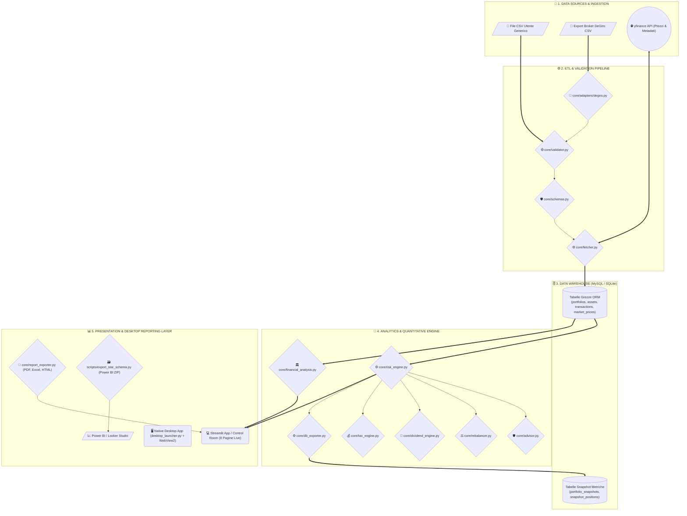

# ARGUS — Risk Analytics Platform


---

## 📌 Panoramica del Progetto

**ARGUS** — il cui nome si ispira al mito dell'osservatore dai cento occhi che vede tutto e non dorme mai — è una piattaforma integrata di **Business Intelligence, Financial Valuation, Forensic Accounting e Quantitative Risk Management**. Progettata con un'interfaccia ad alta densità informativa di livello istituzionale, la soluzione offre un ecosistema avanzato per la diagnosi contabile, la profilazione del rischio e la protezione strategica di portafogli d'investimento multi-asset (*Equity, ETF, Fixed Income, Crypto e Cash*).

Sviluppata come soluzione avanzata per l'analisi di Finanza Quantitativa, **ARGUS** converte registri di negoziazione eterogenei (CSV generici ed esportazioni native da broker quali DeGiro) in un framework analitico strutturato. La piattaforma integra:
* **Infrastruttura Data Warehouse**: Storicizzazione relazionale duale su MySQL e SQLite con gestione nativa multi-valuta (EUR, USD, GBP, CHF) e tassi di cambio storici.
* **Motore Quantitativo & Portfolio Engineering**: Risoluzione analitica della Frontiera Efficiente di Markowitz affiancata da stimatori *Ledoit-Wolf Shrinkage*, allocazione mediante Machine Learning con **Hierarchical Risk Parity (HRP — Marcos López de Prado)**, copertura con modello analitico **Black-Scholes (1973)** con calcolo dei 5 Greci e Delta-Hedging con opzioni Put, generazione di rendimento passivo con *Covered Call Yield Enhancer*, modelli a tre fattori di Fama-French, Carhart a 4 fattori, modello macro-fattoriale *MSCI Barra a 5 fattori ortogonalizzati*, simulazioni stocastiche *Merton Jump-Diffusion*, classificazione di regime macro con **Market Regime Switching (3-State Markov Model)**, rilevatore di anomalie di mercato via *Machine Learning Isolation Forest* e proiezioni stocastiche *Monte Carlo* (con decomposizione di Cholesky e distribuzioni *Student-t* a code grasse).
* **Financial Statement & Forensic Accounting**: Suite completa per la valutazione della solvibilità e del valore intrinseco aziendale mediante modelli *Altman Z-Score*, decomposizione *DuPont a 5 fattori*, *Piotroski F-Score (9pt)*, **Contabilità Forense Beneish M-Score (1999)** a 8 indici econometrici per il rilevamento di frodi contabili e manipolazione degli utili, **Sloan Accrual Ratio (1996)** per la qualità dei flussi di cassa, stima del *WACC (CAPM)*, *DCF stocastico a due stadi* e classificatore *Random Forest Distress Risk*.

A differenza dei benchmark basati su simulazioni sintetiche, **ARGUS** è stato validato empiricamente su un dataset reale di oltre 400 operazioni finanziarie storiche (2021–2026). Il sistema garantisce una precisione deterministica centesimale nella gestione di scenari operativi complessi, tra cui la contabilità a code FIFO, la gestione dei dividendi frazionati, la riconciliazione dei movimenti di cassa e la risoluzione automatica da codici ISIN a ticker negoziali.

---

## 🚀 Caratteristiche Chiave & Moduli Operativi

### 1. 🏛️ Analisi dei Bilanci, Valutazione & Contabilità Forense (`core/financial_analysis.py`, `core/forensic_accounting.py` & Pagina 5)
* **Beneish M-Score (1999)**: Modello econometrico forense a 8 fattori (DSRI, GMI, AQI, SGI, DEPI, SGAI, LVGI, TATA) per il calcolo della probabilità di manipolazione dei bilanci aziendali con soglia istituzionale $M > -1.78$.
* **Sloan Accrual Ratio (1996)**: Quantificazione analitica della qualità contabile dell'utile netto rispetto ai flussi di cassa operativi reali per isolare gli utili artificiali.
* **Altman Z-Score Model (1968)**: Modello econometrico per la previsione del rischio di insolvenza/bancarotta a 24 mesi con classificazione a semaforo (*Zona Sicura Z > 2.99*, *Zona Grigia 1.81–2.99*, *Zona di Pericolo Z < 1.81*).
* **Diagnostica Predittiva Machine Learning (Random Forest Distress Classifier)**: Classificatore ensemble addestrato sui ratio di bilancio per stimare la probabilità di distress finanziario.
* **Scomposizione DuPont (3 e 5 Fattori)**: Decomposizione del ROE nei driver di Profit Margin, Asset Turnover, Equity Multiplier, Tax Burden e Interest Burden.
* **Piotroski F-Score (9 Punti Stanford)**: Valutazione di salute contabile basata su Profittabilità (4 pt), Struttura/Liquidità (3 pt) ed Efficienza Operativa (2 pt).
* **Calcolatore Dinamico WACC (CAPM)**: Costo del Capitale Medio Ponderato calcolato combinando il Costo dell'Equity via CAPM ($r_e = R_f + \beta \cdot ERP$), il Costo del Debito al netto delle imposte e i pesi di mercato.
* **Valutazione Intrinseca DCF Monte Carlo (2-Stage)**: Attualizzazione dei Flussi di Cassa Liberi con 1.000 iterazioni stocastiche per generare la distribuzione di probabilità del Fair Value per azione.
* **Consultazione Bilanci 10-K**: Download ed estrazione diretta di Conto Economico, Stato Patrimoniale e Cash Flow reali da Yahoo Finance.
* **Comparativa Multiaziendale**: Confronto affiancato di 2+ aziende con grafico Radar sovrapposto e matrice dei multipli di mercato (*P/E*, *EV/EBITDA*, *P/B*, *P/S*).

### 2. 🔬 Motore Quantitativo, Ottimizzazione & Hedging con Opzioni (`core/risk_engine.py`, `core/hrp_optimizer.py`, `core/options_hedging.py`, `core/regime_switching.py` & Pagine 2 e 3)
* **Hierarchical Risk Parity (HRP — Marcos López de Prado 2016)**: Ottimizzazione del portafoglio basata su Machine Learning, Tree Clustering, Quasi-Diagonalizzazione e Bisezione Ricorsiva con matrice di distanza $D_{i,j} = \sqrt{(1 - \rho_{i,j})/2}$ che supera l'instabilità delle matrici inverse di Markowitz.
* **Modello Analitico Black-Scholes (1973) & Greci**: Prezzatura di opzioni Europee Call/Put e calcolo analitico dei 5 Greci ($\Delta, \Gamma, \Theta, \text{Vega}, \rho$) con calcolatore di Delta-Hedging per immunizzare il Beta di portafoglio e Covered Call Yield Enhancer per generare rendimento extra.
* **Market Regime Switching (3-State Model)**: Rilevamento automatico dello stato macroeconomico del mercato (Bull Low-Vol, Range-Bound e Crisis High-Vol) basato su volatilità e rendimenti rolling a 21 giorni.
* **Simulatore Stocastico Merton Jump-Diffusion**: Modellizzazione non-gaussiana dei rendimenti che combina il Moto Browniano Geometrico continuo con uno shock di salto di Poisson ($N_t \sim \text{Poisson}(\lambda dt)$) per quantificare il *Tail Risk* durante i crolli finanziari.
* **Rilevatore di Anomalie ML Isolation Forest**: Algoritmo non supervisionato di Machine Learning per l'identificazione automatica di giornate di panico, rotture di correlazione (*Correlation Breakdown*) e distorsioni strutturali sui vettori di rendimento, volatilità 20g, correlazione media e drawdown.
* **Modello Macro-Fattoriale MSCI Barra a 5 Fattori Ortogonalizzati**: Decomposizione OLS del rischio di portafoglio su fattori di stile ($F_{\text{MKT}}, F_{\text{SMB}}, F_{\text{HML}}, F_{\text{WML}}, F_{\text{TERM}}$) ortogonalizzati tramite Gram-Schmidt per azzerare la multicollinearità.
* **ATR Trailing Stop-Loss & Chandelier Exit Manager**: Generazione quantitativa di livelli di stop-loss dinamici basati sulla reale ampiezza di oscillazione ($3 \times ATR_{14}$) e sui massimi a 22 giorni.
* **Value at Risk (VaR) & Expected Shortfall (CVaR)**: Stima analitica della perdita massima (VaR) e della *perdita media nello scenario peggiore* (CVaR al 95% e 99%) nelle metodologie Storica, Parametrica e Cornish-Fisher (corretta per Skewness e Kurtosis).
* **Validazione Regolamentare VaR (Kupiec POF Backtest)**: Backtest del VaR su 252 giorni di negoziazione con classificazione a semaforo dell'Accordo di Basilea (*Verde/Giallo/Rosso*).
* **Monte Carlo Fan / Ribbon Chart**: Proiezione stocastica a nastro fino a 3 Anni (756 giorni) con 10.000 traiettorie basate su Moto Browniano Geometrico e decomposizione di Cholesky, comprensiva di supporto per code grasse (distribuzione Student-t con $\nu=5$).
* **Ottimizzazione di Markowitz & Ledoit-Wolf Shrinkage**: Risoluzione della Frontiera Efficiente per Max Sharpe Ratio e Min Volatility con contrazione della matrice di covarianza.
* **Style Analysis Fama-French & Carhart**: Modelli di regressione multivariata a 3 e 4 fattori per ricavare l'Alpha puro ($\alpha$), Market Beta, Size SMB, Value HML e Momentum WML.

### 3. 🌪️ Stress Testing & Analisi di Scenario (`core/risk_engine.py` & Pagina 6)
* **MSCI Barra Multi-Scenario Matrix**: Stima delle perdite in € e % simulando i 5 grandi shock storici (*Dot-Com 2000*, *Lehman 2008*, *US Downgrade 2011*, *COVID-19*, *Rate Shock 2022*).
* **Custom Beta Shock Waterfall**: Simulazione dell'impatto di uno shock arbitrario del benchmark ($\Delta R_b \in [-50\%, +30\%]$) su ogni singola posizione di portafoglio.

### 4. 📈 Analisi Tecnica & Quantitative Charting (`core/technical_analysis.py` & Pagina 8)
* **Indicatori Algoritmici Istituzionali**: Calcolo di Medie Mobili (EMA 20, EMA 50, SMA 200 con rilievo *Golden Cross / Death Cross*), *MACD (12, 26, 9)* con istogramma di momentum, *RSI 14* con identificazione delle zone di ipercomprato (>70) o ipervenduto (<30), *Bande di Bollinger (20, 2.0 std)* con **Bollinger Squeeze Detection** (compressione di volatilità al di sotto del 20° percentile storico), *ATR 14* per la misura del rischio di ampiezza e *ADX 14* per la valutazione della forza strutturale del trend.
* **Volume Profile (POC, VAH, VAL)**: Distribuzione orizzontale dei volumi di contrattazione sui livelli di prezzo per l'identificazione del **Point of Control (POC - linea oro)**, della **Value Area High (VAH)** e della **Value Area Low (VAL)** contenenti il 70% del volume totale negoziato.
* **Candlestick Pattern Recognition**: Algoritmo non-lineare per il rilevamento automatico dei principali pattern a candela sulle barre recenti (*Bullish/Bearish Engulfing*, *Hammer*, *Shooting Star*, *Doji*).
* **Technical Confluence Score Card (0-100)**: Modello di punteggio ponderato su 5 driver tecnici con emissione del verdetto tattico (🟢🟢 *Strong Buy*, 🟢 *Buy*, 🟡 *Hold/Neutral*, 🔴 *Sell*, 🔴🔴 *Strong Sell*).
* **Trend Multi-Timeframe Alignment**: Allineamento del trend primario su orizzonti **Giornaliero (1D)** e **Settimanale (1W)** per verificare la sincronizzazione della tendenza tra diversi timeframes.
* **Cockpit di Charting Interattivo Plotly**: Layout di grafici multi-pannello ad alta risoluzione con sottografici sincronizzati e Volume Profile orizzontale affiancato.

### 5. 📋 Diagnostica Posizioni, FIFO & Dividendi (`core/rebalancer.py`, `core/dividend_engine.py` & Pagina 4)
* **Motore Contabile FIFO (`_fifo_engine`)**: Tracciamento a code FIFO per il calcolo esatto del prezzo medio di carico (WACP), distinguendo tra PnL realizzato e non realizzato.
* **Smart Rebalancer & Ordini di Trading**: Generatore di ordini di acquisto/vendita ad azioni intere per allineare il portafoglio alle allocazioni target (Markowitz, Equal Weight, Custom).
* **Calendario Flusso Dividendi**: Stima del Dividend Yield medio e proiezione del calendario mensile degli incassi per singola azienda pagatrice.

### 6. 💰 Ottimizzazione Fiscale TUIR Art. 67 (`core/tax_engine.py`)
* **Normativa Italiana Fiscale**: Distinzione tra l'aliquota agevolata **12.5%** sui Titoli di Stato (White List) e l'aliquota **26.0%** su Azioni, Obbligazioni ed ETF.
* **Compensabilità Minusvalenze (Zainetto Fiscale)**: Riconoscimento della regola TUIR per cui le plusvalenze da ETF costituiscono *Redditi di Capitale* e **non compensano le minusvalenze** (generate da *Redditi Diversi*).
* **Tax-Loss Harvesting Advisor**: Identificazione delle posizioni in perdita latente da smobilizzare strategicamente prima della chiusura dell'anno fiscale.

### 7. 📊 Reporting, Esportazioni & Desktop Shell (`core/report_exporter.py`, `desktop_launcher.py`)
* **Report Executive PDF & Workbook Excel Multi-Tab**: Generazione in-memory di Factsheet PDF a 2 pagine e file Excel (.xlsx) su 4 schede tematiche.
* **Report Standalone HTML**: Esportazione di un report interattivo HTML standalone con stile dark mode ed animazioni.
* **Star Schema ZIP per Power BI & Looker Studio**: Pacchetto `.zip` contenente le tabelle relazionali (`dim_assets.csv`, `fact_positions.csv`, `fact_portfolio_summary.csv`) pronte per l'importazione nei tool di BI.
* **Applicazione Desktop Nativa Windows**: Shell nativa basata su **PyWebView** (motore Edge WebView2) che esegue ARGUS in una finestra dedicata con icona applicativa dell'**Occhio di Argus**, lifecycle manager ed avvio protetto.

### 8. ⚡ Multi-Tier Caching & Diagnostics Cockpit (`core/cache_shield.py`, `core/diagnostics.py`)
* **Multi-Tier Caching & Rate-Limit Shield (yfinance)**: Architettura a doppio livello di persistenza che combina una cache LRU in RAM ad accesso sub-millisecondo con un database su disco SQLite (`data/yfinance_cache.db`) a scadenza 24 ore (TTL 86.400s), exponential backoff con jitter per schermare errori HTTP 429 Too Many Requests e fallback offline seamless.
* **System Diagnostics & Health-Check Cockpit**: Suite di controllo integrata per il monitoraggio della latenza di calcolo dei 26 motori finanziari (ms), integrità delle tabelle MySQL/SQLite, determinismo dei seed stocastici di Monte Carlo ed efficienza della memoria di sistema.

---

## 🏛️ Architettura di Runtime del Sistema

Il sistema adotta un'architettura modulare a 5 livelli (*Ingestion*, *ETL & Validation*, *Data Warehouse*, *Analytics Core*, *Presentation/Desktop*) validata e mappata end-to-end:

### 🗺️ Specifica Architetturale IR & Visualizzazioni
* 🌐 **[Visualizza il Diagramma Interattivo Live su GitHub Pages](https://alessandro-sal.github.io/argus-risk-analytics/argus-architecture.html)**: Mappa interattiva autotrattenuta generata con **Archify**.
* 📂 **[File HTML Standalone Locale](docs/argus-architecture.html)**: Versione autotrattenuta offline per il download.
* ⚙️ **[Specifica Architetturale JSON IR](docs/argus-architecture.json)**: Specifica IR di sistema.



---

## 📂 Struttura del Repository

```text
argus-risk-analytics/
├── .github/                     # Workflows di CI/CD
│   └── workflows/
│       └── ci.yml
├── config/                      # Configurazione e mapping ISIN-Ticker
│   └── config.json
├── core/                        # Engine quantitativo, calcoli di rischio e moduli istituzionali
│   ├── adapters/                # Adapter per broker esterni (DeGiro)
│   │   ├── __init__.py
│   │   └── degiro.py
│   ├── advisor.py               # ARGUS Quant Advisor & Health Score Engine
│   ├── attribution.py           # Brinson-Fachler Performance Attribution
│   ├── db_exporter.py           # Layer di storicizzazione snapshot su DB
│   ├── dividend_engine.py       # Cash Flow Forecast & Dividend Calendar
│   ├── excel_generator.py       # Modello tattico Excel What-If
│   ├── exporter.py              # Esportatore CSV denormalizzati
│   ├── fetcher.py               # Download dati storici yfinance & conversione valute
│   ├── financial_analysis.py    # Altman Z-Score, DuPont, Piotroski, WACC, DCF Monte Carlo
│   ├── hedging.py               # Copertura Beta-Neutral & Tail Risk Protection
│   ├── html_exporter.py         # Exporter Report Standalone HTML
│   ├── models.py                # Schema ORM SQLAlchemy (MySQL & SQLite)
│   ├── pdf_generator.py         # Exporter Factsheet PDF (ReportLab)
│   ├── rebalancer.py            # Smart Rebalancer & Generatore Ordini
│   ├── report_exporter.py       # Manager Centralizzato Esportazione Report
│   ├── risk_engine.py           # Motore FIFO, VaR, Markowitz, Monte Carlo, Fama-French
│   ├── risk_limits.py           # Early Warning System & Controlli di Rischio
│   ├── schemas.py               # Data Contracts & Validazione Pydantic
│   ├── sidebar.py               # Utilities per Sidebar UI
│   ├── tax_engine.py            # Ottimizzazione Fiscale TUIR Art. 67
│   ├── technical_analysis.py    # Motore Analisi Tecnica, Volume Profile & Confluenza
│   ├── ui_utils.py              # Helper Grafici Plotly & Componenti UI
│   └── validator.py             # Pipeline di Bonifica & Normalizzazione Data
├── data/                        # Dataset di input & database SQLite fallback
│   └── test_portfolio_realistic_90s.csv # Test dataset 90s positions (Tracciato per demo e test)
├── docker/                      # File di containerizzazione Docker
│   └── Dockerfile
├── docs/                        # Documentazione Tecnica & Specifica Architetturale
│   ├── CSV_Format_Specification.md # Specifica tecnica formato CSV & DeGiro
│   ├── DESIGN.md                # Design System & UI Specs
│   ├── FLOWCHART.md             # Diagramma di Flusso ETL a 5 Livelli
│   ├── PROJECT_HANDOFF.md       # Documento di Consegna & Handoff Tecnico
│   ├── argus-architecture.html  # Diagramma Architetturale HTML Standalone
│   ├── argus-architecture.json  # Specifica Architetturale JSON IR
│   ├── argus_banner.jpg         # Banner grafico del progetto
│   ├── argus_icon.ico           # Asset icona Occhio di Argus
│   ├── index.html               # GitHub Pages landing view
│   └── metriche_rischio.md      # Manuale Matematico ed Econometrico completo
├── exports/                     # Cartella di destinazione report esportati (.xlsx, .pdf, .zip)
│   └── .gitkeep
├── gsheets_sync_subproject/     # Sub-servizio Sincronizzazione ETL Google Sheets
├── notebooks/                   # Jupyter Notebooks di prototyping quantitativo
│   └── test_pipeline.ipynb
├── scripts/                     # Script di Build, Schema SQL e Pacchettizzazione
│   ├── DB.sql                   # Schema DDL Data Warehouse MySQL 8.0
│   ├── build_desktop_app.py     # Automazione compilazione PyInstaller (.exe)
│   ├── create_desktop_shortcut.py # Generatore collegamento Desktop con icona (.lnk)
│   ├── export_star_schema.py    # Generatore pacchetto ZIP Star Schema per Power BI
│   ├── generate_excel_model.py  # Generatore standalone modello Excel
│   ├── generate_icon.py         # Generatore icona ICO multi-risoluzione
│   ├── package_release.py       # Pacchettizzatore Release ZIP
│   └── test_run.py              # Script di esecuzione e verifica rapida
├── src/                         # Codice sorgente dell'applicazione Streamlit
│   ├── 0_Control_Room.py        # Entry point principale & Control Room
│   └── pages/                   # Moduli e viste (1..8) della dashboard
│       ├── 1_📈_Dashboard_Generale.py
│       ├── 2_🔴_Analisi_Rischio.py
│       ├── 3_🔬_Modelli_Quantitativi.py
│       ├── 4_📋_Posizioni_e_Dettagli.py
│       ├── 5_🏛️_Valutazione_Aziendale.py
│       ├── 6_🌪️_Stress_Testing.py
│       ├── 7_📊_Analisi_Temporale.py
│       └── 8_📈_Analisi_Tecnica.py
├── tests/                       # Test suite automatizzata PyTest (65 test PASSED)
├── .env.example                 # Esempio configurazione variabili d'ambiente
├── CODE_OF_CONDUCT.md           # Codice di Condotta
├── CONTRIBUTING.md              # Guida ai contributi
├── LICENSE.md                   # Licenza Open Source MIT
├── README.md                    # Documentazione Principale del Progetto
├── SECURITY.md                  # Politica di Sicurezza
├── app.py                       # Launcher alias per l'applicazione Streamlit
├── desktop_launcher.py          # Entry point nativo Desktop App (PyWebView + Edge WebView2)
├── docker-compose.yml           # Configurazione Docker Compose (App + MySQL 8.0)
├── pyproject.toml               # Configurazione tool (PyTest, Ruff)
├── requirements.txt             # Dipendenze Python
├── setup_desktop.bat            # Script di setup 1-Click per ambiente Desktop Windows
├── start_dashboard.bat          # Script d'avvio rapido per Windows
└── start_dashboard.sh           # Script d'avvio per Linux/macOS
```

---

## ⚙️ Requisiti di Sistema & Installazione

### Opzione A: Applicazione Desktop Nativa Windows (Consigliato)

ARGUS include un'architettura **Desktop Nativa** basata su **PyWebView** (motore Windows Edge WebView2) che esegue la piattaforma in una finestra indipendente con icona personalizzata, senza barre del browser, ed arresta automaticamente i processi alla chiusura della finestra.

1. **Configurazione 1-Click (Per utenti Windows)**:
   Fai doppio clic sul file **`setup_desktop.bat`**. Lo script installerà le dipendenze Python e genererà il collegamento con l'icona dell'**Occhio di Argus** sul tuo Desktop personale.

2. **Avvio Diretto**:
   ```bash
   py desktop_launcher.py
   ```
   *Oppure fai doppio clic su `start_dashboard.bat`.*

3. **Compilazione dell'Eseguibile Standalone (`ARGUS.exe`)**:
   Per pacchettizzare la piattaforma in un singolo `.exe` distribuiscibile:
   ```bash
   py scripts/build_desktop_app.py
   ```
   L'eseguibile verrà generato nella cartella `dist/ARGUS_Desktop/ARGUS.exe`.

---

### Opzione B: Avvio Rapido con Docker Compose

L'applicazione è completamente containerizzata (App Streamlit + Database MySQL 8.0):

```bash
docker compose up --build
```
L'applicazione web sarà accessibile all'indirizzo `http://localhost:8501`.

---

### Opzione C: Installazione Locale Python

1. **Prerequisiti**: Python 3.11+, MySQL 8.0+ (opzionale, in caso contrario viene utilizzato SQLite locale fallback `data/argus_local.db`).

2. **Clona il repository**:
   ```bash
   git clone https://github.com/Alessandro-Sal/argus-risk-analytics.git
   cd argus-risk-analytics
   ```

3. **Ambiente virtuale ed installazione dipendenze**:
   ```bash
   python -m venv venv
   # Su Windows:
   .\venv\Scripts\activate
   # Su Linux/macOS:
   source venv/bin/activate

   pip install -r requirements.txt
   ```

4. **Avvio Dashboard Streamlit**:
   ```bash
   streamlit run app.py
   ```

---

## 🧪 Esecuzione della Test Suite Automatizzata

Il progetto include 65 test automatizzati PyTest che coprono l'engine quantitativo, l'analisi tecnica, la validazione dei dati, i modelli di bilancio e le esportazioni di report:

```bash
py -m pytest
```

---

## 📚 Documentazione Tecnica di Dettaglio

La documentazione completa si trova all'interno della cartella [`docs/`](docs/):

1. 🤝 **[docs/PROJECT_HANDOFF.md](docs/PROJECT_HANDOFF.md)**: Documento di consegna del progetto, stato dei moduli e contesto decisionale ed architetturale.
2. 📈 **[docs/metriche_rischio.md](docs/metriche_rischio.md)**: Manuale matematico ed econometrico dettagliato di tutte le metriche e dei modelli finanziari implementati.
3. 🗺️ **[docs/FLOWCHART.md](docs/FLOWCHART.md)**: Architettura visiva del sistema e diagramma dei flussi dati ETL a 5 livelli.
4. 📐 **[docs/DESIGN.md](docs/DESIGN.md)**: Linee guida architetturali e design system della dashboard.
5. 📝 **[docs/CSV_Format_Specification.md](docs/CSV_Format_Specification.md)**: Specifica tecnica del formato CSV di input e supporto per l'adapter DeGiro.

---

## 📄 Licenza

Questo progetto è distribuito sotto licenza open-source **MIT License**. Consulta il file [LICENSE.md](LICENSE.md) per i dettagli.

---

*ARGUS — Investment Risk & Portfolio BI Platform.*
