# ARGUS - Risk Analytics & Wealth Intelligence Platform


[](https://github.com/Alessandro-Sal/argus-risk-analytics/actions/workflows/ci.yml)
[](https://alessandro-sal.github.io/argus-risk-analytics/)
[](https://github.com/Alessandro-Sal/argus-risk-analytics/releases/latest)
[](https://www.python.org/)
[](LICENSE.md)
[-brightgreen)](tests/)
[](https://github.com/astral-sh/ruff)
[](docker-compose.yml)

---

## 📌 Panoramica del Progetto

**ARGUS** — il cui nome si ispira al mito dell'osservatore dai cento occhi che vede tutto e non dorme mai — è una piattaforma integrata di **Business Intelligence, Financial Valuation, Forensic Accounting, AI Narrative Intelligence, Data Engineering e Quantitative Risk Management** potenziata con standard **Bloomberg Terminal Parity**. Progettata con un'interfaccia ad alta densità informativa di livello istituzionale, la soluzione offre un ecosistema avanzato per la diagnosi contabile, la profilazione del rischio e la protezione strategica di portafogli d'investimento multi-asset (*Equity, ETF, Fixed Income, Crypto e Cash*).

Sviluppata come soluzione di punta per l'analisi di Finanza Quantitativa, **ARGUS** converte registri di negoziazione eterogenei (file CSV generici, esportazioni native da broker quali **DeGiro**, **Directa SIM**, **Fineco Bank**, **Interactive Brokers / IBKR**, **Trade Republic**, **Scalable Capital**, **eToro**, **Revolut Trading** e sincronizzazioni live da **Google Sheets** con estrazione duale separata di *Stocks & Crypto*) in un framework analitico strutturato. La piattaforma integra:
* **🏛️ Next-Level Enterprise Transformation v8.1 & Universal Financial Intelligence (`core/universal_ledger.py`, `core/wealth/human_capital_engine.py`, `core/prescriptive_rebalancer.py`, `core/msci_barra_risk_engine.py`, `core/wealth/tbs_monte_carlo.py`, `core/ai_analyst.py`)**: Trasformazione architetturale strategica di classe Tier-1 (standard BlackRock Aladdin, Bloomberg AIM, MSCI Barra):
  1. *Universal One-Ledger Core & Vectorized DuckDB/PyArrow Engine*: Modello a partita doppia unificato per asset liquidi ed illiquidi, calcolo contabile FIFO WACP/PMC con window functions analitiche C++ in DuckDB, estrazione zero-copy PyArrow e persistenza Apache Parquet.
  2. *Human Capital Valuation & Total Balance Sheet VaR (TBS-VaR)*: Integrazione attuariale del Capitale Umano come asset sintetico Quasi-Equity/Quasi-Bond (sconto Nelson-Siegel, premio rischio settore/disoccupazione), matrice di covarianza cross-asset allargata (Mercati + Real Estate + Capitale Umano), stima di TBS-VaR 95% e TBS-CVaR 95%, stress test su mutui a tasso variabile (+200 bps), Emergency Runway in mesi e raccomandazioni di sottopeso settoriale contro il rischio di correlazione stipendio-portafoglio.
  3. *Prescriptive Conic Rebalancer & FIX 4.4 Protocol Blotter*: Ottimizzatore convesso/SLSQP multi-obiettivo (Tracking Error vs Turnover vs Tax Drag vs Almgren-Chriss Slippage/Market Impact) con assorbimento progressivo delle minusvalenze (TUIR 26% / 12.5%) e generazione di flussi ordini conformi allo standard internazionale FIX Protocol 4.4 (Tag 35=D, Tag 54, Tag 38, Tag 44, Tag 59).
  4. *Tri-Agent AI Quantitative Governance Council*: Comitato collegiale autonomo composto da 3 agenti con mandati specialistici ortogonali (*QuantRiskAuditor*, *TaxEfficiencySpecialist*, *MacroExecutionStrategist*), protocollo formale di consenso, scoring di governance e verbale esecutivo di delibera conforme MiFID II / CONSOB.
  5. *Asset-Level Factor Risk Decomposition Engine (MSCI Barra GEM3/USE4)*: Scomposizione formale della covarianza $\Sigma = X F X^T + \Delta$ tra Rischio Sistemico Fattoriale e Rischio Idiosincratico Specifico, Marginal Contribution to Total Risk (MCTR), Percent Contribution to Total Risk (PCTR per titolo e per fattore di stile/settore GICS) secondo il teorema di Eulero, e mappa radar degli active factor tilts.
  6. *Total Balance Sheet Lifetime Monte Carlo Simulation Engine (TBS-MC)*: Simulazione stocastica su 5.000 cammini a ciclo di vita (fino a 90 anni) per la stima della probabilità di rovina patrimoniale $P(\text{Liquidity} \le 0)$, identificazione dell'Età di Massima Fragilità, calcolo del corridoio di spesa annua sostenibile e fan chart dei percentili del Patrimonio Netto Olistico ($P_{10}, P_{25}, P_{50}, P_{75}, P_{90}$).
* **🏛️ Enterprise Masterplan v7.0 & Cross-Asset Macro Bridge (`core/wealth/unified_stress_bridge.py`, `core/wealth/tax_aware_location.py`, `core/autonomous_rebalancer.py`)**: Convergenza unificata tra rischio di mercato mobiliare e patrimonio totale (immobili, liquidità, fondi pensione, debito/mutui) con il **Cross-Asset Macro Bridge**, **Tax-Aware Asset Location Optimizer** (arbitraggio fiscale tra conti tassabili e previdenza integrativa), **Autonomous Rebalancer con WACP/PMC reale e recupero minusvalenze** dallo zainetto fiscale, calibrazione zero-coupon **Nelson-Siegel & Key Rate Durations (KRD)** a 5 nodi istituzionali (1Y, 2Y, 5Y, 10Y, 30Y) e stima del **Liquidity-Adjusted Value at Risk (L-VaR Bangia 1999)** con costo stocastico di bid-ask spread.
* **🎓 Institutional 5-Block Educational Modals & Crisp Vector SVG Icons (`core/ui_utils.py`)**: Standardizzazione istituzionale delle schede esplicative di tutte le metriche visualizzate in piattaforma, conformi allo schema a 5 blocchi (📌 *Cos'è & Definizione*, 📐 *Formula Matematica*, 🎯 *Come interpretarlo & Benchmark*, ⚙️ *Implementazione nel Codice*, ⚠️ *Limiti & Falsi Segnali*) affiancate da icone informative vettoriali SVG pure-code nitide a qualsiasi risoluzione.
* **🏛️ Obsidian Sovereign UI/UX Institutional Design System (`core/ui_utils.py`)**: Rinnovamento visivo ad alta densità "Fintech Institutional Grade" con gerarchia a 3 livelli (Header & Context Pill $\to$ Horizontal Control Bar $\to$ Modular Content Grid), palette antracite/ardesia a contrasto certificato WCAG AAA, cifre contabili a spaziatura monospaziata tabulare (`JetBrains Mono` con `tnum`), micro-grafici SVG pure-code ultra-leggeri a zero latenza (`generate_svg_sparkline`), status badge con animazione pulsante (`render_status_badge`), KPI card multilivello (`render_kpi_metric`, `render_kpi_card`), container in vetro acrilico (`render_glassmorphic_card`) e data table con barre di avanzamento orizzontali dinamiche `ProgressColumn` (`render_data_table`).
* **📊 Quantitative Data Visualization Framework & Plotly Factory (`core/ui_utils.py`)**: Architettura centralizzata di data visualization basata sui template ufficiali registrati `argus_dark` e `argus_light` con griglie a basso contrasto, layout factory `apply_custom_chart_layout` (formattazione automatica assi valuta/percentuale, hovermode unificato, spikelines temporali coordinate) e toolbar essenziale ad alta risoluzione (PNG $2\times$ via `get_plotly_config`). Include una Pattern Library per i 4 grafici quantitativi fondamentali (*Monte Carlo Fan Chart* con coni percentili 5-25-50-75-95, *Matrice di Correlazione Cross-Asset* fissa -1.0/+1.0, *Cash Flow Waterfall Chart* con saldo netto cumulato e *NAV Cumulato & Underwater Drawdown Plot* sincronizzato su doppio asse temporale con rilevamento del Max Drawdown).
* **🌪️ Unified Macro Stress Engine & Liquidity Squeeze Protocol (`core/wealth/wealth_stress_engine.py`)**: Motore congiunto di simulazione macroeconomica multi-asset che connette il portafoglio titoli del modulo Risk al bilancio patrimoniale del modulo Wealth. Modella la trasmissione dello shock tassi sui mutui a tasso variabile tramite ammortamento non-lineare alla francese ($\Delta PMT$), identifica analiticamente il **Point of Forced Liquidation ($t^*$)** sul fondo di emergenza, quantifica la perdita irreversibile da liquidazione forzata di asset depressi sui minimi di mercato e ricalcola il **Dynamic Safe Withdrawal Rate (FIRE SWR)** secondo le regole prudenziali di Guyton-Klinger contro il *Sequence of Returns Risk*, con timeline Plotly interattiva.
* **🧱 State Management Reattivo & Multi-Workspace Isolation (`core/workspace_context.py`)**: Architettura a sottocontesti tipizzati (`RiskSubContext`, `WealthSubContext`, `UIViewState`) con persistenza e isolamento deterministico della sessione (`data/cache/sessions/session_{id}.pkl`), metodo `flush_risk_domain()` per la bonifica automatica e chirurgica delle chiavi di widget orfane in Streamlit, e consolidamento in-memory in tempo reale del Net Worth tra modulo Risk e modulo Wealth senza necessità di snapshot preventivi su database.
* **🛡️ AI Analyst & MiFID II Regulatory Compliance Guardrails (`core/sec_rag_engine.py`, `core/voice_advisor_engine.py`)**: Standard di governance finanziaria con disclaimer vincolanti Art. 21 TUF e divieto di consulenza/raccomandazioni operative non autorizzate, validatore semantico di aderenza numerica contro allucinazioni LLM, chunking normativo a finestra scorrevole e query expansion lessicale bilingue sui bilanci SEC Form 10-K, affiancati da executive voice briefing a 2 voci (CIO & CRO).
* **📊 Institutional Financial Reporting Design System (`core/reporting_design_system.py`, `core/modular_factsheet_builder.py`, `core/pdf_generator.py`, `core/excel_generator.py`)**: Suite grafica unificata basata sulla palette istituzionale *Obsidian Sovereign*, canvas ReportLab A4 a due passaggi (`InstitutionalNumberedCanvas`) con numerazione continua "Pagina X di Y", grafici a ciambella vettoriali in-memory senza dipendenze esterne o memory leak, ed esportazioni Excel interattive con tabelle native `ListObject` e formule dinamiche live (`XIRR`, somme condizionali).
* **🛡️ Cybersecurity, Data Vault & Anti-Formula Injection (`core/security_engine.py`)**: Difesa in profondità (*Defense-in-Depth*) contro attacchi **CWE-1236 (Formula Injection)** con sanitizzazione di ogni cella esportata in CSV e XLSX multi-foglio (neutralizzazione prefissi `=`, `+`, `-`, `@`, `\t`, `\r`), de-identificazione e mascheramento dinamico PII (IBAN, Codice Fiscale e conti correnti conformi a GDPR Art. 5/32), cifratura dei dati sensibili a riposo **ArgusDataVault** (algoritmo Fernet AES-128/256 CBC con autenticazione HMAC-SHA256 e derivazione chiave PBKDF2 a 100.000 iterazioni) e sanitizzazione preventiva delle credenziali nei prompt inoltrati ai modelli LLM esterni.
* **🔄 Zero-Downtime Hot Backup & Disaster Recovery Atomico (`core/backup_engine.py`)**: Motore di continuità operativa e resilienza basato sulle API C native `sqlite3_backup_init` per snapshot consistenti a caldo del database patrimoniale senza interruzione dei servizi, checkpointing preventivo del Write-Ahead Logging (`PRAGMA wal_checkpoint(TRUNCATE)`), doppio audit di integrità (`PRAGMA integrity_check` & `PRAGMA foreign_key_check`), compressione trasparente gzip con rotazione e retention temporale, e procedura di ripristino atomico point-in-time protetta da copia di rollback automatico `.emergency_pre_restore`. Integrato come hook di pre-flight in `desktop_launcher.py`.
* **🗄️ Database Reliability Engineering & Embedded Schema Migration Engine (`core/database_migration_manager.py`)**: Framework evolutivo embedded per database client-side (SQLite & DuckDB) a zero dipendenze esterne pesanti. Implementa Dual-Layer Schema Versioning ($O(1)$ con `PRAGMA user_version` + audit ledger crittografico `schema_migrations` con hash SHA-256 anti-manomissione), pre-flight shadow backup atomico prima di modifiche DDL, fail-safe disaster recovery con rollback automatico immediato e ripristino dallo snapshot su eccezione, schema drift inspector continuo contro i modelli Python (`core/models.py`, `core/wealth/wealth_models.py`), rilevamento orfani referenziali (`PRAGMA foreign_key_check`) e indici compositi analitici per l'accelerazione vettorizzata di query OLAP e attach nativo in DuckDB C++.
* **🩺 Lead SRE Observability, Structured JSON Logging & Self-Service Support Bundle Engine (`core/diagnostics.py`, `src/0_Control_Room.py`)**: Framework istituzionale di telemetria, logging sicuro e supporto diagnostico client-side. Implementa formattazione JSONL atomica (`StructuredJsonFormatter`), separazione fisica a canali isolati con rotazione controllata (`logs/argus_system.jsonl` per ops/latenze/errori e `logs/argus_audit.jsonl` per audit trail contabile di business con `log_audit_event`), filtro di mascheramento dati sensibili `FinancialAndPIISanitizingFilter` a conformità GDPR Art. 32 / PCI-DSS (oscuramento irreversibile di IBAN, Codici Fiscali, numeri di carte PAN, importi monetari e token/credenziali), decoratore `@measure_latency`, visualizzatore live dei log con filtri per severità e generatore 1-click di **Support Bundle ZIP** (`generate_support_bundle`) con diagnostica hardware (CPU, RAM via `psutil`, disco), stato integrità database SQLite, versioni pacchetti e log recenti sanificati.
* **🚦 Enterprise Data Quality Gate & Middleware Ingestion (`core/data_quality_gate.py`)**: Middleware di validazione e riconciliazione contabile pre-ingestion basato su schemi dichiarativi **Pydantic v2** (`CanonicalTradeRecord`, `QualityGateReport`), regole semantiche avanzate (blocco posizioni corte accidentali, rilevamento trade in giorni festivi/weekend, validazione cross-currency FX), riconciliazione automatica ISIN/Ticker e deduplicazione deterministica a chiave naturale SHA-256 (`tx_hash`) per garantire l'idempotenza assoluta nei ricaricamenti multipli di estratti conto.
* **⚡ Bloomberg Terminal Command Gateway & Mnemonic Parser**: Barra di comando istituzionale globale con sintassi a codici rapidi (`<TICKER> <MNEMONIC> <GO>`, es. `AAPL DES`, `MSFT FA`, `NVDA VOLS`, `PORT RISK`, `YCRV`, `BTP YAS`, `US10Y FI`, `CDS`, `STREAM`, `ATTR`, `TAX`, `EQS`, `BQUANT`, `LAUNCHPAD`, `XL`, `LIVE`, `TERM`, `CLI`), autocompletamento fuzzy, visual command feedback in tempo reale, sincronizzazione bidirezionale perfetta con la Navigation Rail e navigazione rapida senza mouse.
* **🖥️ ARGUS Live Terminal & Interactive CLI Execution Desk (`LIVE` / `TERM`)**: Console operativa interattiva in-app con prompt comandi Bloomberg (`ARGUS:LIVE>`), motore streaming Level-2 Depth Book con calcolo del Microprice di Stoikov (2018) e Order Flow Imbalance (OFI), simulatore Order Management System (OMS) Blotter con order slicing algoritmico TWAP/VWAP e telemetria di sistema in tempo reale (`TOP` Monitor CPU, RAM RSS, Ring Buffer, DB).
* **🤖 Smart Order Routing & Algoritmi di Esecuzione TWAP / VWAP**: Motore istituzionale di order slicing intraday (09:00 - 17:30) per grandi blocchi ed ordini di ribilanciamento con profilazione della curva di liquidità a "U", **TWAP** uniforme con jitter stocastico anti-frontrunning, **VWAP** ponderato sui volumi con tetto di partecipazione (POV Cap al 15%), stima dello slippage atteso e calcolo del risparmio netto rispetto all'ordine a mercato immediato.
* **🧬 Asset Allocation con Reinforcement Learning (RL Policy Sandbox)**: Agente neurale Policy Gradient (REINFORCE con baseline mobile) formulato come Processo Decisionale di Markov (MDP) continuo nello spazio degli stati $\mathbb{R}^{3N}$ (rendimenti, volatilità di regime, momentum), addestrato a massimizzare il **Sortino Ratio** penalizzando i drawdown e l'attrito di turnover, con simulazione storica ad episodi e curve di equity comparate con benchmark 1/N.
* **🌐 Frontiera Efficiente Tri-Dimensionale & Iperspazio Quantitativo 3D**: Estensione volumetrica della frontiera di Markowitz con proiezione nello spazio 3D $(X = \text{Volatilità}, Y = \text{Rendimento}, Z = \text{Concentrazione HHI } / \text{ CVaR 95\% } / \text{ Sortino})$, alimentata da un algoritmo di campionamento **Multi-Alpha Dirichlet ($\alpha \in [0.05, 5.0]$) con Sparse Masking** per mappare con continuità l'intero volume geometrico dal baricentro ($1/N$) ai vertici di massima concentrazione ($HHI = 1.0$).
* **🏛️ Suite Fiscale Avanzata a 4 Pilastri & Regime Dichiarativo (TUIR, Quadro RT/RW/RM & Withholding)**:
  1. *Asimmetria Fiscale ETF & Rebalancer Compliance (TUIR Artt. 44, 67, 68)*: Separazione analitica e vincolante tra *Redditi di Capitale* (plusvalenze ETF tassate al 26% non compensabili) e *Redditi Diversi* (azioni, bond, ETC, certificates compensabili con minusvalenze pregresse nello zainetto quadriennale), integrata in tutti i ribilanciatori sia euristici che convessi (`core/tax_aware_rebalancer.py`, `core/prescriptive_rebalancer.py`).
  2. *Prospetto Precompilato Modello Redditi PF (Quadri RT, RW e RM)*:
     - **Quadro RT (Sezione II & Sezione II-B Cripto-Attività)**: Compilazione ministeriale righi RT21-RT26, gestione franchigia assoluta 2.000€ su cripto-attività ex L. 197/2022 con tassazione integrale al 26% oltre soglia e codice tributo 1100.
     - **Quadro RW (Monitoraggio Fiscale & IVAFE)**: Valutazione della giacenza media annua ponderata ($\bar{G} > 5.000€ \implies 34,20€$) e picco massimo annuale ($> 15.000€ \implies$ solo monitoraggio fiscale senza IVAFE) su conti correnti esteri (Revolut, Degiro, IBKR), codice 21 per cripto-attività (decentralizzato 000) e aliquota maggiorata allo **0,40% per territori Black List** ex L. 213/2023.
     - **Quadro RM (Sezione V - Rigo RM12)**: Imposizione al 26% sul *Netto Frontiera* per dividendi esteri e proventi distribuiti da ETF esteri percepiti su broker esteri senza intermediario residente (codice tributo 1242 / F24).
  3. *Analizzatore Withholding Tax & Doppia Imposizione*: Tracciamento ritenute alla fonte estere (W-8BEN 15% USA, 26,375% Germania, 35% Svizzera), calcolo dell'aliquota effettiva reale ($37,10\%$ USA) e quantificazione del Tax Drag rispetto ad ETF UCITS ad accumulazione.
  4. *Tax-Loss Harvesting & Step-Up Fiscale Anti-Elusivo (Art. 10-bis L. 212/2000)*: Ottimizzazione del risparmio d'imposta tramite matrice di Proxy Asset correlati per garantire piena sostanza economica (no Wash Sale abusive) e Step-Up a imposta 0€ per affrancare il PMC e consumare le minusvalenze al 4° anno solare.
* **🐍 ARGUS BQuant Python Sandbox In-App (`BQUANT` / `PY`)**: Console Python interattiva in-app per eseguire script analitici direttamente in-memory sui DataFrame di sessione (`df_positions`, `df_returns`, `df_prices`, `results`), interrogazioni SQL ad alta velocità con motore DuckDB in-process, cattura automatica di stdout/stderr, tabelle `df_out` e figure Plotly interattive con 5 snippet quantitativi istituzionali preimpostati.
* **🎛️ ARGUS Launchpad & Institutional Role Workspaces (`LAUNCHPAD` / `WS`)**: Orchestratore di dashboard per 5 profili operativi istituzionali (*Trading Desk & Execution*, *Risk Officer & Compliance*, *Portfolio Manager & CIO*, *Quantitative Analyst & Data Scientist*, *Corporate Treasurer & Fixed Income*) con 1-Click Fast Teleportation verso i moduli primari, Live Role KPI Cockpit e persistenza del layout su database SQLite locale.
* **📊 Excel Live Connector & Bloomberg RTD Builder (`XL` / `EXCEL`)**: Costruttore visuale di formule Excel Bloomberg Parity (`=ARGUS_BDP`, `=ARGUS_BDH`, `=ARGUS_RISK`), generatore di moduli VBA Desktop (`.bas`), Microsoft Office Scripts TypeScript (`.ts`) per Excel 365/Web ed esportatore di cartelle di lavoro multi-foglio `.xlsx` (*Executive_Summary*, *Positions_Portfolio*, *Fixed_Income_YAS*, *Execution_Schedule*).
* **🔍 Formula Engine EQS & Screener Universale (`EQS`)**: Motore di valutazione AST logico-booleana per interrogazioni composte personalizzate dall'utente (es. `Piotroski >= 7 AND Altman > 2.9 AND ROIC > WACC * 1.5 AND Beta < 1.0`), download parallelo multi-thread ultra-rapido (8 workers) e Smart Sizing Optimizer pre-trade.
* **🌊 Modello di Market Impact Almgren-Chriss & Execution Schedule**: Modellazione analitica dell'impatto permanente e temporaneo di liquidazione di ordini istituzionali in base all'Average Daily Volume (ADV), traiettoria ottima iperbolica $\sinh(\kappa(T-t))/\sinh(\kappa T)$, Half-Life di smobilizzo, piano di slicing a 10 scaglioni ed Execution VaR al 95%.
* **📊 Backtesting di Strategie Multi-Fattoriali a 5 Quintili**: Analisi di performance e rischio su panieri quantitativi ordinati (Q1..Q5), calcolo dello spread Long-Short ($Q1 - Q5$), Information Ratio e test di monotonicità di rango di Spearman ($r_s$) sui fattori Quality, Low-Beta, Momentum e Profitability.
* **📈 Fixed Income Istituzionale & Z-Spread (`YAS` / `FI`)**: Risolutore numerico per **Yield to Maturity (YTM)**, **Current Yield**, **Macaulay Duration**, **Modified Duration**, **Convexity esatta**, **DV01 / PVBP**, espansione di Taylor di 2° ordine ($\frac{\Delta P}{P} \approx -D_{\text{mod}} \Delta y + \frac{1}{2} C (\Delta y)^2$) e calibrazione dello **Z-Spread (Zero-Volatility Spread)** rispetto alla curva spot sovereign Nelson-Siegel-Svensson.
* **🛡️ Credit Default Swap (CDS) & Curva di Default Implicita**: Stima dell'Hazard Rate (intensità di default $\lambda = \frac{S_{\text{CDS}}}{1 - R}$) e term structure continua della probabilità cumulativa di default $PD(t) = 1 - e^{-\lambda \cdot t}$ su scadenze 6M, 1Y, 2Y, 3Y, 5Y, 7Y, 10Y, 15Y, 30Y.
* **⚡ Real-Time In-Memory Ring Buffer & Order Flow Engine (`STREAM`)**: Struttura dati circolare thread-safe con complessità temporale $O(1)$ per ingestione tick-by-tick ad alta frequenza, calcolo istantaneo di **VWAP intraday**, **Order Flow Imbalance (OFI)**, volatilità rolling e Level-2 Order Book Microprice (Stoikov 2018).
* **📉 Decomposizione Istituzionale del Rischio (Marginal VaR, Component VaR & LVaR)**: Decomposizione del Value at Risk con proprietà di Eulero ($\sum \text{CVaR}_i = \text{VaR}_p$), calcolo del Marginal VaR $(\partial \text{VaR}/\partial w_i)$, quantificazione del contributo percentuale di ogni posizione al rischio e stima del **Liquidity-Adjusted VaR (LVaR Bangia 1999)** con penalizzazione per orizzonti di smobilizzo e bid-ask spread.
* **📊 Attribuzione di Performance Multi-Periodo Carino (Zero-Residual) & Karnosky-Singer**: Algoritmo di raccordo logaritmico multi-periodale (Carino 1999) con garanzia matematica di **residuo zero** su orizzonti multi-anno ($\sum \text{Effetti} = R_p - R_b$) e scomposizione valutaria Karnosky-Singer per isolare l'impatto del mercato locale, dell'asset selection e del rischio di cambio.
* **🏛️ Modello Nelson-Siegel-Svensson (NSS a 6 Parametri) & Key Rate Durations (KRD)**: Modellazione continua della struttura a termine dei tassi sovrani con doppia gobba $(\beta_0, \beta_1, \beta_2, \beta_3, \tau_1, \tau_2)$, calcolo della sensitività triangolare dei flussi obbligazionari sui nodi chiave (6M, 1Y, 2Y, 5Y, 10Y, 30Y) e stima esatta della Duration Effettiva.
* **Motore Analitico Embedded DuckDB & Archiviazione Apache Parquet**: Database colonnare in-process vettorizzato (C++ SIMD) per eseguire aggregazioni OLAP complesse a latenza sub-millisecondo ($\mu s$/ms), **Cubi Multi-Dimensionali** (`Asset Class` $\times$ `Settore` $\times$ `Valuta`), window functions con `QUALIFY` e `DENSE_RANK()`, **Console SQL Interattiva** per query analitiche arbitrarie su tabelle in-memory ed esportazione con **compressione colonnare dell'85% in Apache Parquet**.
* **Local RAG & SEC Filing Vector Store con Reciprocal Rank Fusion (RRF)**: Motore di Retrieval-Augmented Generation e Vector Store semantico locale potenziato con **Reciprocal Rank Fusion (RRF)** tra matching lessicale BM25 e similarità vettoriale densa Cosine TF-IDF per interrogare con massima accuratezza le sezioni normative dei bilanci SEC (**Item 1**: *Business Overview & Moat*, **Item 1A**: *Risk Factors & Macro Threats*, **Item 7**: *MD&A & Operating Margins*, **Item 8**: *Debt Schedule & Financial Notes*), con evidenziazione delle fonti e citazioni testuali certificate.
* **Kenneth French Factor Library Live (Fama-French 5-Factor & Carhart Momentum)**: Connessione, ingestione e caching delle serie storiche ufficiali di Dartmouth College (*Mkt-RF, Size SMB, Value HML, Profitability RMW, Investment CMA, Momentum MOM/WML*), regressione multivariata OLS con stima di $\alpha$ annualizzato, statistica $t$, $p$-value al 95%, **Factor Return Attribution** per quantificare il contributo di ciascun driver al rendimento complessivo ed evoluzione dinamica delle esposizioni con **Rolling OLS a 60 giorni**, pienamente integrata con il motore generale di rischio.
* **Modulo Fiscale Cripto-Attività con Tassi FX Storici Dinamici (Legge 197/2022 & Circolare AdE 30/E/2023)**: Motore di calcolo fiscale dedicato alle valute virtuali e token con conversione dinamica sui cambi storici ufficiali, prospetto **Quadro RT (Sezione II-B)**, gestione automatica della franchigia annuale di 2.000€ su plusvalenze nette (Art. 67 c. 1 lett. c-sexies TUIR), imposta sostitutiva del 26%, **Zainetto Fiscale Cripto Separato** a 4 anni (non compensabile con azioni/obbligazioni), compilazione pre-dichiarativa del **Quadro RW (Codice 21)** e calcolo dell'**Imposta sul Valore delle Cripto-Attività / IVAFE (0,20% annuo)**.
* **Superficie di Volatilità Implicita 3D, Skew Calibration & Covered Call a Lotti Interi**: Risolutore numerico Newton-Raphson con fallback a Brent per l'inversione di Black-Scholes ($BS(S, K, T, r, \sigma_{\text{IV}}) = P_{\text{mkt}}$), calibrazione parametrica di Volatility Skew e Smile in funzione del log-moneyness $m = \ln(K / S)$ ($\sigma_{\text{IV}}(m) = a + b \cdot m + c \cdot m^2$), modellazione della superficie 3D $(K \times T \to \text{IV})$, dimensionamento realistico del costo di Delta-Hedging con opzioni Put e strategie Covered Call a **lotti eseguibili interi (100x)**.
* **Volatilità Condizionale GARCH(1,1) & Filtered Historical Simulation (FHS)**: Modellazione econometrica avanzata dei cluster di volatilità (Bollerslev 1986) con stima MLE dei parametri $\omega, \alpha, \beta$, persistenza, varianza di lungo periodo $V_L$ e Half-Life di riassorbimento degli shock. Calcolo di VaR e CVaR a code spesse tramite Filtered Historical Simulation (Hull-White 1998, Barone-Adesi 1999) con de-volatilizzazione dei residui empirici e proiezione della struttura a termine della volatilità a 30 giorni conforme agli standard Basel III / FRTB.
* **Multi-Broker Ingestion Hub & Auto-Detector a 8 Piattaforme**: Importazione automatica, riconoscimento istantaneo del formato senza configurazione manuale e normalizzazione da tutti i principali intermediari italiani ed internazionali (**Directa SIM**, **Fineco Bank**, **Interactive Brokers / IBKR**, **Trade Republic**, **Scalable Capital / Baader Bank**, **DeGiro**, **eToro**, **Revolut Trading**), con risolutore ISIN a 3 livelli (in-memory cache, `config.json` persistente e Yahoo Finance live lookup) e pulizia trasparente di formati numerici con virgola/punto e date internazionali.
* **Corporate Actions & Stock Split Engine**: Rilevazione automatica e manuale di frazionamenti azionari (*Forward Split*, es. NVDA 10:1, AAPL 4:1), raggruppamenti (*Reverse Split*) e dividendi in azioni con rettifica retroattiva dei lotti fiscali e contabili della coda FIFO, garantendo la rigorosa invarianza del valore fiscale totale ($Q \times P = \text{Cost Basis}$) secondo il TUIR Art. 67 e gli standard IFRS/US GAAP.
* **Modello Parametrico Nelson-Siegel & Curva Tassi Privi di Rischio Dinamica Multi-Valuta**: Modellazione term structure zero-coupon con stima parametrica continua di Nelson-Siegel a 4 parametri $(\beta_0, \beta_1, \beta_2, \tau)$, calcolo dei fattori di sconto continui $DF(t) = e^{-y(t) \cdot t}$ e calibrazione real-time del tasso risk-free ($R_f$) in base alla valuta base di portafoglio (**EUR** con BCE €STR via `XEON.DE`, **USD** con US 3M Treasury Bill via `^IRX`, **GBP** con BoE SONIA via `CSH2.L`, **CHF** con SNB SARON), con supporto ad override manuale e propagazione istantanea su Sharpe Ratio, Sortino Ratio, Jensen's Alpha, Treynor Ratio, Black-Scholes Delta-Hedging, Cost of Capital WACC e Kelly Position Sizing.
* **Infrastruttura Data Warehouse Duale & Total Wealth Hub**: Storicizzazione relazionale duale su MySQL 8.0 e SQLite locale (`data/argus_local.db`), gestione multi-valuta (EUR, USD, GBP, CHF) e **Total Wealth Hub Multi-Portafoglio** per salvare, confrontare e consolidare profili distinti (*Crescita, Dividendi, Previdenza, Crypto*) in un unico Master Portfolio unificato con fusione ponderata delle serie storiche dei rendimenti, stima esatta della durata solare (standard GIPS / CFA Institute) e decomposizione del rischio di componente.
* **Dual Google Sheets Pipeline (Stocks + Crypto)**: Connessione crittografata tramite Google Service Account con estrazione parallela e separazione nativa a livello di database dei fogli `History B/S Stocks` e `History B/S Crypto`, normalizzazione automatica dei tassi di cambio multi-valuta (EUR/USD/GBP) e mappatura dei ticker crypto (`BTC-EUR`, `ETH-EUR`, `SOL-EUR`, ecc.).
* **Database & Memory Storage Cockpit**: Monitoraggio in tempo reale dell'occupazione fisica dei database SQLite/MySQL, della memoria RAM (RSS) del processo, grafico Donut della ripartizione dello storage per tabella e file, e pulsanti di manutenzione 1-click (*VACUUM compattazione disco, pulizia cache scaduta TTL 24h, rigenerazione indici B-Tree e test PRAGMA integrity*).
* **Posizioni Chiuse & Graveyard Analytics**: Tracciamento contabile FIFO integrale delle operazioni chiuse con **Curva Cumulativa di PnL Realizzato (€)**, **High-Water Mark (Picco)**, telemetria di trade drawdown, **Trading Calendar & Heatmap Mensile** (matrice Mese $\times$ Anno) e scomposizione per settore GICS e asset class.
* **Fisco Italiano & Tax-Loss Harvesting Wizard (TUIR Art. 67)**: Modulo per la massimizzazione dell'efficienza fiscale con **Strategia Step-Up a 0€ imposte** (vendita e riacquisto immediato di titoli in utile su *Redditi Diversi* per azzerare le minusvalenze pregresse dello Zainetto Fiscale in scadenza quadriennale) e **Strategia Tax-Loss Harvesting** su posizioni in perdita latente.
* **Motore Quantitativo & Portfolio Engineering di Frontiera**: Risoluzione analitica della Frontiera Efficiente di Markowitz affiancata da stimatori *Ledoit-Wolf Shrinkage*, **Equal Risk Contribution (ERC / Parità di Rischio Pura)**, **Dipendenza di Coda Asimmetrica con Tail Copulas (Clayton & Gumbel)** per rilevare il rischio di crash congiunto non lineare, **Simulatore Interattivo Trade-Level Kelly Criterion & Half-Kelly Position Sizing** (pre-popolato con Win Rate e Payoff Ratio reali del Graveyard), **Live Rebalancing Sandbox** interattivo, allocazione mediante Machine Learning con **Hierarchical Risk Parity (HRP - Marcos López de Prado)**, copertura analitica con **Black-Scholes (1973)** con calcolo dei 5 Greci e Delta-Hedging con opzioni Put, generazione di rendimento passivo con *Covered Call Yield Enhancer*, modelli econometrici a 3 fattori di Fama-French (con regressione OLS multivariata), Carhart a 4 fattori, modello macro-fattoriale *MSCI Barra a 5 fattori ortogonalizzati*, simulazioni stocastiche *Merton Jump-Diffusion*, classificazione di regime macro con **Market Regime Switching (3-State Markov Model)**, rilevatore di anomalie di mercato via *Machine Learning Isolation Forest* e proiezioni stocastiche *Monte Carlo* (con decomposizione di Cholesky e distribuzioni *Student-t* a code grasse).
* **AI & LLM Narrative Intelligence (ARGUS AI Analyst & Copilot)**: Motore di sintesi narrativa automatica a due livelli (**LLM Online** con Google Gemini / OpenAI e **NLG Deterministico Offline 100%**) per generare Executive Memorandum istituzionali e rispondere in tempo reale a domande complesse sul portafoglio via chat interattiva.
* **Financial Statement & Forensic Accounting**: Suite completa per la valutazione della solvibilità e del valore intrinseco aziendale mediante modelli *Altman Z-Score*, decomposizione *DuPont a 5 fattori*, *Piotroski F-Score (9pt)*, **Contabilità Forense Beneish M-Score (1999)** a 8 indici econometrici per il rilevamento di frodi contabili e manipolazione degli utili, **Sloan Accrual Ratio (1996)** per la qualità dei flussi di cassa, stima del *WACC (CAPM)*, *DCF stocastico a due stadi* e classificatore *Random Forest Distress Risk*.
* **🎯 Goal-Based Investing & Multi-Life-Goal Engine (Merton Jump-Diffusion SPI %)**: Modulo di pianificazione per traguardi di vita (*FIRE, anticipo prima casa, università figli, rendita previdenziale*) con simulazione stocastica su 5.000 cammini a salti di Poisson, calcolo del **Success Probability Index (SPI %)**, coni di confidenza a ventaglio ($P5, P25, P50, P75, P95$), stima dello shortfall e risolutore dell'apporto mensile PAC raccomandato per raggiungere $\text{SPI} \ge 85\%$.
* **📉 Target-Date Dynamic Glide Path & TCO / Fee Drag Lookthrough**: Algoritmo sigmoideo di de-risking progressivo (*Equity $\to$ Fixed Income $\to$ Cash/Alts*) combinato con l'analizzatore di **Total Cost of Ownership (TCO)** per misurare l'erosione da costi di gestione (TER medio ponderato) su orizzonti di 5, 10, 20 e 30 anni rispetto a benchmark indicizzati a basso costo (0.15%).
* **📑 Client-Ready Advisory Pitchbook (PDF Multipagina Istituzionale)**: Generatore esecutivo di dossier PDF A4 a 6 pagine per Family Office e Private Banking con impaginazione pixel-perfect (Edge/Chrome headless e ReportLab in-memory), Stato Patrimoniale 360°, Health Score Radar a 5 pilastri, Goal-Based tracking, TCO MiFID II ex-post e Action Plan.
* **⚖️ Tax-Smart Rebalancing Watchdog & Drift Monitor**: Monitoraggio in tempo reale dello scostamento dell'asset allocation patrimoniale rispetto ai pesi target, rilevamento automatico del Cash Drag (con quantificazione del costo opportunità annuo) e generazione degli ordini di riallineamento a minimo impatto fiscale (TUIR Art. 67).
* **🏡 Real Estate Net Equity & Dynamic LTV Integration**: Collegamento dinamico tra gli immobili registrati e i debiti residui dei mutui per il calcolo in tempo reale del Net Home Equity, del Loan-to-Value (LTV %) medio ponderato e della rata di ammortamento stimata.
* **🌪️ Macro Factor Stress Testing Normativo & Reverse Stress (`STRESS MACRO` / `RSTRESS`)**: Scenari macroeconomici congiunti (EBA Regulatory Adverse 2026, Fed CCAR Severe, Stagflazione, Geopolitica Risk-Off) e risolutore numerico di Reverse Stress per identificare le soglie minime di crash necessarie a violare la solvibilità.
* **⚖️ Autonomous AI Rebalancer & MiFID II Suitability Gate (`PROP REBAL` / `MIFID CHECK`)**: Generatore automatico di distinte ordini (Trade Blotter) per riallineare il portafoglio ai pesi target con vincoli di turnover, stima dell'imposta capital gain (TUIR) e verifica di adeguatezza MiFID II e limiti di concentrazione (UCITS 5/10/40).
* **🌿 European SFDR Sustainability Desk & Carbon Footprint (`ESG` / `CARBON`)**: Diagnosi di sostenibilità conforme al Regolamento UE 2019/2088 (SFDR Art. 6/8/9), intensità carbonica ponderata ($t\text{CO}_2e/\text{M€}$) e screening controversie internazionali.
* **📈 Multi-Leg Options Strategy Workbench & Payoff Desk (`OPTS BUILD` / `PAYOFF`)**: Costruttore interattivo di strategie su derivati multi-gamba (Iron Condor, Protective Collar, Bull/Bear Spreads, Straddle) con analisi delle Greche aggregate (Delta, Gamma, Theta, Vega) e profilo di PnL a scadenza e anticipato.
* **📄 Universal White-Label Client Quarterly PDF Report Generator (`REPORT QTR`)**: Motore di reporting esecutivo multipagina ad alta risoluzione (PDF) per Family Office & HNWI con bilancio consolidato, attribuzione di performance Brinson, stress testing ed ESG scorecard.
* **🏛️ Private Debt, Direct Lending & Credit Waterfall Desk (`PDEBT` / `COVENANT`)**: Modello multi-tranche per investimenti in credito illiquido (Senior Secured, Unitranche, Mezzanine), monitoraggio contrattuale dei covenants (Debt/EBITDA, ICR, DSCR) e capitalizzazione interessi PIK (*Payment-in-Kind*).
* **🤖 Algorithmic Trade Execution & Implementation Shortfall (`ALGO EXEC` / `IMPACT`)**: Scomposizione analitica dei costi di transazione istituzionali (Perold 1988) tra Delay, Market Impact, Commissioni e Costo Opportunità, con benchmark comparato tra ordini a mercato, TWAP, VWAP e Adaptive IS.
* **🌍 Cross-Border Tax & Global Wealth Structuring Engine (`GLOBAL TAX` / `RESIDENCY`)**: Simulatore tributario comparato per patrimoni internazionali (Italia Ordinaria, Art. 24-bis Neo-Residenti 100k/200k, Svizzera Zugo, Lussemburgo SOPARFI, Dubai Zero-Tax) e ottimizzazione ritenute estere DTT.
* **⚡ Machine Learning Hidden Markov Models (HMM) Regime Detection (`HMM` / `REGIME ML`)**: Rilevamento non supervisionato a 3 stati latenti di mercato (Bull, Range-Bound, Crisis), matrice di transizione dinamica e raccomandazioni tattiche anticicliche.
* **🎙️ AI Voice Executive Briefing & Wealth Audio Podcast (`VOICE BRIEF` / `AUDIO`)**: Generatore automatico di audio briefing esecutivi e copioni broadcast a 2 voci (Chief Investment Officer & Chief Risk Officer) sincronizzati sui dati reali di bilancio.
* **📊 Wealth Temporal Analytics & Net Worth Dynamics (`WEALTH TIME` / `WTIME`)**: Suite temporale completa per il patrimonio con traiettoria storica a 24 mesi per asset class, matrice mensile dei flussi di risparmio (Gen..Dic + Totale Annuo), curva Underwater di drawdown patrimoniale vs High-Water Mark, metriche rolling a 6 mesi (Growth %, Volatilità %, Liquid Share %) e diagnosi di stagionalità dei flussi.
* **📑 Hub di Reportistica & Esportazioni Istituzionali Multi-Formato (9 Formati)**: Centro unificato di export per Family Office e HNWI con White-Label Client Quarterly PDF ReportLab, Advisory Pitchbook a 6 pagine, Tear-Sheet Sintetica (PDF/HTML), Master Excel Dossier (.xlsx a 10 fogli con formule), Parquet Analytical Database, Prospetto Fiscale Quadro RW/RT (.csv), Registro Transazioni (.csv), Snapshot JSON e Copione Audio Podcast (.txt).
* **🎓 Wealth Educational Modals & IFRS/GIPS Dialogs (`@st.dialog`)**: Modali informativi interattivi in alta risoluzione distribuiti su tutti i moduli Wealth per guidare l'utente su metodologia di bilancio, regola 50/30/20, perizie illiquidi, modello di Merton SPI %, ammortamento mutui e successioni.
* **Interfaccia Istituzionale, Navigation Rail Bidirezionale & Spotlight (`Ctrl+K`)**: Sincronizzazione automatica tra Sidebar ed elementi attivi delle pagine, **Spotlight Command Palette** integrata per ricerca globale istantanea su tutti i 21 moduli, oltre 50 sottomoduli, ticker e comandi di sistema, comparatore **Multi-Benchmark Overlay** fino a 4 indici contemporanei con scorecard di Alpha e Sharpe, e architettura *Zero-Recalc* con reattività istantanea.

---

## 🚀 Caratteristiche Chiave & Moduli Operativi (21 Moduli Istituzionali)

### 🏛️ SEZIONE 1: QUANTITATIVE RISK & PORTFOLIO BI (Moduli 0 – 11)

### 0. 🎛️ Control Room & Total Wealth Hub (`src/0_Control_Room.py`)
* **⚡ Motore Analitico Embedded DuckDB & SQL Sandbox**: Esecuzione in-process vettorizzata SIMD per aggregazioni OLAP sub-millisecondo, preset istituzionali 1-click (Cubi Multi-Dimensionali, Window Functions `QUALIFY`, Storico Volumi/Commissioni, Matrice FX), console SQL interattiva ed esportazione compressa in formato **Apache Parquet**.
* **Multi-Broker Ingestion Hub**: Ingestione universale con auto-rilevamento (**Auto-Detect**) per CSV Standard, DeGiro, Directa SIM, Fineco Bank, Interactive Brokers (IBKR), Trade Republic e Scalable Capital. Include modale con guida export passo-passo per ciascun broker.
* **Total Wealth Hub (Multi-Account)**: Salvataggio di profili di portafoglio distinti per strategia (*Growth*, *Dividendi*, *Previdenza*, *Crypto*), caricamento rapido 1-click (`📂 Carica`), scorecard comparativa affiancata e **Consolidamento automatico in Master Wealth Portfolio** con fusione ponderata delle serie storiche dei rendimenti su oltre 5.000 osservazioni giornaliere, calcolo esatto del CAGR ancorato alla durata temporale solare e ottimizzazione Markowitz Ledoit-Wolf integrata.
* **Dual Pipeline Google Sheets Live**: Ingestione simultanea e separata di `History B/S Stocks` e `History B/S Crypto`, conversione multi-valuta e creazione automatica dei portafogli dedicati con persistenza locale e su MySQL.
* **Database & Memory Storage Cockpit**: Dashboard diagnostica con 4 KPI superiori (*Stato Piattaforma*, *Storage Totale Disco*, *RAM Processo*, *Cache Shield*), grafico Donut Plotly di ripartizione dello storage per tabella e file, e pulsanti di manutenzione 1-click (*VACUUM & Compatta DB*, *Pulisci Cache Scaduta TTL > 24h*, *Rigenera Indici B-Tree*).
* **Selezione Database & Multi-Valuta**: Switch dinamico tra database (`investment_risk_bi` vs `wealth`), modalità Offline in-memory e selezione valuta base (EUR, USD, GBP, CHF).
* **Diagnostica di Sistema & Multi-Tier Caching**: Monitoraggio in tempo reale delle latenze dei 26 motori computazionali e dello scudo anti-rate limit della cache locale SQLite.

### 1. 📈 Dashboard Generale & AI Analyst (`src/pages/1_📈_Dashboard_Generale.py`)
* **🧠 ARGUS AI Analyst (Executive Memorandum)**: Diagnosi narrativa strutturata in 4 sezioni (*Sintesi Esecutiva*, *Profilo di Rischio*, *Regime Macro*, *Raccomandazioni Tattiche*) con architettura dual-engine (Gemini / OpenAI API / NLG Deterministico Offline).
* **💬 ARGUS Quant Copilot**: Chatbot interattivo integrato con chip di scelta rapida per interrogare l'AI su VaR, Sharpe, ribilanciamento e titoli in portafoglio.
* **Executive Cockpit & Badges Istituzionali**: Sintesi quantitativa immediata, Radar Factor a 6 assi, PnL cumulato e conformità regolamentare.
* **Dynamic Multi-Benchmark Overlay & Scorecard**: Confronto simultaneo del portafoglio contro fino a 4 benchmark personalizzati (SPY, QQQ, ACWI, AGG, GLD, BTC) con tabella analitica comparativa (CAGR, Volatilità, Sharpe, Max Drawdown, Alpha).
* **Centro Esportazione Report**: Download in-memory di Factsheet PDF a 2 pagine, Workbook Excel multi-tab, Report HTML Standalone e pacchetto Star Schema ZIP per Power BI.

### 2. 🖥️ Live Terminal & Real-Time Market Desk (`src/pages/2_🖥️_Live_Terminal.py`)
* **🛡️ Desk Compliance HUD & Pre-Trade Risk Checks**: Controllo automatico e vincolante dei limiti di conformità istituzionale prima dell'invio a mercato (`evaluate_pre_trade_risk`), con monitoraggio in tempo reale del **Circuit Breaker** di perdita giornaliera (max -€5.000), del tetto di concentrazione su singolo asset (max 25%), della leva lorda (max 1.50x) e dell'impatto marginale sul VaR ($\Delta\text{VaR}$).
* **⚡ Live Market Streaming Tape & Level-2 Order Book**: Ingestione ad alta frequenza di quotazioni spot real-time multi-asset via `yfinance fast_info`, visualizzazione del Level-2 Depth Book a 5 livelli Bid/Ask, calcolo istantaneo del **Microprice di Stoikov (2018)**, **VWAP** e **Order Flow Imbalance (OFI)**.
* **⚡ Fast Ladder Trading & One-Click DOM Routing**: Pannello di immissione ed esecuzione ordini ultra-rapido (`🟢 BUY`, `🔴 SELL`, `🛑 Chiudi Posizione`) con routing istantaneo verso l'OMS, algoritmi di execution slicing `MKT`, `TWAP (15m)` e `VWAP (30m)`.
* **🧩 Intraday Multi-Currency PnL Attribution**: Scomposizione analitica del PnL Day (€) in **Effetto Prezzo Titolo** $(\text{Qty} \cdot \Delta\text{Spot} \cdot \text{FX}_{t-1})$ ed **Effetto Tasso di Cambio FX** $(\text{Qty} \cdot \text{Spot}_t \cdot \Delta\text{FX})$, con visualizzazione a zero latenza nella tabella del portafoglio e nei KPI superiori.
* **📈 Relative Performance Overlay Chart & Benchmark Matrix (Base 0%)**: Modulo di confronto dinamico intraday normalizzato a base $0.00\%$ tra il Portafoglio ARGUS e i benchmark di riferimento (SPY, QQQ, BTC-USD, EUR/USD), arricchito dalla **Matrice di Performance Relativa & Alpha Intraday** con stima di Beta implicito e stato di Momentum.
* **📰 Live News & Macro Catalyst Feed Hub**: Feed istituzionale di annunci macroeconomici (CPI, decisioni BCE/Fed) ed eventi societari (trimestrali/earnings, lanci prodotto) con sentiment score (`BULLISH 🟢`, `HAWKISH 🦅`, `VOLATILE ⚡`, `NEUTRAL ⚪`) e countdown temporale.
* **⌨️ Console Interattiva Bloomberg CLI (`ARGUS:LIVE>`)**: Prompt a riga di comando ad alta densità con supporto immediato all'invio con tasto **INVIO** (`PORT LIVE`, `PORT RISK`, `WATCHLIST`, `QUOTE <TICKER>`, `VAR 95`, `TOP`, `BUY`, `TWAP`, `EQS`, `SQL`, `NEWS`, `SNAP`, `SHOCK`, `CORR`).
* **📋 Live OMS Execution Blotter**: Simulatore di negoziazione con algoritmi di order slicing TWAP e VWAP, stima dello slippage e calcolo del risparmio eseguito.
* **📊 Telemetria di Sistema (TOP Monitor)**: Monitoraggio in tempo reale di RAM RSS, utilizzo CPU, thread attivi, cache e record DB.

### 3. 🔴 Analisi del Rischio & Rilevamento Anomalie (`src/pages/3_🔴_Analisi_Rischio.py`)
* **📊 Profilo del Rischio & Fama-French**: Rischio sistematico Beta, Tracking Error, Information Ratio, asimmetria (Skewness), curtosi (Kurtosis/Fat Tails) e regressione OLS multivariata sui 3 fattori accademici Kenneth French.
* **📉 VaR, CVaR & Backtesting Kupiec**: Decomposizione di Eulero VaR/CVaR $(\sum \text{CVaR}_i = \text{VaR}_p)$, Marginal VaR $(\partial \text{VaR}/\partial w_i)$, Liquidity-Adjusted VaR (LVaR Bangia 1999), 4 modelli di VaR (Storico, Parametrico Gaussiano, Cornish-Fisher asimmetrico e Filtered Historical Simulation FHS) e validazione regolamentare su 252 giorni con test Kupiec POF conforme ai semafori di Basilea.
* **🔗 Correlazioni, Liquidità & ATR Chandelier**: Matrice di correlazione interattiva Pearson/Spearman, monitoraggio volumi medi giornalieri (Average Daily Volume ADV) e calcolo dinamico degli Stop-Loss Chandelier ($3 \times ATR_{14}$).
* **🕵️‍♂️ Rilevatore Anomalie ML (Isolation Forest)**: Algoritmo non supervisionato di Machine Learning per l'identificazione precoce di panic selling, rotture improvvise delle correlazioni storiche (*Correlation Breakdown*) e code di rischio non lineari.

### 4. 🔬 Modelli Quantitativi di Frontiera & Live Sandbox (`src/pages/4_🔬_Modelli_Quantitativi.py`)
* **📊 Markowitz & Rebalancing**: Frontiera Efficiente risolta via SciPy SLSQP vincolato con stimatori di covarianza *Ledoit-Wolf Shrinkage*, Parità di Rischio Pura (Equal Risk Contribution ERC), Frontiera 3D ad alta densità con campionamento Multi-Alpha Dirichlet e generatore di ribilanciamento interattivo.
* **🤖 AI Reinforcement Learning Policy Sandbox**: Ottimizzazione dinamica dei pesi di portafoglio basata su Policy Gradient REINFORCE e MDP continuo nello spazio degli stati $\mathbb{R}^{3N}$, addestrata ad adattarsi ai cambi di regime di mercato massimizzando il Sortino Ratio con controllo del turnover.
* **🧬 Tail Copula & Kelly**: Mappatura della dipendenza di coda asimmetrica inferiore ($\lambda_L$) e superiore ($\lambda_U$) con copule di Clayton e Gumbel per il rischio di crash sistemico, affiancata dal simulatore continuo/discreto Kelly Criterion & Half-Kelly Position Sizing.
* **🎲 Monte Carlo & Merton**: Simulazioni stocastiche previsionali a 10.000 cammini con Decomposizione di Cholesky e distribuzioni Student-t a code grasse, combinate con il modello Merton Jump-Diffusion a shock di salto Poissoniani.
* **🛡️ Hedging & Opzioni**: Prezzatura analitica Black-Scholes (1973), calcolo dei 5 Greci ($\Delta, \Gamma, \Theta, \mathcal{V}, \rho$), dimensionamento del Delta-Hedging con opzioni Put protettive, strategie Covered Call a lotti interi (100x) e calibrazione dello Skew/Smile di volatilità 3D.
* **🎯 Attribuzione & Fattori**: Decomposizione di Brinson-Fachler con algoritmo di raccordo logaritmico multi-periodale a residuo zero (Carino 1999), scomposizione valutaria Karnosky-Singer FX e backtesting fattoriale a 5 quintili con test di monotonicità di rango di Spearman ($r_s$).
* **🏛️ Fixed Income & Z-Spread**: Risolutore numerico per Yield to Maturity (YTM), Current Yield, Macaulay/Modified Duration, Convessità esatta, DV01/PVBP, Z-Spread rispetto alla curva sovrana Nelson-Siegel e term structure della probabilità di default da spread CDS.

### 5. 📋 Posizioni, Contabilità FIFO & Fiscalità TUIR (`src/pages/5_📋_Posizioni_e_Dettagli.py`)
* **📋 Posizioni Attive & Costi FIFO**: Mappa analitica e tabellare dei titoli in portafoglio con calcolo deterministico del Weighted Average Cost Price (WACP), separazione tra PnL realizzato/non realizzato e grafici di concentrazione settoriale GICS.
* **🪦 Posizioni Chiuse & Graveyard Cockpit**: Tracciamento contabile FIFO delle operazioni storiche chiuse, Curva Cumulativa del PnL Realizzato (€) con High-Water Mark di picco, telemetria di trade drawdown e Trading Calendar Heatmap Mese $\times$ Anno.
* **📅 Proiezione Dividendi**: Calendario dinamico mensile degli incassi cedolari per singola società, storico incassi reali e calcolo del Dividend Yield medio di portafoglio.
* **💰 Ottimizzazione Fiscale (TUIR Art. 67)**: Suite fiscale integrata a 4 pilastri con simulatore Riforma Fiscale 2026 (armonizzazione ETF e quantificazione Tax Drag), prospetto precompilato per il Regime Dichiarativo con Quadro RT (tributo 1100) e Quadro RW/IVAFE, analizzatore Withholding Tax (W-8BEN 15% USA, aliquota reale 37,10%) e simulatore pre-trade Tax-Smart Lot Sizing.
* **⚡ Liquidità & Smart Order Router**: Motore istituzionale di order slicing intraday (09:00 - 17:30) per la minimizzazione dello slippage su ordini consistenti e ribilanciamenti con profilazione della curva a "U", algoritmi **TWAP** uniforme (con jitter anti-frontrunning) e **VWAP** ponderato sui volumi (con POV Cap al 15%), affiancato dal modello di liquidazione ottima iperbolica di Almgren-Chriss.

### 6. 🏛️ Analisi dei Bilanci, Valutazione & Contabilità Forense (`src/pages/6_🏛️_Valutazione_Aziendale.py`)
* **Beneish M-Score (1999)**: Modello econometrico a 8 indici (DSRI, GMI, AQI, SGI, DEPI, SGAI, LVGI, TATA) per rilevare manipolazioni contabili (soglia critica $M > -1.78$).
* **Sloan Accrual Ratio (1996)**: Analisi della qualità dell'utile netto rispetto ai flussi di cassa operativi reali per isolare gli utili artificiali.
* **Altman Z-Score Model (1968)**: Previsione del rischio di fallimento a 24 mesi (*Safe Z > 2.99*, *Grey 1.81–2.99*, *Distress Z < 1.81*).
* **Diagnostica Predittiva ML (Random Forest Distress Classifier)**: Classificatore ensemble sui ratio finanziari per stimare la probabilità di default.
* **Scomposizione DuPont (3 e 5 Fattori)** & **Piotroski F-Score (9pt Stanford)**.
* **Valutazione Intrinseca DCF Monte Carlo (2-Stage)** & **WACC CAPM**.
* **Local RAG & SEC Filing Vector Store (Form 10-K / 10-Q Q&A)**: Interrogazione semantica in linguaggio naturale sui bilanci e note integrative con chunking normativo (**Item 1**, **Item 1A**, **Item 7 MD&A**, **Item 8 Debt Notes**), retrieval BM25/Cosine a latenza zero e citazione verificata delle fonti ufficiali.
* **Consultazione Bilanci Ufficiali 10-K** & **Comparativa Multiaziendale** con grafici Radar e multipli di settore.

### 7. 🌪️ Stress Testing & Scenari di Crisi (`src/pages/7_🌪️_Stress_Testing.py`)
* **MSCI Barra Multi-Scenario Matrix**: Stima delle perdite in € e % simulando i 5 grandi shock storici (*Dot-Com 2000*, *Lehman 2008*, *US Downgrade 2011*, *COVID-19*, *Rate Shock 2022*).
* **Beta Shock Waterfall & Macro Scenario Builder**: Simulazione interattiva su shock tassi ($\Delta r$), cambi ($\Delta\text{FX}$), materie prime ($\Delta\text{Commodity}$) ed equity.
* **Superficie 3D di Rischio (Plotly Surface)**: Mappatura tridimensionale interattiva dell'impatto combinato di shock congiunti.

### 8. 📊 Analisi Temporale & Storicizzazione Multi-Snapshot (`src/pages/8_📊_Analisi_Temporale.py`)
* **Time Series Multi-Snapshot**: Evoluzione temporale del controvalore di portafoglio, del capitale investito e delle metriche di rischio tra snapshot storici.
* **Matrice dei Delta ($\Delta$)**: Confronto analitico affiancato tra due punti temporali qualsiasi con calcolo del tasso di risparmio e apporti di liquidità.

### 9. 📈 Analisi Tecnica Quantitativa & Volume Profile (`src/pages/9_📈_Analisi_Tecnica.py`)
* **⚡ Real-Time Streaming Ring Buffer & Order Flow Imbalance (OFI)**: Ingestione tick-by-tick ad alta frequenza, VWAP dinamico, Order Flow Imbalance e Level-2 Microprice (Stoikov 2018).
* **Indicatori Algoritmici**: Medie Mobili (EMA 20, EMA 50, SMA 200 con Golden/Death Cross), MACD, RSI 14, Bande di Bollinger con **Bollinger Squeeze Detection**, ATR 14 e ADX 14.
* **Volume Profile (POC, VAH, VAL)**: Distribuzione orizzontale dei volumi sul grafico con evidenziazione del Point of Control (POC) e della Value Area (70% del volume totale).
* **Candlestick Pattern Recognition**: Rilevamento automatico di pattern (*Bullish/Bearish Engulfing*, *Hammer*, *Shooting Star*, *Doji*).
* **Technical Confluence Score Card (0-100)**: Score ponderato su 5 driver tecnici con verdetto tattico (*Strong Buy* $\rightarrow$ *Strong Sell*) e allineamento trend multi-timeframe (1D vs 1W).

### 10. 🔍 Screener Quantitativo & Pre-Trade Simulator (`src/pages/10_🔍_Screener_Opportunita.py`)
* **⚡ Formula Engine EQS (Custom Query Builder)**: Parsing ed esecuzione vettorizzata di espressioni logiche personalizzate dall'utente con oltre 35 alias finanziari supportati.
* **🚀 Parallel Multi-Thread Download (8 Workers)**: Download concorrente con ThreadPoolExecutor e retry esponenziale anti-429 per processare interi universi di mercato (fino a 100 titoli) in 2–4 secondi, con fallback automatico `fast_info` per ETF e crypto.
* **🔄 Granular Cache Invalidation & Force Live Refresh**: Tracciamento granulare del contenuto degli universi (preconfigurati, custom o portafoglio attivo) con pulsante `🔄 Forza Live` per bypassare istantaneamente la cache SQLite L2 e recuperare dati freschi.
* **Asset Discovery Multi-Fattoriale**: Esplorazione quantitativa di 11 universi globali (*US Mega Caps S&P 100*, *EuroStoxx 50*, *FTSE MIB Leaders*, *AI Supercycle*, *Dividend Champions*, *Healthcare*, *Defense & Aerospace*, *Portafoglio Attivo Live*, *Custom*) su Valutazione, Qualità Contabile, Rischio e Momentum.
* **Normalizzazione Istituzionale Dividend Yield %**: Calcolo normalizzato su $\frac{\text{dividendRate}}{\text{last\_price}}\times 100$, pricing sintetico per stablecoin ed ETF europei.
* **Smart Sizing Optimizer & Pre-Trade Simulator**: Simulazione *What-If* dell'impatto sul portafoglio reale ($\Delta\text{CAGR}$, $\Delta\sigma$, $\Delta\text{Sharpe}$, $\Delta\text{Beta}$, $\Delta\text{Diversification Ratio}$ di Choueifaty), determinazione del peso ottimo $w^*$ del candidato con curva di frontiera Sharpe.
* **Confronto Radar Head-to-Head & Factsheet PDF One-Pager**: Confronto grafico a 6 dimensioni fino a 4 titoli ed esportazione immediata di Factsheet PDF istituzionale ad alta risoluzione.

### 11. 💻 BQuant Python Sandbox, Workspace Launchpad & Excel Live Connector (`src/pages/11_💻_BQuant_e_Launchpad.py`)
* **🐍 Console Python Interattiva In-App (Bloomberg BQuant Style)**: Editor di codice Python integrato con iniezione dinamica in-memory dei DataFrame di sessione (`df_positions`, `df_returns`, `df_prices`, `results`), query SQL vettoriali ad alta velocità con DuckDB in-process, cattura automatica di stdout, tabelle `df_out` con download CSV e grafici Plotly interattivi con 5 snippet quantitativi istituzionali preimpostati.
* **🎛️ ARGUS Launchpad & Role Workspace Customizer**: Configurazione rapida dell'ambiente operativo basata su 5 profili istituzionali predefiniti (*Trading Desk & Execution*, *Risk Officer & Compliance*, *Portfolio Manager & CIO*, *Quantitative Analyst & Data Scientist*, *Corporate Treasurer & Fixed Income*) con 1-Click Fast Teleportation verso i moduli primari, Live Role KPI Cockpit e persistenza delle preferenze su SQLite locale.
* **📊 Excel Live Connector & Bloomberg RTD Formula Generator**: Costruttore visuale di formule Excel compatibili Bloomberg Terminal (`=ARGUS_BDP`, `=ARGUS_BDH`, `=ARGUS_RISK`), generatore di codice VBA Desktop (`.bas`), Microsoft Office Scripts TypeScript (`.ts`) per Excel 365/Web ed esportatore di workbook istituzionali multi-foglio formattati (`Executive_Summary`, `Positions_Portfolio`, `Fixed_Income_YAS`, `Execution_Schedule`).

---

### 💎 SEZIONE 2: WEALTH MANAGEMENT & PERSONAL FINANCE (Moduli 12 – 21)

### 12. 🎛️ Wealth Control Room (`src/pages/12_🎛️_Wealth_Control_Room.py`)
* **🏛️ Master Wealth Hub & Multi-Account Management**: Centro di comando unificato per la gestione di conti correnti, depositi, conti titoli, carte e passività con switch dinamico tra profili patrimoniali.
* **🔄 Live Sync Google Sheets & Transazioni**: Sincronizzazione automatica da fogli Google con categorizzazione semantica, supporto multi-banca e associazione automatica conti.
* **🩺 Diagnostica di Bilancio & Master Excel Workbook**: Health Check del bilancio personale ed esportazione del Master Workbook Excel multi-tab (.xlsx) con bilancio patrimoniale consolidato.

### 13. 🏛️ Patrimonio & Net Worth Consolidato (`src/pages/13_🏛️_Patrimonio_e_NetWorth.py`)
* **📜 Bilancio Personale Istituzionale (Personal Financial Statements)**:
  * **Stato Patrimoniale a Sezioni Contrapposte**: Prospetto contabile conforme agli standard CFP Board e Private Banking, con aggregazione analitica dell'Attivo (Liquidità & Mezzi Equivalenti, Investimenti Finanziari, Previdenza di Lungo Termine, Attività Reali & Beni Personali, Crediti) contrapposto a Passività (Debiti a breve e medio/lungo termine) e Patrimonio Netto con quadratura a pareggio matematico perfetto ($\text{Totale Attivo} = \text{Totale Passivo} + \text{Patrimonio Netto}$, $\Delta = 0,00\text{ €}$).
  * **Conto Economico di Gestione (Income Statement)**: Rendiconto economico per anno solare con distinzione rigorosa tra Redditi Personali (Lavoro, Capitale, Supporto familiare, Rimborsi) e Costi di Gestione/Consumi di vita (Abitazione, Alimentari, Ristorazione, Mobilità, Formazione, Salute, Svago).
  * **Waterfall Chart & Allocazione del Capitale**: Rappresentazione grafica Plotly a cascata dai flussi lordi al Risparmio Netto d'Esercizio, con rendiconto della destinazione del surplus tra investimenti in asset produttivi (PAC Titoli/ETF, Cripto-attività, Fondi Pensione) e accantonamento di cassa liquida.
  * **6 Indici di Bilancio & Radar di Solidità**: Suite di KPI patrimoniali con benchmark istituzionali e semafori di sicurezza: *Indice di Solvibilità* ($\ge 70\%$), *Debt-to-Assets* ($\le 30\%$), *Runway Fondo di Emergenza* ($\ge 6\text{ mesi}$), *Personal Savings Rate* ($\ge 20\%$), *Debt Service-to-Income DSTI* ($\le 33\%$), *Invested Assets Ratio* ($\ge 50\%$) affiancati da Radar Chart e rating sintetico (AAA / AA / A).
* **🏛️ Consolidamento a 5 Livelli**: Aggregazione in tempo reale di Liquidità, Investimenti Finanziari (collegamento dinamico a portafogli Risk), Asset Fisici/Caveau, Previdenza Integrativa e Passività.
* **🏆 Wealth Health Score (0-100)**: Punteggio sintetico di salute patrimoniale calcolato su 5 pilastri: Riserva di Liquidità, Tasso di Risparmio, Diversificazione, Copertura Previdenziale e Grado di Indebitamento (DTI).
* **🌪️ Global Wealth Stress-Testing 3D, Waterfall & Liquidity Squeeze Timeline**: Simulazione interattiva di shock macro congiunti (Stagflazione 2022, Cigno Nero, Crisi Immobiliare, GFC 2008 Deflattivo, COVID 2020) con scomposizione Plotly Waterfall, stima del *Point of Forced Liquidation ($t^*$)*, calcolo della variazione rata mutuo alla francese, Dynamic FIRE SWR (Guyton-Klinger) e proiezione Monte Carlo della ripresa del Net Worth a 10 anni.
* **🏢 Family Office Multi-Entity & Holding Consolidator**: Consolidamento patrimoniale e societario tra diverse entità giuridiche del nucleo familiare (*Persona Fisica, Holding SRL, Società Semplice, Trust Familiare, Polizze Dedicate*) con elisione automatica delle partite infragruppo (finanziamenti soci ed equity intercompany) e analisi di convenienza fiscale **PEX (Participation Exemption Art. 87 TUIR: 1,2% effettivo vs 26% IRPEF)**.
* **💱 Multi-Currency FX Exposure & Forward Hedging Overlay**: Mappatura dell'esposizione a valute estere (USD, GBP, CHF, JPY), calcolo dei Forward Points e costo annuo di copertura secondo la Covered Interest Parity (CIP) e simulazione di scenari di shock valutario (-15%) a confronto tra strategie Unhedged, 50% e 100% Hedged.
* **🎯 Total Wealth Brinson-Fachler Multi-Asset Attribution**: Scomposizione del rendimento attivo patrimoniale (Alpha) rispetto a un benchmark strategico composito in Effetto Allocazione, Effetto Selezione ed Effetto Interazione su tutto il patrimonio consolidato.
* **📊 Trend Storico & Snapshot Temporali**: Storicizzazione dei bilanci patrimoniali e monitoraggio della crescita del capitale nel tempo.
* **📑 Client-Ready Advisory Pitchbook**: Generazione ed esportazione di dossier multipagina esecutivi in formato PDF e HTML per clientela Private Banking e Family Office.

### 14. 💳 Cash Flow, Budgeting 50/30/20 & Spese (`src/pages/14_💳_Cash_Flow_e_Spese.py`)
* **📊 Libro Mastro Entrate & Uscite**: Analisi granulare dei flussi di cassa, scomposizione per categorie di spesa e monitoraggio del tasso di risparmio mensile.
* **⚖️ Regola del 50/30/20 & Zero-Based Budgeting**: Valutazione automatica della ripartizione tra Bisogni Primari (50%), Desideri/Discrezionali (30%) e Risparmio/Investimenti (20%).
* **🔍 Smart Cashflow Reconciliation & Auto-Matching**: Algoritmo di pattern matching semantico tra flussi contabili bancari ed impegni contrattuali ricorrenti (mutui, stipendi, abbonamenti), con calcolo del tasso di riconciliazione e rilevamento istantaneo di doppi addebiti sospetti.
* **🔁 Subscription Sentinel & Cumulative Opportunity Drag**: Rilevamento automatico degli abbonamenti ricorrenti e delle rate a termine (da `Config_FixedExpenses`), con stima del capitale perso se investito al 7% annuo su 5, 10 e 20 anni.
* **🔮 Rolling Cash Flow Forecast & Z-Score Anomalies**: Proiezioni probabilistiche di cassa a 3 e 6 mesi (bande P10/P50/P90) e rilevamento statistico delle uscite straordinarie anomale ($Z \ge 1.8$).

### 15. ⌚ Asset Illiquidi, Caveau & Orologi di Lusso (`src/pages/15_⌚_Asset_Illiquidi_e_Orologi.py`)
* **🪙 Caveau Metalli Preziosi**: Gestione metalli da investimento (Oro 18K/24K, Argento) con rivalutazione automatica al prezzo spot e calcolo plusvalenze.
* **⌚ Collezione Orologi di Lusso**: Inventario orologi da collezione (Rolex, Omega, Patek Philippe, ecc.) con tracciamento referenza, corredo, grado di conservazione e pricing di mercato.
* **💼 Private Equity, Venture Capital & J-Curve Waterfall**: Monitoraggio di quote societarie non quotate, club deal e fondi chiusi con tracking di Capitale Impegnato (Committed), Richiamato (Called) e Unfunded, metriche standard ILPA (**MOIC/TVPI**, **DPI**, **RVPI**, **XIRR**) e modellazione stocastica della J-Curve a 8 anni.
* **💧 Matrice di Liquidabilità**: Mappatura del tempo medio di smobilizzo (Days-to-Cash) e haircut prudenziale in caso di liquidazione rapida.

### 16. 🛡️ Previdenza & Pension Planning (`src/pages/16_🛡️_Previdenza_e_Pension_Planning.py`)
* **🎲 Simulazione Monte Carlo Fondo Pensione**: Proiezione stocastica del montante pensionistico a 10.000 scenari con calcolo rendita mensile attesa post-tassazione agevolata (15% $\rightarrow$ 9%).
* **💼 Rivalutazione TFR (Trattamento di Fine Rapporto)**: Calcolo contabile della rivalutazione annuale di legge ($1.5\% + 75\% \text{ FOI}$) e confronto rendimento TFR in azienda vs Fondo Pensione negoziale/aperto.
* **🏛️ Gap Previdenziale & Tasso di Sostituzione**: Stima della pensione pubblica INPS attesa e quantificazione del gap reddituale rispetto all'ultimo stipendio.

### 17. 🔥 Indipendenza Finanziaria, FIRE & Goal-Based Engine (`src/pages/17_🔥_Indipendenza_Finanziaria_e_FIRE.py`)
* **🧮 Calcolatore FIRE Dinamico**: Determinazione del FIRE Number per 4 archetipi (*Standard FIRE 100%*, *Lean FIRE 70%*, *Fat FIRE 135%*, *Coast FIRE*).
* **🌪️ Ponte Wealth ⇄ Risk Management**:
  * **Fondo Anti-Forced Selling (Liquidity-at-Risk)**: Calibrazione dinamica dei mesi di runway in funzione del 95% CVaR e della volatilità di mercato per azzerare il rischio di vendite forzate in drawdown.
  * **Net Worth-at-Risk (NWaR)**: Stress test macroeconomico consolidato su shock sistemici (*Crisi 2008*, *Stagflazione*, *Crypto Winter*, *Job Loss*).
  * **Dynamic Safe Withdrawal Rate (SWR)**: Tasso di prelievo sicuro con regime switching anticiclico (*3.2% Crisi*, *3.8% Normale*, *4.2% Bull Market*).
* **🎯 Goal-Based Multi-Traguardo & Stocastico Merton Jump-Diffusion (SPI %)**:
  * Gestione e persistenza su DB di $N$ traguardi di vita (*Casa, FIRE, Studi, Auto, Pensione*).
  * Simulazioni Monte Carlo su 5.000 scenari stocastici a salti di Poisson con ventaglio $P5-P95$, stima dello shortfall e calcolo dell'apporto mensile PAC ottimale per raggiungere un **Success Probability Index (SPI $\ge 85\%$)**.
  * **Dynamic Glide Path**: Curva sigmoidea di de-risking temporale (Equity $\to$ Bonds $\to$ Cash $\to$ Oro).
* **🔮 Sequence of Returns Risk (SRR) & Decumulation Crash Test**:
  * Simulatore di decumulo patrimoniale a 30 anni sotto 4 regimi di sequenza rendimenti (*Early Crash -25% Y1-Y3*, *Rendimento Costante +6%*, *Late Crash Y11*, *Early Crash CON Glide Buffer*).
  * Dimensionamento algoritmico del **Glide Cash Buffer** ($SWR \times 2.5\text{ anni}$) per azzerare le liquidazioni forzate in bear market.
* **💸 Total Cost of Ownership (TCO) & Fee Drag Breakdown**:
  * Stima del TER medio ponderato degli strumenti e quantificazione dell'erosione patrimoniale cumulativa da commissioni a 5, 10, 20 e 30 anni vs benchmark ETF low-cost (0.15%).

### 18. 📑 Fiscalità, Quadro RW & Tax-Loss Harvesting (`src/pages/18_📑_Fiscalita_e_Quadro_RW.py`)
* **🏛️ Ripartizione Fiscale Italia vs Estero**: Monitoraggio dell'incidenza tributaria patrimoniale (Imposta di Bollo IT 0,20% vs IVAFE estera).
* **🌾 Motore di Tax-Loss Harvesting**: Identificazione quantitativa delle posizioni in perdita latente da realizzare strategicamente entro il 31 dicembre per compensare lo zainetto fiscale quadriennale.
* **🛡️ Simulatore Deduzione IRPEF Fondo Pensione**: Calcolo del credito IRPEF recuperabile in busta paga (Modello 730) saturando il plafond di € 5.164,57 per gli scaglioni al 23%, 35% e 43%.
* **📑 Monitoraggio Monitoraggio Fiscale Quadro RW & Criptovalute**.

### 19. 🏡 Immobili, Mutui & Buy vs Rent (`src/pages/19_🏡_Immobili_e_Mutui.py`)
* **📐 Piani di Ammortamento Mutuo**: Simulatore mutui a tasso fisso e variabile con calcolo quota capitale, quota interessi, debito residuo e impatto di estinzioni anticipate parziali.
* **🏢 Real Estate ROI & Cap Rate**: Valutazione del rendimento lordo/netto da locazione, Cash-on-Cash Return e incidenza imposte (Cedolare Secca vs IRPEF, IMU).
* **⚖️ Buy vs Rent Analyzer**: Modello comparativo a valore attuale netto (NPV) tra acquisto prima casa con mutuo vs affitto con investimento del capitale risparmiato.

### 20. ⚖️ Pianificazione Successoria, Generational Transfer & Asset Protection (`src/pages/20_⚖️_Pianificazione_Successoria.py`)
* **📜 Asse Ereditario & Riunione Fittizia (Art. 556 c.c.)**: Formalizzazione contabile dell'attivo ereditario $\text{Asse} = \max(0, \text{Relictum} - \text{Debiti}) + \text{Donatum}$ con deducibilità passività e divieto di erosione del donatum sotto zero (Cass. Civ. 12919/2012).
* **🍰 Quote di Riserva e Disponibile (Codice Civile Artt. 536-544 c.c.)**: Ripartizione matematica per tutte le configurazioni familiari: coniuge solo (50% riserva + diritto abitazione art. 540 c.c.), coniuge + 1 figlio (1/3 ciascuno), coniuge + $\ge 2$ figli (25% coniuge, 50% figli), solo figli (50% unico, 66.67% multipli), concorso coniuge (50%) + ascendenti (25%) ex art. 544 c.c., e soli ascendenti (33.33% art. 538 c.c.).
* **🛡️ Diagnostica Azione di Riduzione (Artt. 553-564 c.c.)**: Rilevamento in tempo reale delle lesioni di legittima su disposizioni testamentarie e donazioni pregresse a ritroso.
* **🧾 Motore Fiscale Successioni e Donazioni (D.Lgs. 346/1990 - TUS & D.Lgs. 347/1990)**:
  * Mappatura aliquote e franchigie per grado di parentela: 4% oltre 1.000.000€ (coniuge/linea retta), 6% oltre 100.000€ (fratelli/sorelle), 6% senza franchigia (parenti entro 4° grado), 8% (terzi estranei).
  * Franchigia maggiorata a **1.500.000€** per soggetti con disabilità grave riconosciuta ex L. 104/1992 (art. 2 c. 49-bis D.L. 262/2006).
  * Imposte ipotecarie (2%) e catastali (1%) con calcolo forfettario fisso a **€ 400 totali** (€ 200 + € 200) per agevolazione "Prima Casa" (L. 342/2000).
* **🚀 Generational Transfer Optimizer (Ante vs. Post Pianificazione HNWI)**:
  * Simulatore quantitativo per confrontare lo *Status Quo* (inerzia successoria) contro la *Pianificazione Attiva*.
  * **Leva Polizze Vita Ramo I/III**: Capitale esente da imposta successoria (art. 12 lett. c TUS), impignorabile/insequestrabile (art. 1923 c.c.) e liquidabile agli eredi entro 30 giorni per azzerare il *Succession Liquidity Crunch*.
  * **Leva Patto di Famiglia & Holding Familiare (Società Semplice)**: Esenzione totale al 100% da imposta di successione/donazione per quote di controllo societario ($\ge 50\%+1$) ex art. 3 c. 4-ter TUS con prosecuzione quinquennale e blindatura legale da collazione e riduzione (art. 768-quater c.c.).
  * **Leva Donazione Nuda Proprietà Immobili**: Applicazione della tabella ministeriale attuariale dei coefficienti di usufrutto a vita per età del donante (D.P.R. 131/1986) con abbattimento immediato della base imponibile e consolidamento automatico a costo zero alla morte.
  * **Leva Cointestazione Conti**: Presunzione paritetica 50% ex art. 1298 c.c. con liquidità immediatamente disponibile agli eredi.
  * Cruscotto interattivo KPI con delta imposte risparmiate (€ e %), Liquidity Coverage Ratio (LCR), Score di Protezione Patrimoniale (0-100) ed esportazione dell'**Executive Succession Memorandum** in Markdown.

### 21. 🤖 AI Wealth Copilot & Advisor (`src/pages/21_🤖_AI_Copilot_e_Advisor.py`)
* **🧠 Diagnostica Patrimoniale AI**: Analisi automatica in linguaggio naturale dello stato di salute patrimoniale, cash flow ed esposizione al rischio.
* **📑 Executive Quarterly Review (NLG)**: Generazione automatica di Relazioni Trimestrali Istituzionali in Markdown per Family Office e clienti Private Banking, strutturate in 5 sezioni (*Executive Summary*, *Asset Allocation & Drift*, *Goal Progress*, *Macro & Fiscal Outlook*, *Raccomandazioni Tattiche*).
* **💬 Assistente Finanziario Interattivo**: Chatbot avanzato con accesso in tempo reale al bilancio consolidato, budget e simulazioni FIRE.
* **📄 Generatore Report Istituzionali**: Creazione di Tear Sheet patrimoniali completi e sintesi esecutive stampabili.

---

## 🏛️ Architettura di Runtime del Sistema

```mermaid
flowchart TD
    subgraph Layer1 ["📡 1. DATA SOURCES & INGESTION"]
        CSV[/"📄 File CSV Utente Generico"/]
        DEGIRO[/"📄 Export Broker DeGiro CSV"/]
        GSHEETS[/"🌐 Google Sheets Live Sync (Service Account)"/]
        YF(("🌐 yfinance API (Prezzi & Metadati)"))
    end

    subgraph Layer2 ["⚙️ 2. ETL & VALIDATION PIPELINE"]
        ADAPT{"🔌 core/adapters/broker_hub.py"}
        VAL{"⚙️ core/validator.py"}
        SCH{"🛡️ core/schemas.py"}
        FETCH{"⚙️ core/fetcher.py"}
        CACHE{"⚡ core/cache_shield.py (LRU + SQLite 24h)"}
    end

    subgraph Layer3 ["🗄️ 3. DATA WAREHOUSE & WEALTH REGISTRY"]
        DB_RAW[("Tabelle Grezze ORM\n(portfolios, assets, transactions, market_prices)")]
        DB_SNAP[("Tabelle Snapshot Metriche\n(portfolio_snapshots, snapshot_positions)")]
        MULTI_REG[("🗂️ core/multi_portfolio.py\n(Total Wealth Registry & Merged Snapshots)")]
        DUCK_OLAP[("🦆 core/duckdb_engine.py\n(In-Memory OLAP & Parquet Store)")]
    end

    subgraph Layer4 ["🧠 4. ANALYTICS & QUANTITATIVE ENGINE"]
        RE{"⚙️ core/risk_engine.py (VaR/CVaR, LVaR, Almgren-Chriss)"}
        ADV_Q{"🧬 core/advanced_quant.py (Tail Copulas, Kelly, ERC)"}
        FACTORS{"📊 core/factor_library.py (Dartmouth 5-Factor & Q1-Q5 Backtest)"}
        FI_YAS{"🏛️ core/fixed_income.py (YAS, Z-Spread, CDS Curve)"}
        STREAM_ENG{"⚡ core/streaming_engine.py (Ring Buffer, VWAP, OFI)"}
        AI_ANL{"🧠 core/ai_analyst.py (Dual-Engine LLM/NLG & Copilot)"}
        BQUANT_ENG{"🐍 core/bquant_engine.py (Python Sandbox & DuckDB SQL)"}
        WS_ENG{"🎛️ core/workspace_engine.py (Launchpad Role Profiles)"}
        XL_ENG{"📊 core/excel_connector.py (Bloomberg Formulas & XLSX)"}
        HRP{"🧬 core/hrp_optimizer.py"}
        OPT{"🛡️ core/options_hedging.py & volatility_surface.py"}
        REG{"🌊 core/regime_switching.py & garch_fhs_engine.py"}
        FIN{"🏛️ core/financial_analysis.py & sec_rag_engine.py"}
        FORENSIC{"🕵️‍♂️ core/forensic_accounting.py (Beneish & Sloan)"}
        TA{"📈 core/technical_analysis.py"}
        SCREENER{"🔍 core/screener_engine.py (EQS Formula Engine)"}
        TAX{"💰 core/tax_engine.py & crypto_tax_engine.py"}
        REBAL{"⚖️ core/rebalancer.py"}
        DIV{"📅 core/dividend_engine.py"}
        DIAG{"🩺 core/diagnostics.py"}
        DBEXP{"⚙️ core/db_exporter.py"}
    end

    subgraph Layer5 ["📊 5. PRESENTATION & DESKTOP REPORTING LAYER"]
        APP("💻 Streamlit App / Control Room (11 Moduli Live)")
        DESK("🖥️ Native Desktop App (desktop_launcher.py + WebView2)")
        SPOTLIGHT{"🔍 Spotlight Command Palette (Ctrl+K)"}
        REPEXP{"📄 core/report_exporter.py (PDF, Excel, HTML)"}
        STARZIP{"🗃️ scripts/export_star_schema.py (Power BI ZIP)"}
        POWERBI[/"📈 Power BI / Looker Studio"/]
    end

    DEGIRO ==> ADAPT
    ADAPT --> VAL
    CSV ==> VAL
    GSHEETS ==> VAL
    VAL --> SCH
    SCH --> FETCH
    YF <==> CACHE <==> FETCH
    FETCH ==> DB_RAW
    DB_RAW ==> DUCK_OLAP
    DB_RAW ==> RE
    DB_RAW ==> FIN
    DB_RAW ==> TA
    RE --> ADV_Q
    RE --> FACTORS
    RE --> FI_YAS
    RE --> AI_ANL
    RE --> DBEXP
    DBEXP ==> DB_SNAP
    DBEXP ==> MULTI_REG
    RE ==> APP
    ADV_Q ==> APP
    FACTORS ==> APP
    FI_YAS ==> APP
    STREAM_ENG ==> APP
    BQUANT_ENG ==> APP
    WS_ENG ==> APP
    XL_ENG ==> APP
    AI_ANL ==> APP
    FIN ==> APP
    TA ==> APP
    SCREENER ==> APP
    SPOTLIGHT ==> APP
    REPEXP --> APP
    STARZIP --> POWERBI
```



---

## 🚀 Quick Start & Modalità di Esecuzione

ARGUS è progettato con un'architettura ibrida a zero-frizione che supporta quattro diverse modalità di esecuzione:

### 🖥️ Opzione 1: Launcher Desktop Nativo 1-Click (Windows)
Per la massima comodità su ambienti Windows 10/11 senza digitare comandi da terminale:
1. **Setup Iniziale (1-Click)**: Fai doppio clic su `setup_desktop.bat` per installare le dipendenze e generare l'icona sul Desktop.
2. **Avvio Applicativo**: Fai doppio clic su `start_dashboard.bat`. Lo script rileva automaticamente l'interprete Python del sistema e avvia la finestra nativa accelerata via hardware (PyWebView2) con fallback trasparente sul browser web predefinito.

---

### 🐍 Opzione 2: Ambiente Virtuale Locale (Linux / macOS / Windows)
Per sviluppatori e quant researcher che utilizzano il terminale standard:

```bash
# 1. Clona il repository
git clone https://github.com/Alessandro-Sal/argus-risk-analytics.git
cd argus-risk-analytics

# 2. Crea e attiva l'ambiente virtuale (Python 3.11 o 3.12 raccomandato)
python -m venv .venv

# Su Linux/macOS:
source .venv/bin/activate
# Su Windows (PowerShell):
.venv\Scripts\Activate.ps1
# Su Windows (CMD):
.venv\Scripts\activate.bat

# 3. Installa le dipendenze con ruote binarie ottimizzate
python -m pip install --upgrade pip
pip install -r requirements.txt

# 4. Avvia la Control Room istituzionale
streamlit run src/0_Control_Room.py
```
La dashboard si aprirà automaticamente all'indirizzo `http://localhost:8501`.

---

### 🐳 Opzione 3: Container Docker & Docker Compose (Isolamento Totale)
Per distribuire l'applicazione in un ambiente containerizzato production-ready con database relazionale MySQL 8.0:

```bash
# Avvia l'infrastruttura completa (Web App + MySQL 8.0 Data Warehouse)
docker compose up --build -d

# Visualizza i log in tempo reale
docker compose logs -f argus-app
```
L'applicazione risponde su `http://localhost:8501` e il database su porta `3306`.

---

### ☁️ Opzione 4: Streamlit Community Cloud (Zero-Ops)
1. Forka o collega il repository al tuo account [Streamlit Community Cloud](https://share.streamlit.io/).
2. Configura il Main file path su: `src/0_Control_Room.py`.
3. Inserisci le eventuali credenziali opzionali (Gemini, OpenAI) nella sezione *App Settings -> Secrets*.
4. Clicca su **Deploy**.

---

## 📂 Struttura del Repository

```text
argus-risk-analytics/
├── .github/                     # Workflows di CI/CD e Release automatizzata
│   ├── workflows/
│   │   ├── ci.yml
│   │   ├── deploy-pages.yml
│   │   └── release.yml
├── config/                      # Configurazione e mapping ISIN-Ticker
│   └── config.json
├── core/                        # Engine quantitativo, calcoli di rischio e moduli istituzionali
│   ├── adapters/                # Adapter per broker esterni (DeGiro, Directa, Fineco, IBKR, ecc.)
│   │   ├── __init__.py
│   │   ├── broker_hub.py
│   │   ├── degiro.py
│   │   ├── directa.py
│   │   ├── etoro.py
│   │   ├── fineco.py
│   │   ├── ibkr.py
│   │   ├── isin_resolver.py
│   │   ├── revolut.py
│   │   ├── scalable.py
│   │   └── traderepublic.py
│   ├── wealth/                  # Wealth Management & Personal Finance Subsystem
│   │   ├── __init__.py
│   │   ├── wealth_db.py         # Database SQLite/MySQL & Layer relazionale Wealth
│   │   ├── wealth_engine.py     # Motore analitico FIRE, Ammortamenti, Real Estate & NWaR
│   │   ├── wealth_exporter.py   # Esportatore Master Workbook Excel (.xlsx)
│   │   ├── wealth_importer.py   # Parser universale estratti conto bancari
│   │   ├── wealth_models.py     # Schemi e dataclass di bilancio personale
│   │   ├── wealth_snapshot.py   # Gestione snapshot patrimoniali temporali
│   │   ├── wealth_sync.py       # Sincronizzazione Google Sheets & Config_FixedExpenses
│   │   └── wealth_validator.py  # Validazione template e formati bancari italiani
│   ├── advanced_quant.py        # Tail Copulas, Kelly Criterion & Equal Risk Contribution (ERC)
│   ├── advisor.py               # ARGUS Quant Advisor & Health Score Engine
│   ├── ai_analyst.py            # AI & LLM Narrative Intelligence (Gemini/OpenAI & NLG Offline)
│   ├── attribution.py           # Brinson-Fachler, Carino Multi-Period & Karnosky-Singer FX
│   ├── backup_engine.py         # Zero-Downtime Hot Backup, WAL Checkpoint, PRAGMA Audit & Rollback
│   ├── bquant_engine.py         # ARGUS BQuant In-App Python Sandbox & DuckDB In-Memory SQL
│   ├── autonomous_rebalancer.py # Autonomous Rebalancer con WACP/PMC reale & Recupero Minusvalenze
│   ├── broker_detector.py       # Multi-Broker Ingestion Hub & Auto-Detector Formati
│   ├── cache_shield.py          # Multi-Tier LRU & SQLite Rate-Limit Shield (yfinance)
│   ├── closed_trades.py         # Graveyard, FIFO Closed Trades Journal & Tax Step-Up Analytics
│   ├── corporate_actions.py     # Corporate Actions, Stock Splits & Stock Dividends Engine
│   ├── crypto_provider.py       # Aggregatore multi-provider crypto (Binance, Kraken, CoinGecko)
│   ├── crypto_tax_engine.py     # Fisco Cripto-Attività, Quadri RT/RW/IVAFE & Zainetto Cripto
│   ├── data_quality_gate.py     # Pydantic v2 Ingestion Gate, Semantic Sanity & SHA-256 Deduplication
│   ├── database_migration_manager.py # DBRE Migration Engine, Dual Versioning, Shadow Backup & Drift Inspector
│   ├── db_exporter.py           # Layer di storicizzazione snapshot su DB (MySQL & SQLite)
│   ├── diagnostics.py           # System Diagnostics, Storage Cockpit & Maintenance
│   ├── dividend_engine.py       # Cash Flow Forecast & Dividend Calendar
│   ├── duckdb_engine.py         # Motore Analitico In-Process DuckDB (OLAP) & Parquet Storage
│   ├── excel_connector.py       # Bloomberg Formula Generator, VBA Macro, Office Scripts & XLSX Exporter
│   ├── excel_generator.py       # Modello tattico Excel What-If
│   ├── exporter.py              # Esportatore CSV denormalizzati
│   ├── factor_library.py        # Kenneth French Factor Library (5-Factor, MOM & Q1-Q5 Backtest)
│   ├── fetcher.py               # Download dati storici yfinance & conversione valute
│   ├── financial_analysis.py    # Altman Z-Score, DuPont, Piotroski, WACC, DCF Monte Carlo
│   ├── fixed_income.py          # Fixed Income YTM, Duration, Convexity, DV01, Z-Spread, CDS, Nelson-Siegel KRD
│   ├── forensic_accounting.py   # Beneish M-Score (1999) & Sloan Accrual Ratio (1996)
│   ├── garch_fhs_engine.py      # Volatilità Condizionale GARCH(1,1) & Filtered Historical Simulation (FHS)
│   ├── hedging.py               # Copertura Beta-Neutral & Tail Risk Protection
│   ├── hrp_optimizer.py         # Hierarchical Risk Parity (HRP - Marcos López de Prado)
│   ├── html_exporter.py         # Exporter Report Standalone HTML
│   ├── ingestion_utils.py       # Universal Bank Ingestion, Sniffer & Encoding Detection
│   ├── macro_provider.py        # Connettore dati macroeconomici FRED, BCE & Term Structure
│   ├── metadata_resolver.py     # Risoluzione metadati e anagrafiche asset
│   ├── models.py                # Schema ORM SQLAlchemy (MySQL & SQLite)
│   ├── modular_factsheet_builder.py # Institutional Factsheet Generator & Section Compositor
│   ├── msci_barra_risk_engine.py # MSCI Barra Structural Factor Risk & Euler Decomposition (GEM3)
│   ├── multi_portfolio.py       # Total Wealth Multi-Account Registry, Scorecard & Consolidator
│   ├── options_hedging.py       # Black-Scholes 1973, 5 Greci, Delta-Hedging & Covered Call
│   ├── pdf_generator.py         # Exporter Factsheet PDF (ReportLab)
│   ├── prescriptive_rebalancer.py # Prescriptive Conic Rebalancer & FIX 4.4 Protocol Blotter
│   ├── rebalancer.py            # Smart Rebalancer & Generatore Ordini
│   ├── regime_switching.py      # Market Regime Switching (3-State Markov Model)
│   ├── report_exporter.py       # Manager Centralizzato Esportazione Report
│   ├── reporting_design_system.py # Obsidian Sovereign Design System & Numbered Canvas
│   ├── resilient_market_engine.py # Enterprise SRE Circuit Breaker, Jittered Retry & Multi-Provider Engine
│   ├── risk_engine.py           # Motore FIFO, VaR/CVaR Euler, L-VaR Bangia, Almgren-Chriss, Kupiec
│   ├── risk_limits.py           # Early Warning System & Controlli di Rischio UCITS/MiFID
│   ├── schemas.py               # Data Contracts & Validazione Pydantic
│   ├── screener_engine.py       # EQS Formula Engine, Screener Multi-Fattoriale & Pre-Trade Simulator
│   ├── sec_rag_engine.py        # Local RAG & Vector Store Semantico sui Bilanci SEC (10-K/10-Q)
│   ├── security_engine.py       # CWE-1236 Anti-Formula Injection, PII Masking & ArgusDataVault AES
│   ├── sidebar.py               # Navigation Rail v6.5.0, Execution Mode & Spotlight Search
│   ├── streaming_engine.py      # Real-Time Ring Buffer, VWAP, Order Flow Imbalance & Level-2 Book
│   ├── tax_engine.py            # Ottimizzazione Fiscale TUIR Art. 67 & Tax-Loss Harvesting Wizard
│   ├── technical_analysis.py    # Motore Analisi Tecnica, Volume Profile & Confluenza
│   ├── terminal_engine.py       # Live Terminal Desk, Pre-Trade Risk Checks, OMS Blotter & PnL Attribution
│   ├── ui_utils.py              # Helper Grafici Plotly, Modali Informativi Istituzionali & Vector SVG Icons
│   ├── universal_ledger.py      # Universal One-Ledger Core, Star Schema & Vectorized PyArrow/DuckDB
│   ├── validator.py             # Pipeline di Bonifica & Normalizzazione Dati
│   ├── voice_advisor_engine.py  # Executive Voice Briefing & Script a 2 Voci (CIO & CRO)
│   ├── volatility_surface.py    # Superficie di Volatilità Implicita 3D, Skew & Smile Calibration
│   ├── wealth/                  # Moduli Wealth Ecosystem (DB, Engine, Stress, Ingestion)
│   │   ├── human_capital_engine.py # Human Capital Actuarial Valuation & Total Balance Sheet VaR
│   │   ├── personal_balance_sheet.py # Personal Balance Sheet & Net Worth Reconciliation
│   │   ├── tax_aware_location.py # Tax-Aware Asset Location & Frictional Optimization
│   │   ├── tbs_monte_carlo.py   # Lifetime Total Balance Sheet Monte Carlo Engine (5000 Paths)
│   │   ├── unified_stress_bridge.py # Cross-Asset Macro Factor Stress Bridge Engine
│   │   ├── universal_bank_parser.py # Universal Bank Ingestion Hub & Layout Sniffer
│   │   ├── wealth_db.py         # SQLite / MySQL Star Schema & Snapshot Storicizzati
│   │   ├── wealth_engine.py     # Net Worth Engine, FIRE SWR & Dynamic Glide Path
│   │   ├── wealth_exporter.py   # Master Excel Dossier & Multi-Tab Exporter
│   │   ├── wealth_importer.py   # Ingestion Pipeline & Transaction Deduplication
│   │   └── wealth_stress_engine.py # Unified Macro Stress Engine & French Mortgage Model
│   ├── workspace_context.py     # Typed Multi-Session Context & Domain Flush Manager
│   ├── workspace_engine.py      # ARGUS Launchpad, 5 Ruoli Istituzionali & Layout Persistence
│   ├── workspace_manager.py     # State Manager, Routing Dinamico & URL State Sync
│   └── yield_curve.py           # Curva Tassi Privi di Rischio Live Dinamica Multi-Valuta & Nelson-Siegel
├── data/                        # Dataset di input & database SQLite fallback
│   ├── portfolio_transactions_realistic.csv # Dataset realistico multi-asset multi-valuta (EUR, USD, GBP, CHF)
│   ├── argus_workspaces.db      # Database SQLite per persistenza profili Launchpad
│   ├── argus_wealth.db          # Database SQLite locale Wealth Ecosystem
│   └── .gitkeep
├── docker/                      # File di containerizzazione Docker
│   └── Dockerfile               # Multi-stage build hardening (non-root unprivileged user)
├── docs/                        # Documentazione Tecnica & Specifica Architetturale
│   ├── CSV_Format_Specification.md # Specifica tecnica formato CSV & DeGiro
│   ├── DESIGN.md                # Design System & UI Specs
│   ├── FLOWCHART.md             # Diagramma di Flusso ETL a 5 Livelli
│   ├── PROJECT_HANDOFF.md       # Documento di Consegna & Handoff Tecnico (v7.0.0)
│   ├── argus-architecture.html  # Diagramma Architetturale HTML Standalone
│   ├── argus-architecture.json  # Specifica Architetturale JSON IR
│   ├── argus_banner.jpg         # Banner grafico del progetto
│   ├── argus_icon.ico           # Asset icona Occhio di Argus
│   └── metriche_rischio.md      # Manuale Matematico ed Econometrico completo (72 Sezioni)
├── exports/                     # Cartella di destinazione report esportati (.xlsx, .pdf, .zip)
│   └── .gitkeep
├── gsheets_sync_subproject/     # Sub-servizio Sincronizzazione ETL Google Sheets
│   ├── run_daily_scheduler.py   # Schedulatore cron giornaliero
│   └── sync_google_sheets.py    # Pipeline ETL Google Sheets con iniezione dati
├── notebooks/                   # Jupyter Notebooks di prototyping quantitativo
│   └── test_pipeline.ipynb
├── scripts/                     # Script di Build, Schema SQL e Pacchettizzazione
│   ├── DB.sql                   # Schema DDL Data Warehouse MySQL 8.0 (Risk & Assets)
│   ├── DB_wealth.sql            # Schema DDL Wealth Management MySQL 8.0
│   ├── build_desktop_app.py     # Automazione compilazione PyInstaller (.exe)
│   ├── create_desktop_shortcut.py # Generatore collegamento Desktop con icona (.lnk)
│   ├── export_star_schema.py    # Generatore pacchetto ZIP Star Schema per Power BI
│   ├── generate_excel_model.py  # Generatore standalone modello Excel
│   ├── generate_icon.py         # Generatore icona ICO multi-risoluzione
│   ├── package_release.py       # Pacchettizzatore Release ZIP
│   └── test_run.py              # Script di esecuzione e verifica rapida
├── src/                         # Codice sorgente dell'applicazione Streamlit (21 Moduli Operativi)
│   ├── 0_Control_Room.py        # Entry point principale, Total Wealth Hub & Control Room
│   └── pages/                   # Moduli e viste della dashboard (1..21)
│       ├── 1_📈_Dashboard_Generale.py
│       ├── 2_🖥️_Live_Terminal.py
│       ├── 3_🔴_Analisi_Rischio.py
│       ├── 4_🔬_Modelli_Quantitativi.py
│       ├── 5_📋_Posizioni_e_Dettagli.py
│       ├── 6_🏛️_Valutazione_Aziendale.py
│       ├── 7_🌪️_Stress_Testing.py
│       ├── 8_📊_Analisi_Temporale.py
│       ├── 9_📈_Analisi_Tecnica.py
│       ├── 10_🔍_Screener_Opportunita.py
│       ├── 11_💻_BQuant_e_Launchpad.py
│       ├── 12_🎛️_Wealth_Control_Room.py
│       ├── 13_🏛️_Patrimonio_e_NetWorth.py
│       ├── 14_💳_Cash_Flow_e_Spese.py
│       ├── 15_⌚_Asset_Illiquidi_e_Orologi.py
│       ├── 16_🛡️_Previdenza_e_Pension_Planning.py
│       ├── 17_🔥_Indipendenza_Finanziaria_e_FIRE.py
│       ├── 18_📑_Fiscalita_e_Quadro_RW.py
│       ├── 19_🏡_Immobili_e_Mutui.py
│       ├── 20_⚖️_Pianificazione_Successoria.py
│       └── 21_🤖_AI_Copilot_e_Advisor.py
├── tests/                       # Test suite automatizzata PyTest (510 Test su 88 File)
│   ├── test_adapters.py
│   ├── test_advanced_institutional_suite.py
│   ├── test_advanced_quant.py
│   ├── test_advisor.py
│   ├── test_ai_analyst.py
│   ├── test_ai_governance.py
│   ├── test_attribution.py
│   ├── test_backtest.py
│   ├── test_backup_engine.py
│   ├── test_black_litterman_fama_french.py
│   ├── test_bloomberg_terminal_features.py
│   ├── test_broker_adapters.py
│   ├── test_cache_shield_and_diagnostics.py
│   ├── test_closed_trades.py
│   ├── test_corporate_actions.py
│   ├── test_crypto_provider.py
│   ├── test_crypto_tax.py
│   ├── test_custom_stress.py
│   ├── test_data_quality_gate.py
│   ├── test_diversification.py
│   ├── test_duckdb_engine.py
│   ├── test_enhancements.py
│   ├── test_enterprise_masterplan_features.py
│   ├── test_excel.py
│   ├── test_execution_algo.py
│   ├── test_factor_library.py
│   ├── test_fase3_screener_almgren_factors.py
│   ├── test_fase4_bquant_launchpad_excel.py
│   ├── test_financial_analysis.py
│   ├── test_fixed_income_and_streaming.py
│   ├── test_forensic_accounting.py
│   ├── test_frontend_smoke.py
│   ├── test_garch_fhs.py
│   ├── test_hedging_attribution_limits.py
│   ├── test_history_analytics.py
│   ├── test_hrp_optimizer.py
│   ├── test_html_exporter.py
│   ├── test_institutional_expansion.py
│   ├── test_institutional_expansion_v63.py
│   ├── test_institutional_metric_modals.py
│   ├── test_kmeans_elbow.py
│   ├── test_macro_provider.py
│   ├── test_merton_and_isolation_forest.py
│   ├── test_metric_knowledge_modals.py
│   ├── test_migration_manager.py
│   ├── test_ml_and_3d_features.py
│   ├── test_monte_carlo_ui.py
│   ├── test_multi_portfolio.py
│   ├── test_new_quant_features.py
│   ├── test_optimization.py
│   ├── test_personal_balance_sheet.py
│   ├── test_plotly_framework.py
│   ├── test_quant_audit_gates.py
│   ├── test_quant_tax_graveyard_enhancements.py
│   ├── test_rebalancer_and_advisor.py
│   ├── test_regime_and_options.py
│   ├── test_reinforcement_learning.py
│   ├── test_reporting_standardization.py
│   ├── test_risk_engine.py
│   ├── test_screener_engine.py
│   ├── test_sec_rag.py
│   ├── test_security_engine.py
│   ├── test_sqlite_upsert_and_quality_gate.py
│   ├── test_tax_engine.py
│   ├── test_tax_engine_deep_stress.py
│   ├── test_tax_engine_edge_cases.py
│   ├── test_technical_analysis.py
│   ├── test_temporal_engine.py
│   ├── test_terminal_engine.py
│   ├── test_ui_modernization.py
│   ├── test_universal_ingestion.py
│   ├── test_validator.py
│   ├── test_var_backtest.py
│   ├── test_var_cvar.py
│   ├── test_var_lookback.py
│   ├── test_volatility_surface.py
│   ├── test_wealth_engine.py
│   ├── test_wealth_enhancements.py
│   ├── test_wealth_reporting_hub.py
│   ├── test_wealth_sync.py
│   ├── test_wealth_temporal_engine.py
│   ├── test_wealth_validator.py
│   ├── test_workspace_context.py
│   ├── test_workspace_manager.py
│   ├── test_yield_curve.py
│   ├── test_tax_engine_normative_audit.py
│   ├── test_resilient_market_engine.py
│   ├── test_migration_manager.py
│   └── test_structured_logging_and_support_bundle.py
├── .env.example                 # Esempio configurazione variabili d'ambiente
├── CODE_OF_CONDUCT.md           # Codice di Condotta
├── CONTRIBUTING.md              # Guida ai contributi
├── LICENSE.md                   # Licenza Open Source MIT
├── README.md                    # Documentazione Principale del Progetto
├── SECURITY.md                  # Politica di Sicurezza & Compliance
├── app.py                       # Launcher alias per l'applicazione Streamlit
├── argus_desktop.spec           # Spec PyInstaller per build standalone con isolamento percorsi
├── desktop_launcher.py          # Entry point nativo Desktop App (PyWebView + Backup pre-flight)
├── docker-compose.yml           # Configurazione Docker Compose (App + MySQL 8.0)
├── pyproject.toml               # Configurazione tool (PyTest, Ruff)
├── requirements.txt             # Dipendenze Python (inclusi pyarrow>=14.0.0, pydantic>=2.0.0, cryptography)
├── setup_desktop.bat            # Script di setup 1-Click per ambiente Desktop Windows
├── start_dashboard.bat          # Script d'avvio rapido per Windows
└── start_dashboard.sh           # Script d'avvio per Linux/macOS
```

---

## 🧪 Esecuzione della Test Suite Automatizzata

Il progetto include **521 test automatizzati PyTest** distribuiti su 89 file di test (inclusi test property-based con **Hypothesis**, audit normativo fiscale TUIR/L. 197/2022, test di resilienza SRE Circuit Breaker/Jitter, simulazioni successorie del Codice Civile / TUS, test DBRE di migrazione/rollback e la suite di logging strutturato con mascheramento PII/finanziario e Support Bundle) con copertura end-to-end del 100%:

```bash
py -m pytest
```

Output atteso:
```text
======================= 521 passed in ~65.00s (100%) =======================
```

---

## 📄 Licenza

Questo progetto è distribuito sotto licenza open-source **MIT License**. Consulta il file [LICENSE.md](LICENSE.md) per i dettagli.

---

*ARGUS — Institutional Risk & Wealth Intelligence Ecosystem v8.1.0 Institutional Enterprise Release.*
