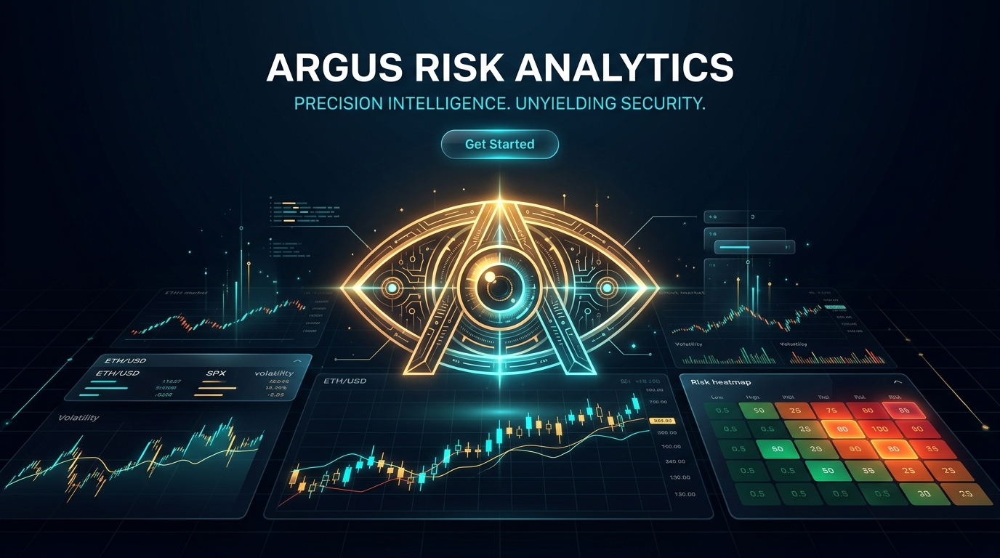
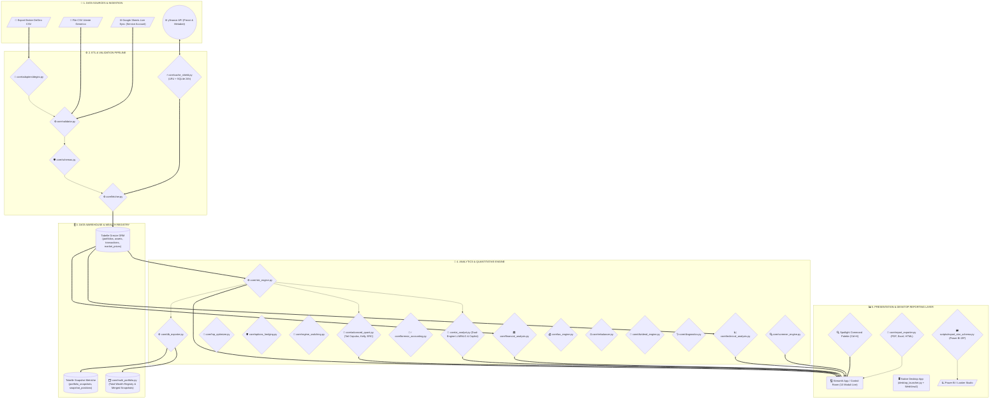

# ARGUS - Risk Analytics Platform




-brightgreen)


---

## 📌 Panoramica del Progetto

**ARGUS** — il cui nome si ispira al mito dell'osservatore dai cento occhi che vede tutto e non dorme mai — è una piattaforma integrata di **Business Intelligence, Financial Valuation, Forensic Accounting, AI Narrative Intelligence e Quantitative Risk Management**. Progettata con un'interfaccia ad alta densità informativa di livello istituzionale, la soluzione offre un ecosistema avanzato per la diagnosi contabile, la profilazione del rischio e la protezione strategica di portafogli d'investimento multi-asset (*Equity, ETF, Fixed Income, Crypto e Cash*).

Sviluppata come soluzione di punta per l'analisi di Finanza Quantitativa, **ARGUS** converte registri di negoziazione eterogenei (file CSV generici, esportazioni native da broker quali DeGiro, Directa, Fineco, Interactive Brokers, Trade Republic, Scalable Capital e sincronizzazioni live da **Google Sheets** con estrazione duale separata di *Stocks & Crypto*) in un framework analitico strutturato. La piattaforma integra:
* **Superficie di Volatilità Implicita 3D, Skew & Smile Calibration per Black-Scholes Hedging**: Risolutore numerico Newton-Raphson con fallback a Brent per l'inversione di Black-Scholes ($BS(S, K, T, r, \sigma_{\text{IV}}) = P_{\text{mkt}}$), calibrazione parametrica di Volatility Skew e Smile in funzione del log-moneyness $m = \ln(K / S)$ ($\sigma_{\text{IV}}(m) = a + b \cdot m + c \cdot m^2$), modellazione della superficie 3D $(K \times T \to \text{IV})$ e dimensionamento realistico del costo di Delta-Hedging con opzioni Put e strategie Covered Call.
* **Volatilità Condizionale GARCH(1,1) & Filtered Historical Simulation (FHS)**: Modellazione econometrica avanzata dei cluster di volatilità (Bollerslev 1986) con stima MLE dei parametri $\omega, \alpha, \beta$, persistenza, varianza di lungo periodo $V_L$ e Half-Life di riassorbimento degli shock. Calcolo di VaR e CVaR a code spesse tramite Filtered Historical Simulation (Hull-White 1998, Barone-Adesi 1999) con de-volatilizzazione dei residui empirici e proiezione della struttura a termine della volatilità a 30 giorni conforme agli standard Basel III / FRTB.
* **Multi-Broker Ingestion Hub & Auto-Detector**: Importazione automatica, riconoscimento istantaneo del formato senza configurazione manuale e normalizzazione da tutti i principali intermediari italiani ed internazionali (**Directa SIM**, **Fineco Bank**, **Interactive Brokers / IBKR**, **Trade Republic**, **Scalable Capital / Baader Bank**, **DeGiro**), con risolutore ISIN a 3 livelli (in-memory cache, `config.json` persistente e Yahoo Finance live lookup) e pulizia trasparente di formati numerici con virgola/punto e date internazionali.
* **Corporate Actions & Stock Split Engine**: Rilevazione automatica e manuale di frazionamenti azionari (*Forward Split*, es. NVDA 10:1, AAPL 4:1), raggruppamenti (*Reverse Split*) e dividendi in azioni con rettifica retroattiva dei lotti fiscali e contabili della coda FIFO, garantendo la rigorosa invarianza del valore fiscale totale ($Q \times P = \text{Cost Basis}$) secondo il TUIR Art. 67 e gli standard IFRS/US GAAP.
* **Curva Tassi Privi di Rischio Dinamica & Multi-Valuta**: Calibrazione automatica e real-time del tasso risk-free ($R_f$) in base alla valuta base di portafoglio (**EUR** con BCE €STR via `XEON.DE`, **USD** con US 3M Treasury Bill via `^IRX`, **GBP** con BoE SONIA via `CSH2.L`, **CHF** con SNB SARON), con supporto ad override manuale e propagazione istantanea su Sharpe Ratio, Sortino Ratio, Jensen's Alpha, Treynor Ratio, Black-Scholes Delta-Hedging, Cost of Capital WACC e Kelly Position Sizing.
* **Infrastruttura Data Warehouse Duale & Total Wealth Hub**: Storicizzazione relazionale duale su MySQL 8.0 e SQLite locale (`data/argus_local.db`), gestione multi-valuta (EUR, USD, GBP, CHF) e **Total Wealth Hub Multi-Portafoglio** per salvare, confrontare e consolidare profili distinti (*Crescita, Dividendi, Previdenza, Crypto*) in un unico Master Portfolio unificato con fusione ponderata delle serie storiche dei rendimenti, stima esatta della durata solare (standard GIPS / CFA Institute) e decomposizione del rischio di componente.
* **Dual Google Sheets Pipeline (Stocks + Crypto)**: Connessione crittografata tramite Google Service Account con estrazione parallela e separazione nativa a livello di database dei fogli `History B/S Stocks` e `History B/S Crypto`, normalizzazione automatica dei tassi di cambio multi-valuta (EUR/USD/GBP) e mappatura dei ticker crypto (`BTC-EUR`, `ETH-EUR`, `SOL-EUR`, ecc.).
* **Database & Memory Storage Cockpit**: Monitoraggio in tempo reale dell'occupazione fisica dei database SQLite/MySQL, della memoria RAM (RSS) del processo, grafico Donut della ripartizione dello storage e strumenti di manutenzione 1-click (*VACUUM compattazione disco, pulizia cache scaduta TTL 24h, rigenerazione indici B-Tree e test PRAGMA integrity*).
* **Posizioni Chiuse & Graveyard Analytics**: Tracciamento contabile FIFO integrale delle operazioni chiuse con **Curva Cumulativa di PnL Realizzato (€)**, **High-Water Mark (Picco)**, telemetria di trade drawdown, **Trading Calendar & Heatmap Mensile** (matrice Mese $\times$ Anno) e scomposizione per settore GICS e asset class.
* **Fisco Italiano & Tax-Loss Harvesting Wizard (TUIR Art. 67)**: Modulo per la massimizzazione dell'efficienza fiscale con **Strategia Step-Up a 0€ imposte** (vendita e riacquisto immediato di titoli in utile su *Redditi Diversi* per azzerare le minusvalenze pregresse dello Zainetto Fiscale in scadenza quadriennale) e **Strategia Tax-Loss Harvesting** su posizioni in perdita latente.
* **Motore Quantitativo & Portfolio Engineering di Frontiera**: Risoluzione analitica della Frontiera Efficiente di Markowitz affiancata da stimatori *Ledoit-Wolf Shrinkage*, **Equal Risk Contribution (ERC / Parità di Rischio Pura)**, **Dipendenza di Coda Asimmetrica con Tail Copulas (Clayton & Gumbel)** per rilevare il rischio di crash congiunto non lineare, **Simulatore Interattivo Trade-Level Kelly Criterion & Half-Kelly Position Sizing** (pre-popolato con Win Rate e Payoff Ratio reali del Graveyard), **Live Rebalancing Sandbox** interattivo, allocazione mediante Machine Learning con **Hierarchical Risk Parity (HRP - Marcos López de Prado)**, copertura analitica con **Black-Scholes (1973)** con calcolo dei 5 Greci e Delta-Hedging con opzioni Put, generazione di rendimento passivo con *Covered Call Yield Enhancer*, modelli econometrici a 3 fattori di Fama-French (con regressione OLS multivariata), Carhart a 4 fattori, modello macro-fattoriale *MSCI Barra a 5 fattori ortogonalizzati*, simulazioni stocastiche *Merton Jump-Diffusion*, classificazione di regime macro con **Market Regime Switching (3-State Markov Model)**, rilevatore di anomalie di mercato via *Machine Learning Isolation Forest* e proiezioni stocastiche *Monte Carlo* (con decomposizione di Cholesky e distribuzioni *Student-t* a code grasse).
* **AI & LLM Narrative Intelligence (ARGUS AI Analyst & Copilot)**: Motore di sintesi narrativa automatica a due livelli (**LLM Online** con Google Gemini / OpenAI e **NLG Deterministico Offline 100%**) per generare Executive Memorandum istituzionali e rispondere in tempo reale a domande complesse sul portafoglio via chat interattiva.
* **Financial Statement & Forensic Accounting**: Suite completa per la valutazione della solvibilità e del valore intrinseco aziendale mediante modelli *Altman Z-Score*, decomposizione *DuPont a 5 fattori*, *Piotroski F-Score (9pt)*, **Contabilità Forense Beneish M-Score (1999)** a 8 indici econometrici per il rilevamento di frodi contabili e manipolazione degli utili, **Sloan Accrual Ratio (1996)** per la qualità dei flussi di cassa, stima del *WACC (CAPM)*, *DCF stocastico a due stadi* e classificatore *Random Forest Distress Risk*.
* **Interfaccia Istituzionale & Spotlight Command Palette (`Ctrl+K`)**: Modalità di esecuzione rapida, **Spotlight Command Palette** integrata per ricerca globale istantanea su tutti i 10 moduli, oltre 30 sottomoduli, ticker e comandi di sistema, comparatore **Multi-Benchmark Overlay** fino a 4 indici contemporanei con scorecard di Alpha e Sharpe, e architettura *Zero-Recalc* con reattività istantanea.

---

## 🚀 Caratteristiche Chiave & Moduli Operativi (10 Pagine)

### 0. 🎛️ Control Room & Total Wealth Hub (`src/0_Control_Room.py`)
* **Multi-Broker Ingestion Hub**: Ingestione universale con auto-rilevamento (**Auto-Detect**) per CSV Standard, DeGiro, Directa SIM, Fineco Bank, Interactive Brokers (IBKR), Trade Republic e Scalable Capital. Include modale con guida export passo-passo per ciascun broker.
* **Total Wealth Hub (Multi-Account)**: Salvataggio di profili di portafoglio distinti per strategia (*Growth*, *Dividendi*, *Previdenza*, *Crypto*), caricamento rapido 1-click (`📂 Carica`), scorecard comparativa affiancata e **Consolidamento automatico in Master Wealth Portfolio** con fusione ponderata delle serie storiche dei rendimenti su oltre 5.000 osservazioni giornaliere, calcolo esatto del CAGR ancorato alla durata temporale solare e ottimizzazione Markowitz Ledoit-Wolf integrata.
* **Dual Pipeline Google Sheets Live**: Ingestione simultanea e separata di `History B/S Stocks` e `History B/S Crypto`, conversione multi-valuta e creazione automatica dei portafogli dedicati con persistenza locale e su MySQL.
* **Database & Memory Storage Cockpit**: Dashboard diagnostica con 4 KPI superiori (*Stato Piattaforma*, *Storage Totale Disco*, *RAM Processo*, *Cache Shield*), grafico Donut Plotly di ripartizione dello storage per tabella e file, e pulsanti di manutenzione 1-click (*VACUUM & Compatta DB*, *Pulisci Cache Scaduta TTL > 24h*, *Rigenera Indici B-Tree*).
* **Selezione Database & Multi-Valuta**: Switch dinamico tra database (`investment_risk_bi` vs `wealth`), modalità Offline in-memory e selezione valuta base (EUR, USD, GBP, CHF).
* **Diagnostica di Sistema & Multi-Tier Caching**: Monitoraggio in tempo reale delle latenze dei 26 motori computazionali e dello scudo anti-rate limit della cache locale SQLite.

### 1. 📈 Dashboard Generale & AI Analyst (`src/pages/1_📈_Dashboard_Generale.py`)
* **🧠 ARGUS AI Analyst (Executive Memorandum)**: Diagnosi narrativa strutturata in 4 sezioni (*Sintesi Esecutiva*, *Profilo di Rischio*, *Regime Macro*, *Raccomandazioni Tattiche*) con architettura dual-engine (Gemini / OpenAI API / NLG Deterministico Offline).
* **💬 ARGUS Quant Copilot**: Chatbot interattivo integrato con chip di scelta rapida per interrogare l'AI su VaR, Sharpe, ribilanciamento e titoli in portafoglio.
* **Executive Cockpit & Badges Istituzionali**: Sintesi quantitativa immediata, Radar Factor a 6 assi, PnL cumulato e conformità regolamentare.
* **Dynamic Multi-Benchmark Overlay & Scorecard**: Confronto simultaneo del portafoglio contro fino a 4 benchmark personalizzati (SPY, QQQ, ACWI, AGG, GLD, BTC) con tabella analitica comparativa (CAGR, Volatilità, Sharpe, Max Drawdown, Alpha).
* **Centro Esportazione Report**: Download in-memory di Factsheet PDF a 2 pagine, Workbook Excel multi-tab, Report HTML Standalone e pacchetto Star Schema ZIP per Power BI.

### 2. 🔴 Analisi del Rischio & Rilevamento Anomalie (`src/pages/2_🔴_Analisi_Rischio.py`)
* **Volatilità Condizionale GARCH(1,1) & FHS**: Calibrazione MLE per la varianza condizionale $\sigma_t^2 = \omega + \alpha \epsilon_{t-1}^2 + \beta \sigma_{t-1}^2$, bande dinamiche di VaR, stima della persistenza e Half-Life dello shock, curva di Term Structure a 30 giorni e simulazione storica filtrata (FHS).
* **Value at Risk (VaR) & Expected Shortfall (CVaR)**: Stima analitica della perdita massima (VaR) e della perdita media nello scenario peggiore (CVaR al 95% e 99%) nelle metodologie Storica, Parametrica, Cornish-Fisher e FHS.
* **Validazione Regolamentare VaR (Kupiec POF Backtest)**: Backtest su 252 giorni di negoziazione con classificazione a semaforo dell'Accordo di Basilea (*Verde/Giallo/Rosso*).
* **Market Regime Switching (3-State Markov Model)**: Identificazione statistica dello stato macroeconomico del mercato (Bull Low-Vol, Range-Bound, Crisis High-Vol) basato su volatilità e rendimenti rolling a 21 giorni.
* **Rilevatore di Anomalie ML Isolation Forest**: Algoritmo non supervisionato per identificare giornate di panico, rotture di correlazione (*Correlation Breakdown*) e code di rischio non lineari.
* **Correlazioni, Liquidità & ATR Chandelier**: Matrice di correlazione interattiva, analisi Average Daily Volume (ADV) e Stop-Loss dinamici Chandelier ($3 \times ATR_{14}$).

### 3. 🔬 Modelli Quantitativi di Frontiera & Live Sandbox (`src/pages/3_🔬_Modelli_Quantitativi.py`)
* **🧬 Asymmetric Tail Copula Models (Clayton & Gumbel)**: Calcolo della dipendenza di coda inferiore ($\lambda_L$) e superiore ($\lambda_U$) per identificare il rischio di contagio e crollo simultaneo non lineare durante i panic selling di mercato, con allerta per coppie ad elevata asimmetria ($\lambda_L \ge 0.30$).
* **🎯 Simulatore Interattivo Trade Sizing (Kelly Criterion)**: Calcolo matematico dell'allocazione ottima continua e discreta con raccomandazione *Half-Kelly ($f^*/2$)* per massimizzare la crescita geometrica azzerando il rischio di rovina, pre-popolato automaticamente con Win Rate % e Payoff Ratio reali del Graveyard e dimensionamento monetario esatto sullo Stop-Loss.
* **⚖️ Equal Risk Contribution (ERC / Risk Parity Pura)**: Ottimizzazione non lineare SLSQP dove ciascun asset contribuisce esattamente per $1/N$ alla volatilità complessiva di portafoglio.
* **Live Rebalancing Sandbox (What-If Weight Matrix)**: Simulatore in tempo reale con slider e preset istituzionali (*⭐ Pesi Attuali*, *⚖️ Equipesato 1/N*, *🏆 Max Sharpe*, *🛡️ Minima Volatilità*, *🧬 Equal Risk ERC*) per calcolare istantaneamente le variazioni $\Delta R$, $\Delta\sigma$, $\Delta\text{VaR}_{95}$ e $\Delta\text{Sharpe}$ con grafico a barre comparative.
* **Hierarchical Risk Parity (HRP - Marcos López de Prado 2016)**: Ottimizzazione del portafoglio basata su Machine Learning, Tree Clustering e Bisezione Ricorsiva con matrice di distanza $D_{i,j} = \sqrt{(1 - \rho_{i,j})/2}$.
* **Modello Analitico Black-Scholes (1973) & Greci**: Prezzatura di opzioni Call/Put europee, calcolo dei 5 Greci ($\Delta, \Gamma, \Theta, \text{Vega}, \rho$), Put Delta-Hedging per immunizzare il Beta e Covered Call Yield Enhancer per generare rendimento extra.
* **Simulatore Stocastico Merton Jump-Diffusion**: Modellizzazione con Moto Browniano Geometrico e shock di salto di Poisson ($N_t \sim \text{Poisson}(\lambda dt)$) per quantificare il rischio di crollo estremo.
* **Monte Carlo Fan Chart**: Proiezione stocastica fino a 3 anni (756 giorni) con 10.000 traiettorie con decomposizione di Cholesky e supporto per code grasse (Student-t con $\nu=5$).
* **Fattori Fama-French, Carhart & MSCI Barra a 5 Fattori**: Decomposizione del rendimento su fattori ortogonalizzati via Gram-Schmidt per azzerare la multicollinearità.

### 4. 📋 Posizioni, Contabilità FIFO & Fiscalità TUIR (`src/pages/4_📋_Posizioni_e_Dettagli.py`)
* **Motore Contabile FIFO (`_fifo_engine`)**: Calcolo deterministico del Weighted Average Cost Price (WACP) e separazione analitica tra PnL realizzato e non realizzato.
* **🪦 Posizioni Chiuse & Graveyard Cockpit Multi-Prospettiva**:
  - *Curva Cumulativa PnL Realizzato (€)* con High-Water Mark di picco e telemetria di trade drawdown.
  - *Trading Calendar & Heatmap Mensile*: Matrice Mese $\times$ Anno con totale annuo e codice colore dinamico.
  - *Scomposizione Settori GICS & Asset Class*: Analisi aggregata del profitto monetario e del Win Rate per settore.
  - *Registro Lotti Chiusi FIFO Log*: Dettaglio cronologico di ciascuna operazione con holding period e prezzo di carico/scarico.
* **💰 Tax-Loss Harvesting & Step-Up Wizard (TUIR Art. 67)**:
  - *Strategia Step-Up Fiscale a 0€ Imposte*: Individua i titoli in guadagno su *Redditi Diversi* (azioni singole, bond, ETC) e calcola le quote da vendere e ricomprare per azzerare le minusvalenze dello Zainetto Fiscale in scadenza senza pagare tasse, alzando il prezzo di carico a zero imposte e risparmiando il 26% sulle plusvalenze future.
  - *Strategia Tax-Loss Harvesting*: Rileva le perdite latenti da monetizzare per abbattere le imposte dell'anno in corso.
* **Smart Rebalancer**: Generatore di ordini operativi ad azioni intere per allineare il portafoglio ai pesi target con gestione del buffer di liquidità.
* **Calendario & Previsione Flusso Dividendi**: Dividend Yield medio di portafoglio, storico reale e calendario mensile degli incassi stimati per azienda.

### 5. 🏛️ Analisi dei Bilanci, Valutazione & Contabilità Forense (`src/pages/5_🏛️_Valutazione_Aziendale.py`)
* **Beneish M-Score (1999)**: Modello econometrico a 8 indici (DSRI, GMI, AQI, SGI, DEPI, SGAI, LVGI, TATA) per rilevare manipolazioni contabili (soglia critica $M > -1.78$).
* **Sloan Accrual Ratio (1996)**: Analisi della qualità dell'utile netto rispetto ai flussi di cassa operativi reali per isolare gli utili artificiali.
* **Altman Z-Score Model (1968)**: Previsione del rischio di fallimento a 24 mesi (*Safe Z > 2.99*, *Grey 1.81–2.99*, *Distress Z < 1.81*).
* **Diagnostica Predittiva ML (Random Forest Distress Classifier)**: Classificatore ensemble sui ratio finanziari per stimare la probabilità di default.
* **Scomposizione DuPont (3 e 5 Fattori)** & **Piotroski F-Score (9pt Stanford)**.
* **Valutazione Intrinseca DCF Monte Carlo (2-Stage)** & **WACC CAPM**.
* **Consultazione Bilanci Ufficiali 10-K** & **Comparativa Multiaziendale** con grafici Radar e multipli di settore.

### 6. 🌪️ Stress Testing & Scenari di Crisi (`src/pages/6_🌪️_Stress_Testing.py`)
* **MSCI Barra Multi-Scenario Matrix**: Stima delle perdite in € e % simulando i 5 grandi shock storici (*Dot-Com 2000*, *Lehman 2008*, *US Downgrade 2011*, *COVID-19*, *Rate Shock 2022*).
* **Beta Shock Waterfall & Macro Scenario Builder**: Simulazione interattiva su shock tassi ($\Delta r$), cambi ($\Delta\text{FX}$), materie prime ($\Delta\text{Commodity}$) ed equity.
* **Superficie 3D di Rischio (Plotly Surface)**: Mappatura tridimensionale interattiva dell'impatto combinato di shock congiunti.

### 7. 📊 Analisi Temporale & Storicizzazione Multi-Snapshot (`src/pages/7_📊_Analisi_Temporale.py`)
* **Time Series Multi-Snapshot**: Evoluzione temporale del controvalore di portafoglio, del capitale investito e delle metriche di rischio tra snapshot storici.
* **Matrice dei Delta ($\Delta$)**: Confronto analitico affiancato tra due punti temporali qualsiasi con calcolo del tasso di risparmio e apporti di liquidità.

### 8. 📈 Analisi Tecnica Quantitativa & Volume Profile (`src/pages/8_📈_Analisi_Tecnica.py`)
* **Indicatori Algoritmici**: Medie Mobili (EMA 20, EMA 50, SMA 200 con Golden/Death Cross), MACD, RSI 14, Bande di Bollinger con **Bollinger Squeeze Detection**, ATR 14 e ADX 14.
* **Volume Profile (POC, VAH, VAL)**: Distribuzione orizzontale dei volumi sul grafico con evidenziazione del Point of Control (POC) e della Value Area (70% del volume totale).
* **Candlestick Pattern Recognition**: Rilevamento automatico di pattern (*Bullish/Bearish Engulfing*, *Hammer*, *Shooting Star*, *Doji*).
* **Technical Confluence Score Card (0-100)**: Score ponderato su 5 driver tecnici con verdetto tattico (*Strong Buy* $\rightarrow$ *Strong Sell*) e allineamento trend multi-timeframe (1D vs 1W).

### 9. 🔍 Screener Quantitativo & Pre-Trade Simulator (`src/pages/9_🔍_Screener_Opportunita.py`)
* **Asset Discovery Multi-Fattoriale**: Esplorazione quantitativa di universi globali (*US Mega Caps S&P 100*, *EuroStoxx 50*, *FTSE MIB Leaders*, *Dividend Aristocrats*, *Disruptive Tech*, *Custom*) su Valutazione, Qualità Contabile, Rischio e Momentum.
* **Archetipi Quantitativi Istituzionali**: Filtri 1-click basati su stili di gestione (*GARP*, *Dividend Fortress*, *Deep Value*, *Low Volatility*, *Momentum Breakout*).
* **Pre-Trade Portfolio Impact Simulator**: Simulazione *What-If* dell'impatto di un nuovo acquisto sulla frontiera di rischio del portafoglio reale prima dell'esecuzione a mercato ($\Delta\text{CAGR}$, $\Delta\sigma$, $\Delta\text{Sharpe}$, $\Delta\text{Beta}$, $\Delta\text{Diversification Ratio}$).
* **Confronto Radar Head-to-Head & Factsheet PDF One-Pager**: Confronto grafico a 6 dimensioni fino a 4 titoli ed esportazione immediata di Factsheet PDF istituzionale ad alta risoluzione per qualsiasi asset analizzato.

---

## 🏛️ Architettura di Runtime del Sistema



---

## 📂 Struttura del Repository

```text
argus-risk-analytics/
├── .github/                     # Workflows di CI/CD e Release automatizzata
│   ├── workflows/
│   │   ├── ci.yml
│   │   ├── deploy-pages.yml
│   │   └── release.yml
├── config/                      # Configurazione e mapping ISIN-Ticker
│   └── config.json
├── core/                        # Engine quantitativo, calcoli di rischio e moduli istituzionali
│   ├── adapters/                # Adapter per broker esterni (DeGiro)
│   │   ├── __init__.py
│   │   └── degiro.py
│   ├── advanced_quant.py        # Tail Copulas, Kelly Criterion & Equal Risk Contribution (ERC)
│   ├── advisor.py               # ARGUS Quant Advisor & Health Score Engine
│   ├── ai_analyst.py            # AI & LLM Narrative Intelligence (Gemini/OpenAI & NLG Offline)
│   ├── attribution.py           # Brinson-Fachler Performance Attribution
│   ├── cache_shield.py          # Multi-Tier LRU & SQLite Rate-Limit Shield (yfinance)
│   ├── closed_trades.py         # Graveyard, FIFO Closed Trades Journal & Tax Step-Up Analytics
│   ├── db_exporter.py           # Layer di storicizzazione snapshot su DB (MySQL & SQLite)
│   ├── diagnostics.py           # System Diagnostics, Storage Cockpit & Maintenance
│   ├── dividend_engine.py       # Cash Flow Forecast & Dividend Calendar
│   ├── excel_generator.py       # Modello tattico Excel What-If
│   ├── exporter.py              # Esportatore CSV denormalizzati
│   ├── fetcher.py               # Download dati storici yfinance & conversione valute
│   ├── financial_analysis.py    # Altman Z-Score, DuPont, Piotroski, WACC, DCF Monte Carlo
│   ├── forensic_accounting.py   # Beneish M-Score (1999) & Sloan Accrual Ratio (1996)
│   ├── hedging.py               # Copertura Beta-Neutral & Tail Risk Protection
│   ├── hrp_optimizer.py         # Hierarchical Risk Parity (HRP - Marcos López de Prado)
│   ├── html_exporter.py         # Exporter Report Standalone HTML
│   ├── models.py                # Schema ORM SQLAlchemy (MySQL & SQLite)
│   ├── multi_portfolio.py       # Total Wealth Multi-Account Registry, Scorecard & Consolidator
│   ├── options_hedging.py       # Black-Scholes 1973, 5 Greci, Delta-Hedging & Covered Call
│   ├── pdf_generator.py         # Exporter Factsheet PDF (ReportLab)
│   ├── rebalancer.py            # Smart Rebalancer & Generatore Ordini
│   ├── regime_switching.py      # Market Regime Switching (3-State Markov Model)
│   ├── report_exporter.py       # Manager Centralizzato Esportazione Report
│   ├── risk_engine.py           # Motore FIFO, VaR Cornish-Fisher, Kupiec, Markowitz, MC
│   ├── risk_limits.py           # Early Warning System & Controlli di Rischio UCITS/MiFID
│   ├── schemas.py               # Data Contracts & Validazione Pydantic
│   ├── screener_engine.py       # Screener Quantitativo Multi-Fattoriale & Pre-Trade Simulator
│   ├── sidebar.py               # Navigation Rail v5.5.0, Execution Mode & Spotlight Search
│   ├── tax_engine.py            # Ottimizzazione Fiscale TUIR Art. 67 & Tax-Loss Harvesting Wizard
│   ├── technical_analysis.py    # Motore Analisi Tecnica, Volume Profile & Confluenza
│   ├── ui_utils.py              # Helper Grafici Plotly, Modali Informativi & Componenti UI
│   ├── validator.py             # Pipeline di Bonifica & Normalizzazione Dati
│   └── workspace_manager.py     # State Manager, Routing Dinamico & URL State Sync
├── data/                        # Dataset di input & database SQLite fallback
│   ├── portfolio_transactions_realistic.csv # Dataset realistico multi-asset multi-valuta (EUR, USD, GBP, CHF)
│   └── .gitkeep
├── docker/                      # File di containerizzazione Docker
│   └── Dockerfile
├── docs/                        # Documentazione Tecnica & Specifica Architetturale
│   ├── CSV_Format_Specification.md # Specifica tecnica formato CSV & DeGiro
│   ├── DESIGN.md                # Design System & UI Specs
│   ├── FLOWCHART.md             # Diagramma di Flusso ETL a 5 Livelli
│   ├── PROJECT_HANDOFF.md       # Documento di Consegna & Handoff Tecnico
│   ├── argus-architecture.html  # Diagramma Architetturale HTML Standalone
│   ├── argus-architecture.json  # Specifica Architetturale JSON IR
│   ├── argus_banner.jpg         # Banner grafico del progetto
│   ├── argus_icon.ico           # Asset icona Occhio di Argus
│   └── metriche_rischio.md      # Manuale Matematico ed Econometrico completo (40 Sezioni)
├── exports/                     # Cartella di destinazione report esportati (.xlsx, .pdf, .zip)
│   └── .gitkeep
├── gsheets_sync_subproject/     # Sub-servizio Sincronizzazione ETL Google Sheets
│   ├── run_daily_scheduler.py   # Schedulatore cron giornaliero
│   └── sync_google_sheets.py    # Pipeline ETL Google Sheets con iniezione dati
├── notebooks/                   # Jupyter Notebooks di prototyping quantitativo
│   └── test_pipeline.ipynb
├── scripts/                     # Script di Build, Schema SQL e Pacchettizzazione
│   ├── DB.sql                   # Schema DDL Data Warehouse MySQL 8.0
│   ├── build_desktop_app.py     # Automazione compilazione PyInstaller (.exe)
│   ├── create_desktop_shortcut.py # Generatore collegamento Desktop con icona (.lnk)
│   ├── export_star_schema.py    # Generatore pacchetto ZIP Star Schema per Power BI
│   ├── generate_excel_model.py  # Generatore standalone modello Excel
│   ├── generate_icon.py         # Generatore icona ICO multi-risoluzione
│   ├── package_release.py       # Pacchettizzatore Release ZIP
│   └── test_run.py              # Script di esecuzione e verifica rapida
├── src/                         # Codice sorgente dell'applicazione Streamlit (10 Moduli)
│   ├── 0_Control_Room.py        # Entry point principale, Total Wealth Hub & Control Room
│   └── pages/                   # Moduli e viste (1..9) della dashboard
│       ├── 1_📈_Dashboard_Generale.py
│       ├── 2_🔴_Analisi_Rischio.py
│       ├── 3_🔬_Modelli_Quantitativi.py
│       ├── 4_📋_Posizioni_e_Dettagli.py
│       ├── 5_🏛️_Valutazione_Aziendale.py
│       ├── 6_🌪️_Stress_Testing.py
│       ├── 7_📊_Analisi_Temporale.py
│       ├── 8_📈_Analisi_Tecnica.py
│       └── 9_🔍_Screener_Opportunita.py
├── tests/                       # Test suite automatizzata PyTest (110 Test)
│   ├── test_adapters.py
│   ├── test_advanced_quant.py
│   ├── test_advisor.py
│   ├── test_ai_analyst.py
│   ├── test_attribution.py
│   ├── test_backtest.py
│   ├── test_black_litterman_fama_french.py
│   ├── test_cache_shield_and_diagnostics.py
│   ├── test_closed_trades.py
│   ├── test_custom_stress.py
│   ├── test_diversification.py
│   ├── test_enhancements.py
│   ├── test_excel.py
│   ├── test_financial_analysis.py
│   ├── test_forensic_accounting.py
│   ├── test_frontend_smoke.py
│   ├── test_gsheets_sync.py
│   ├── test_hedging_attribution_limits.py
│   ├── test_history_analytics.py
│   ├── test_hrp_optimizer.py
│   ├── test_html_exporter.py
│   ├── test_kmeans_elbow.py
│   ├── test_merton_and_isolation_forest.py
│   ├── test_ml_and_3d_features.py
│   ├── test_monte_carlo_ui.py
│   ├── test_multi_portfolio.py
│   ├── test_new_quant_features.py
│   ├── test_optimization.py
│   ├── test_quant_tax_graveyard_enhancements.py
│   ├── test_rebalancer_and_advisor.py
│   ├── test_regime_and_options.py
│   ├── test_risk_engine.py
│   ├── test_screener_engine.py
│   ├── test_tax_engine.py
│   ├── test_tax_engine_edge_cases.py
│   ├── test_technical_analysis.py
│   ├── test_validator.py
│   ├── test_var_backtest.py
│   ├── test_var_cvar.py
│   ├── test_var_lookback.py
│   └── test_workspace_manager.py
├── .env.example                 # Esempio configurazione variabili d'ambiente
├── CODE_OF_CONDUCT.md           # Codice di Condotta
├── CONTRIBUTING.md              # Guida ai contributi
├── LICENSE.md                   # Licenza Open Source MIT
├── README.md                    # Documentazione Principale del Progetto
├── SECURITY.md                  # Politica di Sicurezza
├── app.py                       # Launcher alias per l'applicazione Streamlit
├── desktop_launcher.py          # Entry point nativo Desktop App (PyWebView + Edge WebView2)
├── docker-compose.yml           # Configurazione Docker Compose (App + MySQL 8.0)
├── pyproject.toml               # Configurazione tool (PyTest, Ruff)
├── requirements.txt             # Dipendenze Python
├── setup_desktop.bat            # Script di setup 1-Click per ambiente Desktop Windows
├── start_dashboard.bat          # Script d'avvio rapido per Windows
└── start_dashboard.sh           # Script d'avvio per Linux/macOS
```

---

## 🧪 Esecuzione della Test Suite Automatizzata

Il progetto include **110 test automatizzati PyTest** con copertura end-to-end del 100%:

```bash
py -m pytest
```

Output atteso:
```text
============================= 110 passed in ~7.00s =============================
```

---

## 📄 Licenza

Questo progetto è distribuito sotto licenza open-source **MIT License**. Consulta il file [LICENSE.md](LICENSE.md) per i dettagli.

---

*ARGUS — Institutional Risk Intelligence, AI Analytics & Portfolio Platform v5.5.0.*
