# Diagramma di Flusso e Architettura del Sistema: ARGUS Risk Analytics

Il flusso di elaborazione di **ARGUS Risk Analytics Platform** segue un'architettura **Data Pipeline / ETL** professionale, articolata in **5 livelli (Layers)** distinti e disaccoppiati. Questa struttura garantisce modularità, scalabilità e perfetta separazione delle responsabilità tra validazione dei dati, calcolo quantitativo, analisi fondamentale di bilancio, persistenza su database relazionale e visualizzazione multilivello.

---

## 🗺️ Diagramma di Flusso Generale (Mermaid)

```mermaid
flowchart TD
    %% -------------------------------------
    %% STYLING (Colori, bordi, font)
    %% -------------------------------------
    classDef source fill:#E1F5FE,stroke:#0288D1,stroke-width:2px,color:#01579B,rx:10,ry:10,font-weight:bold
    classDef script fill:#E8F5E9,stroke:#388E3C,stroke-width:2px,color:#1B5E20,rx:5,ry:5,font-weight:bold
    classDef engine fill:#FFF3E0,stroke:#F57C00,stroke-width:2px,color:#E65100,rx:5,ry:5,font-weight:bold
    classDef storage fill:#ECEFF1,stroke:#607D8B,stroke-width:3px,color:#263238,font-weight:bold
    classDef frontend fill:#F3E5F5,stroke:#8E24AA,stroke-width:2px,color:#4A148C,rx:10,ry:10,font-weight:bold

    %% -------------------------------------
    %% NODI E SUBGRAPHS (Architettura a 5 Livelli)
    %% -------------------------------------
    subgraph Layer1 ["📡 1. DATA SOURCES & INGESTION"]
        direction TB
        CSV[/"📄 File CSV Utente Generico"/]:::source
        DEGIRO[/"📄 Export Broker DeGiro CSV"/]:::source
        GSHEETS[/"🌐 Google Sheets Live Dual Sync (Stocks & Crypto)"/]:::source
        YF(("🌐 yfinance API (Prezzi & Metadati)")):::source
    end

    subgraph Layer2 ["⚙️ 2. ETL & VALIDATION PIPELINE"]
        direction TB
        ADAPT{"🔌 core/adapters/degiro.py\n(DeGiro Parser)"}:::script
        VAL{"⚙️ core/validator.py\n(Cleaning & Normalization)"}:::script
        SCH{"🛡️ core/schemas.py\n(Pydantic Data Contracts)"}:::script
        FETCH{"⚙️ core/fetcher.py\n(Market & FX Enrichment)"}:::script
        CACHE{"⚡ core/cache_shield.py\n(Multi-Tier LRU & SQLite Cache Shield)"}:::script
    end

    subgraph Layer3 ["🗄️ 3. DATA WAREHOUSE (MySQL / SQLite)"]
        direction TB
        DB_RAW[("Tabelle Grezze ORM\n(portfolios, assets, transactions, market_prices)")]:::storage
        DB_SNAP[("Tabelle Snapshot Metriche\n(portfolio_snapshots, snapshot_positions)")]:::storage
    end

    subgraph Layer4 ["🧠 4. ANALYTICS & QUANTITATIVE ENGINE"]
        direction TB
        RE{"⚙️ core/risk_engine.py\n(FIFO Basis, VaR Cornish-Fisher, Kupiec Test,\nLedoit-Wolf SLSQP, Black-Litterman, Carhart 4-Factor,\nMSCI Barra 5-Factor, Merton Jump-Diffusion,\nATR Chandelier Exits, 3D Stress Surface, Almgren-Chriss, Cholesky MC)"}:::engine
        TERM_ENG{"🖥️ core/terminal_engine.py\n(Desk Risk Limits, Pre-Trade Circuit Breakers,\nOMS Blotter TWAP/VWAP Slicing, Intraday PnL Attribution,\nRelative Performance Overlay & Macro Catalysts)"}:::engine
        AI_ANL{"🧠 core/ai_analyst.py\n(Dual-Engine AI Analyst Memorandum & Copilot)"}:::engine
        ADV_Q{"🧬 core/advanced_quant.py\n(Asymmetric Tail Copulas, Kelly Sizing, ERC)"}:::engine
        MULTI{"🗂️ core/multi_portfolio.py\n(Total Wealth Multi-Portfolio Hub & Consolidator)"}:::engine
        HRP{"🧬 core/hrp_optimizer.py\n(Hierarchical Risk Parity ML,\nTree Clustering & Recursive Bisection)"}:::engine
        OPT{"🛡️ core/options_hedging.py\n(Black-Scholes 1973, 5 Greci,\nPut Delta-Hedging & Covered Call)"}:::engine
        REG{"🌊 core/regime_switching.py\n(Market Regime 3-State Markov Model)"}:::engine
        FORENSIC{"🕵️‍♂️ core/forensic_accounting.py\n(Beneish M-Score & Sloan Accruals)"}:::engine
        TA{"📈 core/technical_analysis.py\n(EMA/SMA, MACD, RSI 14, Bollinger Squeeze,\nVolume Profile POC/VAH/VAL, Candlestick Pattern Recognition,\nTechnical Confluence Score 0-100, Multi-Timeframe Trend)"}:::engine
        FIN{"🏛️ core/financial_analysis.py\n(Altman Z-Score, DuPont, Piotroski F-Score,\nWACC CAPM, DCF Monte Carlo, ML Isolation Forest Anomaly Detector, 10-K)"}:::engine
        DIAG{"🩺 core/diagnostics.py\n(Engine Latency Benchmark & Health Check)"}:::engine
        ADV{"🛡️ core/advisor.py\n(ARGUS Quant Advisor & Health Score)"}:::engine
        HEDGE{"🛡️ core/hedging.py\n(Beta-Neutral Hedging & Tail Protection)"}:::engine
        ATTR{"🎯 core/attribution.py\n(Brinson-Fachler Performance Attribution)"}:::engine
        LIMITS{"🚨 core/risk_limits.py\n(Risk Limits & Early Warning Engine)"}:::engine
        TAX{"💰 core/tax_engine.py\n(Tax Optimization & TUIR Art. 67 ETF Rules)"}:::engine
        REBAL{"⚖️ core/rebalancer.py\n(Smart Rebalancer & Order Generator)"}:::engine
        DIV{"📅 core/dividend_engine.py\n(Dividend Forecast & Company Cash Schedule)"}:::engine
        SCREENER{"🔍 core/screener_engine.py\n(Multi-Factor Asset Discovery, Quality/Value/Momentum,\nStrategy Presets & Pre-Trade Impact Simulator)"}:::engine
        DBEXP{"⚙️ core/db_exporter.py\n(Storicizzazione DB & Multi-Snapshot)"}:::script
    end

    subgraph Layer5 ["📊 5. PRESENTATION & DESKTOP REPORTING LAYER"]
        direction TB
        APP("💻 Streamlit App / Control Room (10 Moduli Live)"):::frontend
        DESK("🖥️ Native Desktop App\n(desktop_launcher.py + WebView2)"):::frontend
        EXE("📦 Standalone Executable\n(dist/ARGUS_Desktop/ARGUS.exe)"):::frontend
        REPEXP{"📄 core/report_exporter.py\n(PDF Factsheet, Excel & HTML)"}:::script
        STARZIP{"🗃️ scripts/export_star_schema.py\n(Power BI Star Schema ZIP Package)"}:::script
        RELZIP{"📦 scripts/package_release.py\n(GitHub Release ZIP Package)"}:::script
        BIEXP{"📤 core/exporter.py\n(Esportatore CSV Denormalizzati)"}:::script
        POWERBI[/"📈 Power BI / Looker Studio\n(Executive Dashboards)"/]:::frontend
    end

    %% -------------------------------------
    %% CONNESSIONI E FLUSSI (Routing)
    %% -------------------------------------
    DEGIRO ==>|Parse| ADAPT
    ADAPT --> VAL
    CSV ==>|Upload| VAL
    VAL --> SCH
    SCH --> FETCH
    YF <==>|Request Storici & Tassi FX| FETCH
    FETCH ==>|Insert IGNORE / SQLite| DB_RAW

    DB_RAW ==>|Query ORM| RE
    DB_RAW ==>|Query Fondamentali 10-K| FIN
    RE --> ADV
    RE --> REBAL
    RE --> DIV
    RE --> TAX
    RE --> ATTR
    RE --> LIMITS
    RE --> HEDGE
    RE -->|Genera Snapshot| DBEXP
    DBEXP ==>|Storicizza| DB_SNAP

    RE ==>|Session State Dataframes| APP
    FIN ==>|Valutazioni & Solvibilità| APP
    ADV ==>|Health Score & Alerts| APP
    REBAL ==>|Orders Table| APP
    DIV ==>|Company Cash Flow| APP
    RE ==>|Dati In-Memory| REPEXP
    RE ==>|Dati Denormalizzati| BIEXP

    REPEXP -->|Download PDF/Excel/HTML| APP
    BIEXP -->|Esporta CSV| POWERBI
    STARZIP -->|Import ZIP Schema| POWERBI
    DB_SNAP -.->|Direct Query SQL| POWERBI
```

---

## 🏛️ Descrizione Dettagliata dei 5 Livelli Architetturali

### 1. Data Sources & Ingestion
- **CSV Generico Utente**: File di input contenente le transazioni finanziarie storiche.
- **DeGiro Export Adapter**: File CSV nativo esportato dalla piattaforma DeGiro, parsato e convertito automaticamente nello schema standard del sistema via `core/adapters/degiro.py`.
- **yfinance API**: Fonte dati di mercato live per il recupero delle serie storiche dei prezzi di chiusura rettificati (*Adjusted Close*), metadati aziendali (GICS Sector, Country), tassi di cambio multi-valuta (EUR/USD, GBP/EUR, DKK/EUR) e bilanci ufficiali 10-K.

### 2. ETL & Validation Pipeline
- **`core/validator.py`**: Pipeline a 11 passaggi per la bonifica dei dati (sanitizzazione stringhe, normalizzazione date in formato ISO `YYYY-MM-DD`, correzione ticker crypto e valute).
- **`core/schemas.py`**: Validazione rigorosa a runtime dei contratti dati mediante modelli Pydantic / Dataclasses per intercettare incongruenze prima dell'ingestione.
- **`core/fetcher.py`**: Gestione del lookback window a 365 giorni precedenti alla prima transazione, mapping automatico ISIN $\rightarrow$ Ticker tramite `config.json` e chiamate ottimizzate a Yahoo Finance con conversione valutaria verso la valuta di base selezionata.

### 3. Data Warehouse (MySQL / SQLite)
- **`core/models.py`**: Struttura relazionale gestita tramite classi dichiarative SQLAlchemy ORM.
  - *Tabelle Grezze*: `portfolios`, `assets`, `transactions`, `market_prices` (con vincolo `UNIQUE(asset_id, price_date)`).
  - *Tabelle Snapshot*: `portfolio_snapshots`, `snapshot_positions` per il tracciamento temporale delle metriche di rischio e dei cluster calcolati ad ogni esecuzione.
  - *Fallback SQLite*: Autonomia nativa 100% su database SQLite locale (`data/argus_local.db`) in assenza di MySQL.

### 4. Analytics & Quantitative Engine
- **`core/risk_engine.py`**: Il cervello quantitativo dell'applicazione (FIFO Engine, VaR Cornish-Fisher, Kupiec Test, Markowitz SLSQP, Ledoit-Wolf Shrinkage, Black-Litterman Optimization, Monte Carlo Cholesky & Student-t, Fama-French 3-Factor, Carhart 4-Factor Model, ATR Trailing Stop-Loss & Chandelier Exit, Macro Scenario Builder, Almgren-Chriss Market Impact, K-Means Clustering).
- **`core/terminal_engine.py`**: Motore del Live Trading Desk (Desk Compliance Limits, Pre-Trade Circuit Breakers, OMS Execution Blotter TWAP/VWAP, Intraday Multi-Currency PnL Attribution Price vs FX, Relative Performance Base 0% Overlay e Live News Catalysts).
- **`core/financial_analysis.py`**: Modulo di valutazione fondamentale e solvibilità aziendale (Altman Z-Score, Scomposizione DuPont 3 e 5 fattori, Piotroski F-Score 9pt, WACC CAPM, DCF Monte Carlo 2-stage, Bilanci 10-K e Comparativa Multiaziendale).
- **`core/advisor.py`**: Motore di diagnostica quantitativa e calcolo dello Health Score (0-100).
- **`core/rebalancer.py`**: Generatore di ordini di trading in € e n° quote intere per l'allineamento a strategie target.
- **`core/dividend_engine.py`**: Calcolo del Dividend Yield medio, dividendi storici reali e proiezione del calendario di incassi mensili per singola azienda pagatrice.
- **`core/tax_engine.py`**: Calcolatore fiscale secondo la normativa italiana TUIR Art. 67 (aliquote 12.5% / 26.0%, regola plusvalenze ETF, Tax-Loss Harvesting).
- **`core/attribution.py` & `core/risk_limits.py`**: Attribuzione Brinson-Fachler e sistema di Early Warning sui limiti di rischio.

### 5. Presentation & Desktop Reporting Layer
- **Streamlit App & Desktop Launcher (`desktop_launcher.py` & `app.py`)**: Dashboard a 21 moduli analitici interattivi (Risk & Wealth Intelligence) fruibile via browser o come **Applicazione Desktop Nativa Windows** (`pywebview` + Edge WebView2) con l'icona dell'**Occhio di Argus**, gestione del ciclo di vita dei processi ed avvio protetto `wait_for_server`.
- **Standalone Executable & Release Pipeline (`scripts/build_desktop_app.py` & `scripts/package_release.py`)**: Pacchetto eseguibile standalone `ARGUS.exe` e generatore dell'archivio distribuiscibile `ARGUS_v6.0.0.zip`.
- **`core/report_exporter.py`, `html_exporter.py`, `core/wealth/wealth_exporter.py`**: Generazione dinamica in-memory del report Executive PDF Factsheet (2 pagine), del Workbook Excel Multi-Tab (.xlsx), del Report Wealth Master HTML e del Report HTML Standalone.
- **`scripts/export_star_schema.py`**: Esportazione pacchetto ZIP Star Schema (`dim_assets.csv`, `fact_positions.csv`, `fact_portfolio_summary.csv`) per Microsoft Power BI e Google Looker Studio.
