# Diagramma di Flusso e Architettura del Sistema: ARGUS Risk Analytics

Il flusso di elaborazione di **ARGUS Risk Analytics Platform** segue un'architettura **Data Pipeline / ETL** professionale, articolata in **5 livelli (Layers)** distinti e disaccoppiati. Questa struttura garantisce modularità, scalabilità e perfetta separazione delle responsabilità tra validazione dei dati, calcolo quantitativo, analisi fondamentale di bilancio, persistenza su database relazionale e visualizzazione multilivello.

---

## 🗺️ Diagramma di Flusso Generale (Mermaid)

```mermaid
flowchart TD
    %% -------------------------------------
    %% STYLING (Colori, bordi, font)
    %% -------------------------------------
    classDef source fill:#E1F5FE,stroke:#0288D1,stroke-width:2px,color:#01579B,rx:10,ry:10,font-weight:bold
    classDef script fill:#E8F5E9,stroke:#388E3C,stroke-width:2px,color:#1B5E20,rx:5,ry:5,font-weight:bold
    classDef engine fill:#FFF3E0,stroke:#F57C00,stroke-width:2px,color:#E65100,rx:5,ry:5,font-weight:bold
    classDef storage fill:#ECEFF1,stroke:#607D8B,stroke-width:3px,color:#263238,font-weight:bold
    classDef frontend fill:#F3E5F5,stroke:#8E24AA,stroke-width:2px,color:#4A148C,rx:10,ry:10,font-weight:bold

    %% -------------------------------------
    %% NODI E SUBGRAPHS (Architettura a 5 Livelli)
    %% -------------------------------------
    subgraph Layer1 ["📡 1. DATA SOURCES & INGESTION"]
        direction TB
        CSV[/"📄 File CSV Utente Generico"/]:::source
        DEGIRO[/"📄 Export Broker DeGiro CSV"/]:::source
        BANKS[/"🏦 Estratti Conto Bancari Multi-Banca (CSV / XLSX)"/]:::source
        GSHEETS[/"🌐 Google Sheets Live Dual Sync (Stocks & Crypto)"/]:::source
        YF(("🌐 yfinance API (Prezzi, Metadati & FX)")):::source
    end

    subgraph Layer2 ["⚙️ 2. ETL & VALIDATION PIPELINE"]
        direction TB
        ADAPT{"🔌 core/adapters/ (DeGiro, Directa, Fineco, IBKR)"}:::script
        INGEST{"🔌 core/ingestion_utils.py & universal_bank_parser.py\n(Heuristic Layout Sniffer & Adapters)"}:::script
        GATE{"🚦 core/data_quality_gate.py\n(Pydantic v2 Gate & SHA-256 Deduplication)"}:::script
        VAL{"⚙️ core/validator.py\n(Cleaning & Normalization)"}:::script
        FETCH{"⚙️ core/fetcher.py\n(Market & FX Enrichment)"}:::script
        CACHE{"⚡ core/cache_shield.py\n(Multi-Tier LRU & SQLite Cache Shield)"}:::script
    end

    subgraph Layer3 ["🗄️ 3. DATA WAREHOUSE & STORAGE (MySQL / SQLite / DuckDB / PyArrow)"]
        direction TB
        DB_RAW[("Tabelle Grezze ORM\n(portfolios, assets, transactions, market_prices)")]:::storage
        DB_SNAP[("Tabelle Snapshot Metriche\n(portfolio_snapshots, snapshot_positions)")]:::storage
        DB_WEALTH[("Wealth DB (argus_wealth.db)\n(accounts, cash_flow, assets, mortgages, simulations)")]:::storage
        DUCK[("DuckDB OLAP Engine\n(In-Process SIMD & Parquet Storage)")]:::storage
        ONE_LEDGER[("🏛️ Universal One-Ledger\n(core/universal_ledger.py Double-Entry Fact\n& Zero-Copy PyArrow RecordBatches)")]:::storage
    end

    subgraph Layer4 ["🧠 4. ANALYTICS, WEALTH & QUANTITATIVE ENGINE"]
        direction TB
        CTX{"🧱 core/workspace_context.py\n(Typed Contexts, Session Persistence & Flush)"}:::engine
        RE{"⚙️ core/risk_engine.py\n(FIFO Basis, VaR Cornish-Fisher, Kupiec Test,\nLedoit-Wolf SLSQP, Black-Litterman, Carhart 4-Factor,\nMSCI Barra 5-Factor, Merton Jump-Diffusion,\nATR Chandelier Exits, 3D Stress Surface, Almgren-Chriss, Cholesky MC)"}:::engine
        BARRA{"🔬 core/msci_barra_risk_engine.py\n(MSCI Barra Factor Risk, Euler MCTR/PCTR = 100%,\nActive Tilts & Multi-Scenario Factor Stress)"}:::engine
        HUMAN_CAP{"🌐 core/wealth/human_capital_engine.py\n(Nelson-Siegel Human Capital, Quasi-Equity/Bond,\nTotal Balance Sheet VaR 95% & Runway)"}:::engine
        TBS_MC{"🎲 core/wealth/tbs_monte_carlo.py\n(5,000 Path Lifetime TBS Simulation,\nRuin Probability & Safe Spending Corridor)"}:::engine
        PRESCRIPTIVE{"⚖️ core/prescriptive_rebalancer.py\n(Multi-Objective Conic SLSQP, Minusvalenze Harvesting,\n& FIX Protocol 4.4 Standard Execution Blotter)"}:::engine
        TRI_AGENT{"🏛️ core/ai_analyst.py\n(Tri-Agent Governance Council:\nQuant Risk, Tax Efficiency, Macro Execution)"}:::engine
        WEALTH_ENG{"🏛️ core/wealth/wealth_engine.py\n(Net Worth Consolidation, FIRE SWR, Mutui, Successione)"}:::engine
        WEALTH_STRESS{"🌪️ core/wealth/wealth_stress_engine.py\n(Macro Stress, Mutui Francese, Liquidity Squeeze & SWR)"}:::engine
        BRIDGE{"🌉 core/wealth/unified_stress_bridge.py\n(Cross-Asset Macro Bridge & Multi-Asset Factors)"}:::engine
        TAX_LOC{"🏛️ core/wealth/tax_aware_location.py\n(Tax-Aware Asset Location & Friction Optimizer)"}:::engine
        TERM_ENG{"🖥️ core/terminal_engine.py\n(Desk Risk Limits, Pre-Trade Circuit Breakers,\nOMS Blotter TWAP/VWAP Slicing, Intraday PnL Attribution,\nRelative Performance Overlay & Macro Catalysts)"}:::engine
        AI_ANL{"🧠 core/ai_analyst.py\n(AI Analyst Memorandum & MiFID II / TUF Guardrails)"}:::engine
        SEC_RAG{"🔍 core/sec_rag_engine.py\n(Semantic Window Chunking & RRF Local Vector Store)"}:::engine
        VOICE{"🎙️ core/voice_advisor_engine.py\n(Dual-Voice Executive Briefing CIO/CRO)"}:::engine
        ADV_Q{"🧬 core/advanced_quant.py\n(Asymmetric Tail Copulas, Kelly Sizing, ERC, L-VaR Bangia)"}:::engine
        MULTI{"🗂️ core/multi_portfolio.py\n(Total Wealth Multi-Portfolio Hub & Consolidator)"}:::engine
        FIN{"🏛️ core/financial_analysis.py\n(Altman Z-Score, DuPont, Piotroski, WACC, DCF Monte Carlo, 10-K)"}:::engine
        TA{"📈 core/technical_analysis.py\n(Volume Profile POC/VAH/VAL, Confluence Score 0-100, Streaming)"}:::engine
        TAX{"💰 core/tax_engine.py & crypto_tax_engine.py\n(TUIR Art. 67, Step-Up Wizard & Quadri RT/RW)"}:::engine
        REBAL{"⚖️ core/rebalancer.py\n(Smart Rebalancer & Order Generator)"}:::engine
        AUTOREBAL{"🤖 core/autonomous_rebalancer.py\n(Autonomous Rebalancer with Real PMC & Minusvalenze)"}:::engine
    end

    subgraph Layer5 ["📊 5. PRESENTATION & INSTITUTIONAL REPORTING LAYER"]
        direction TB
        APP("💻 Streamlit App / Control Room (21 Moduli Live)"):::frontend
        DESK("🖥️ Native Desktop App\n(desktop_launcher.py + WebView2)"):::frontend
        DESIGN_SYS{"📄 core/reporting_design_system.py & modular_factsheet_builder.py\n(Obsidian Sovereign PDF & Numbered Canvas)"}:::script
        EXCEL_EXP{"📊 core/excel_generator.py & excel_connector.py\n(ListObject Tables, Live Formulas & RTD)"}:::script
        STARZIP{"🗃️ scripts/export_star_schema.py\n(Power BI Star Schema ZIP Package)"}:::script
        POWERBI[/"📈 Power BI / Looker Studio\n(Executive Dashboards)"/]:::frontend
    end

    %% -------------------------------------
    %% CONNESSIONI E FLUSSI (Routing)
    %% -------------------------------------
    DEGIRO ==>|Parse| ADAPT
    BANKS ==>|Sniff & Parse| INGEST
    CSV ==>|Upload| VAL
    ADAPT --> GATE
    INGEST --> GATE
    VAL --> GATE
    GATE --> FETCH
    YF <==>|Request Storici & Tassi FX| FETCH
    FETCH ==>|Insert IGNORE / SQLite| DB_RAW
    INGEST ==>|Sync| DB_WEALTH

    DB_RAW ==>|Query ORM| RE
    DB_RAW ==>|Query Fondamentali 10-K| FIN
    DB_WEALTH ==>|Query Patrimoniale| WEALTH_ENG
    RE <==>|Reattivo In-Memory| CTX
    WEALTH_ENG <==>|Reattivo In-Memory| CTX
    CTX ==>|Macro Shock & Stress| WEALTH_STRESS

    RE --> AI_ANL
    WEALTH_STRESS --> AI_ANL
    AI_ANL --> VOICE
    FIN --> SEC_RAG

    RE ==>|Session State Dataframes| APP
    WEALTH_ENG ==>|Stato Patrimoniale| APP
    WEALTH_STRESS ==>|Stress Results| APP
    CTX ==>|State Sync & Domain Flush| APP

    CTX ==>|Dati In-Memory| DESIGN_SYS
    CTX ==>|Dati Denormalizzati| EXCEL_EXP
    DESIGN_SYS -->|Download PDF Factsheet / Pitchbook| APP
    EXCEL_EXP -->|Download Workbook .xlsx| APP
    DB_RAW -.->|Export ZIP| STARZIP
    STARZIP -->|Import Schema| POWERBI
```

---

## 🏛️ Descrizione Dettagliata dei 5 Livelli Architetturali

### 1. Data Sources & Ingestion
- **CSV Generico Utente**: File di input contenente le transazioni finanziarie storiche.
- **DeGiro & Multi-Broker Adapters**: Parser automatici per DeGiro, Directa SIM, Fineco Bank, Interactive Brokers (IBKR), Trade Republic, Scalable Capital, eToro e Revolut Trading.
- **Universal Bank Ingestion**: Ingestione di estratti conto bancari eterogenei con layout sniffer euristico per rilevamento automatico di intestazioni, separatori decimali e codifica caratteri.
- **yfinance API**: Fonte dati di mercato live per il recupero delle serie storiche dei prezzi di chiusura rettificati (*Adjusted Close*), metadati aziendali (GICS Sector, Country), tassi di cambio multi-valuta (EUR/USD, GBP/EUR, DKK/EUR) e bilanci ufficiali 10-K.

### 2. ETL & Validation Pipeline
- **`core/data_quality_gate.py`**: Middleware di validazione basato su schemi dichiarativi Pydantic v2 (`CanonicalTradeRecord`, `QualityGateReport`), controlli semantici di integrità e deduplicazione a chiave naturale deterministica SHA-256 (`tx_hash`).
- **`core/validator.py`**: Pipeline a 11 passaggi per la bonifica dei dati (sanitizzazione stringhe, normalizzazione date in formato ISO `YYYY-MM-DD`, correzione ticker crypto e valute).
- **`core/fetcher.py`**: Gestione del lookback window dinamico, mapping automatico ISIN $\rightarrow$ Ticker tramite `config.json` e chiamate ottimizzate a Yahoo Finance con conversione valutaria verso la valuta di base selezionata.

### 3. Data Warehouse & Storage (MySQL / SQLite / DuckDB)
- **`core/models.py` & `wealth_db.py`**: Struttura relazionale gestita tramite classi dichiarative SQLAlchemy ORM.
  - *Tabelle Grezze*: `portfolios`, `assets`, `transactions`, `market_prices`.
  - *Tabelle Snapshot*: `portfolio_snapshots`, `snapshot_positions` per il tracciamento temporale delle metriche di rischio.
  - *Wealth DB*: Star Schema dedicato a conti correnti, cash flow, passività, immobili e perizie beni fisici.
  - *DuckDB OLAP Engine*: Motore colonnare vettorizzato SIMD in-process per aggregazioni analitiche sub-millisecondo ed esportazione Apache Parquet.

### 4. Analytics, Wealth & Quantitative Engine
- **`core/workspace_context.py`**: State management centralizzato a sottocontesti tipizzati (`RiskSubContext`, `WealthSubContext`, `UIViewState`) con persistenza sessione e bonifica selettiva delle chiavi orfane (`flush_risk_domain()`).
- **`core/wealth/wealth_stress_engine.py`**: Motore congiunto di macro stress testing con ammortamento non lineare dei mutui francesi ($\Delta PMT$), identificazione analitica del *Point of Forced Liquidation* ($t^*$), stima della distruzione irreversibile di capitale e ricalcolo dinamico FIRE SWR con regole Guyton-Klinger.
- **`core/risk_engine.py`**: Motore quantitativo di rischio (FIFO Engine, VaR Cornish-Fisher, Kupiec Test, Markowitz SLSQP, Ledoit-Wolf Shrinkage, Black-Litterman, Monte Carlo Cholesky & Student-t, Carhart 4-Factor, MSCI Barra 5-Factor, Almgren-Chriss).
- **`core/ai_analyst.py`, `core/sec_rag_engine.py` & `core/voice_advisor_engine.py`**: Narrative intelligence istituzionale con guardrails normativi MiFID II / Art. 21 TUF, validatore di grounding numerico, RAG semantico 10-K a finestra scorrevole con fusione RRF ed executive audio podcast a due voci.

### 5. Presentation & Institutional Reporting Layer
- **Streamlit App & Desktop Launcher (`desktop_launcher.py` & `app.py`)**: Dashboard a 21 moduli analitici interattivi (Risk & Wealth Intelligence) fruibile via browser o come **Applicazione Desktop Nativa Windows** (`pywebview` + Edge WebView2) con l'icona dell'**Occhio di Argus**.
- **Institutional Reporting Design System (`core/reporting_design_system.py` & `core/modular_factsheet_builder.py`)**: Generazione PDF vettoriale in-memory con palette *Obsidian Sovereign*, canvas a due passaggi `InstitutionalNumberedCanvas` con numerazione "Pagina X di Y" e grafici donut vettoriali privi di memory leak.
- **Excel Interactive Models (`core/excel_generator.py` & `core/excel_connector.py`)**: Esportazione di cartelle di lavoro Excel arricchite con tabelle native `ListObject`, formule vive (`SUM`, `XIRR`) e protezione anti-formula injection CWE-1236.
- **Power BI Integration (`scripts/export_star_schema.py`)**: Esportazione pacchetto ZIP Star Schema (`dim_assets.csv`, `fact_positions.csv`, `fact_portfolio_summary.csv`).
