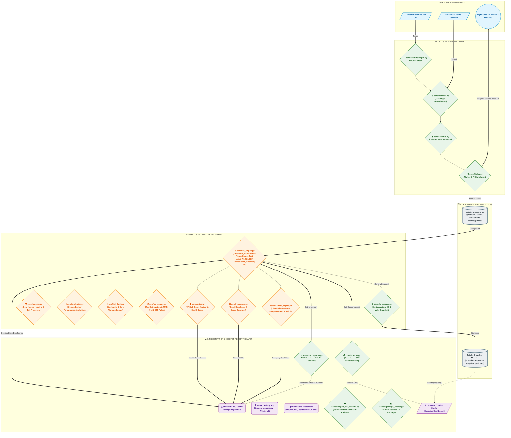

# Diagramma di Flusso e Architettura del Sistema: Investment Risk BI Platform

Il flusso di elaborazione di **Investment Risk BI Platform** segue un'architettura **Data Pipeline / ETL** professionale, articolata in **5 livelli (Layers)** distinti e disaccoppiati. Questa struttura garantisce modularità, scalabilità e perfetta separazione delle responsabilità tra validazione dei dati, calcolo quantitativo, persistenza su database relazionale e visualizzazione multilivello.

---

## 🗺️ Diagramma di Flusso Generale (Mermaid)

---

## 🏛️ Descrizione Dettagliata dei 5 Livelli Architetturali

### 1. Data Sources & Ingestion
- **CSV Generico Utente**: File di input contenente le transazioni finanziarie storiche.
- **DeGiro Export Adapter**: File CSV nativo esportato direttamente dalla piattaforma DeGiro, parsato e convertito automaticamente nello schema standard del sistema via `core/adapters/degiro.py`.
- **yfinance API**: Fonte dati di mercato live per il recupero delle serie storiche dei prezzi di chiusura rettificati (*Adjusted Close*), metadati aziendali (GICS Sector, Country) e tassi di cambio multi-valuta (es. EUR/USD, DKK/EUR).

### 2. ETL & Validation Pipeline
- **`core/validator.py`**: Pipeline a 11 passaggi per la bonifica dei dati (sanitizzazione stringhe, normalizzazione date in formato ISO `YYYY-MM-DD`, correzione ticker crypto e valute).
- **`core/schemas.py`**: Validazione rigorosa a runtime dei contratti dati mediante modelli Pydantic / Dataclasses per intercettare incongruenze o anomalie prima dell'ingestione.
- **`core/fetcher.py`**: Gestione del lookback window a 365 giorni precedenti alla prima transazione, mapping automatico ISIN $\rightarrow$ Ticker tramite `config.json` e chiamate ottimizzate a Yahoo Finance con risoluzione dinamica delle conversioni valutarie verso la valuta base.

### 3. Data Warehouse (MySQL ORM)
- **`core/models.py`**: Struttura relazionale gestita tramite classi dichiarative SQLAlchemy ORM.
  - *Tabelle Grezze*: `portfolios`, `assets`, `transactions`, `market_prices` (con vincolo `UNIQUE(asset_id, price_date)` e query `INSERT IGNORE` per prevenire duplicazioni).
  - *Tabelle Snapshot*: `portfolio_snapshots`, `snapshot_positions` per il tracciamento temporale delle metriche di rischio e dei cluster calcolati ad ogni esecuzione.

### 4. Analytics & Quantitative Engine
- **`core/risk_engine.py`**: Il cervello quantitativo dell'applicazione (FIFO, VaR Cornish-Fisher, Kupiec Test, Markowitz, Monte Carlo Cholesky, Fama-French, K-Means).
- **`core/advisor.py`**: Motore di diagnostica quantitativa e calcolo dello Health Score (0-100) basato su anomalie di concentrazione, Component VaR, P/E elevati e potenziale Sharpe delta.
- **`core/rebalancer.py`**: Generatore di ordini di trading in € e n° quote intere per l'allineamento a strategie target con gestione di versamenti/prelievi di cassa (+/- €).
- **`core/dividend_engine.py`**: Calcolo del Dividend Yield medio, dividendi storici reali e proiezione del calendario di incassi mensili per singola azienda pagatrice.
- **`core/db_exporter.py`**: Layer di storicizzazione snapshot su MySQL e recupero delle serie storiche per l'analisi temporale multi-run.

### 5. Presentation & Desktop Reporting Layer
- **Streamlit App & Desktop Launcher (`desktop_launcher.py` & `app.py`)**: Dashboard a 7 pagine interattive fruibile sia via browser sia come **Applicazione Desktop Nativa Windows** (`pywebview` + Edge WebView2) con l'icona personalizzata **Occhio di Argus**, gestione del ciclo di vita dei processi ed avvio protetto con polling attivo `wait_for_server`.
- **Standalone Executable & Release Pipeline (`scripts/build_desktop_app.py` & `scripts/package_release.py`)**: Pacchetto eseguibile standalone `ARGUS.exe` e generatore dell'archivio distribuiscibile `ARGUS_Desktop_v5.0.zip` per la pubblicazione su GitHub Releases.
- **`core/report_exporter.py`**: Generazione dinamica in-memory sia del report Executive PDF Factsheet (2 pagine) sia del Workbook Excel Multi-Tab (.xlsx) con 4 schede tematiche.
- **`core/exporter.py` & `scripts/export_star_schema.py`**: Esportazione di tabelle denormalizzate e Star Schema in formato `.zip` per la connessione nativa verso Microsoft Power BI e Google Looker Studio.
