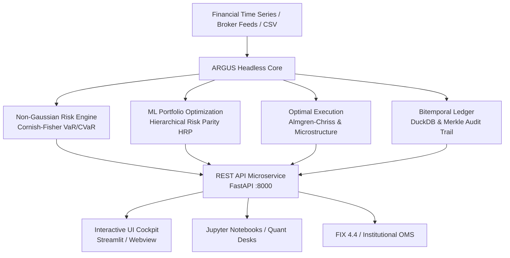

# ARGUS Quantitative Risk Engine & Analytics

  <strong>Tier-1 Institutional Quantitative Risk, Machine-Learning Portfolio Optimization & Bitemporal Audit Engine</strong>

---

## Executive Overview

**ARGUS** is an institutional-grade quantitative finance ecosystem designed for **Family Offices**, **Asset Management Companies (SGR)**, and **Quantitative Research Desks**. 

Engineered with a **Headless-First architecture**, ARGUS decouples heavy vectorized mathematical models from presentation layers, allowing quantitative analysts to consume core algorithms either as:
- A standalone Python library (`pip install argus-risk`)
- A high-throughput REST API microservice (`fastapi` / `uvicorn`)
- A rich interactive analytical cockpit powered by Streamlit and DuckDB

---

## Core Analytical Pillars

### 1. Non-Gaussian Tail Risk & Cornish-Fisher Expansion
Standard Gaussian models critically underestimate fat-tail events in volatile regimes. ARGUS models empirical higher statistical moments (skewness $\mathcal{S}$ and excess kurtosis $\mathcal{K}$) using the **Cornish-Fisher expansion** and the **Boudt-Peterson-Croux (2008)** Modified Expected Shortfall (CVaR).

### 2. Hierarchical Risk Parity (HRP)
Addressing Markowitz CLA's extreme sensitivity to covariance estimation errors, ARGUS implements Marcos López de Prado's machine-learning algorithm combining graph-theory correlation tree clustering, quasi-diagonalization, and top-down recursive bisection.

### 3. Institutional Algorithmic Execution
Microstructure order router implementing the **Square-Root Law** of market impact, **Almgren-Chriss (2000)** optimal liquidation trajectories, and TWAP/VWAP scheduling with anti-frontrunning stochastic jitter and FIX 4.4 protocol blotters.

### 4. Bitemporal Audit Trail & Merkle Ledger
Compliant with **ISO/IEC 9075:2011**, **MiFID II**, and **GIPS**, ARGUS tracks time along two orthogonal dimensions:
- **Valid Time ($VT$)**: When an event actually occurred in the financial world.
- **Transaction Time ($TT$)**: When our system recorded or modified the record.
Every decision, override, and allocation shift is immutably signed using SHA-256 hash chaining and sealed via a Merkle Tree.

---

## Quick Navigation

- [🚀 Quickstart in 5 Lines](getting-started/quickstart.md) — From raw CSV returns to optimal HRP allocation.
- [📦 Installation Guide](getting-started/installation.md) — Headless core, REST API, or full UI suite.
- [📐 Quantitative Methodology](methodology/risk_engine.md) — Complete mathematical formulations with LaTeX proofs.
- [📜 Institutional Whitepaper](compliance/whitepaper.md) — Institutional whitepaper and compliance governance.
