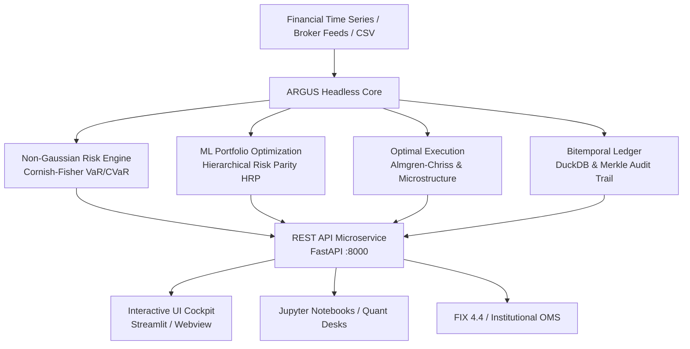

# ARGUS Quantitative Risk Engine & Analytics

  <strong>Tier-1 Institutional Quantitative Risk, Machine-Learning Portfolio Optimization & Bitemporal Audit Engine</strong>

---

## Executive Overview

**ARGUS** is an institutional-grade quantitative finance ecosystem designed for **Family Offices**, **Asset Management Companies (SGR)**, and **Quantitative Research Desks**. 

Engineered with a **Headless-First architecture**, ARGUS decouples heavy vectorized mathematical models from presentation layers, allowing quantitative analysts to consume core algorithms either as:
- A standalone Python library (`pip install argus-risk`)
- A high-throughput REST API microservice (`fastapi` / `uvicorn`)
- A rich interactive analytical cockpit powered by Streamlit and DuckDB

---

## Core Analytical Pillars

### 1. Non-Gaussian Tail Risk & Cornish-Fisher Expansion
Standard Gaussian models critically underestimate fat-tail events in volatile regimes. ARGUS models empirical higher statistical moments (skewness $\mathcal{S}$ and excess kurtosis $\mathcal{K}$) using the **Cornish-Fisher expansion** and the **Boudt-Peterson-Croux (2008)** Modified Expected Shortfall (CVaR).

### 2. Hierarchical Risk Parity (HRP)
Addressing Markowitz CLA's extreme sensitivity to covariance estimation errors, ARGUS implements Marcos López de Prado's machine-learning algorithm combining graph-theory correlation tree clustering, quasi-diagonalization, and top-down recursive bisection.

### 3. Institutional Algorithmic Execution
Microstructure order router implementing the **Square-Root Law** of market impact, **Almgren-Chriss (2000)** optimal liquidation trajectories, and TWAP/VWAP scheduling with anti-frontrunning stochastic jitter and FIX 4.4 protocol blotters.

### 4. Bitemporal Audit Trail & Merkle Ledger
Compliant with **ISO/IEC 9075:2011**, **MiFID II**, and **GIPS**, ARGUS tracks time along two orthogonal dimensions:
- **Valid Time ($VT$)**: When an event actually occurred in the financial world.
- **Transaction Time ($TT$)**: When our system recorded or modified the record.
Every decision, override, and allocation shift is immutably signed using SHA-256 hash chaining and sealed via a Merkle Tree.

### 5. Extreme Value Theory (EVT) & Basel IV Backtesting
Peaks-Over-Threshold (POT) modeling with Generalized Pareto Distribution (GPD) for extreme tail quantiles (99.0% and 99.9% VaR/CVaR), coupled with the Basel IV Regulatory Traffic Light backtesting suite (Kupiec POF test, Christoffersen independence clustering test, conditional coverage test, and regulatory capital multipliers 3.00x–4.00x).

### 6. Advanced Optimizers: MDP & Min-CVaR Linear Programming
Maximum Diversification Portfolio (Choueifaty Diversification Ratio maximization via SLSQP) and exact Mean-CVaR portfolio optimization formulated as a linear program (Rockafellar & Uryasev 2000) solved via HiGHS in sub-5ms.

### 7. Consolidated Total Wealth Stress Testing (EBA & CCAR)
Holistic balance-sheet stress engine transmitting joint macroeconomic shocks (EBA Adverse 2026, Fed CCAR Severe, Stagflation, Geopolitical Risk-Off) across liquid assets, real estate, pension funds, luxury caveau, and fixed liabilities with Debt-to-Assets leverage effect modeling.

### 8. Real Kenneth French (Dartmouth College) Factor Econometrics
Multi-factor risk attribution powered by empirical factor time-series directly sourced from Kenneth French's Dartmouth Data Library (Mkt-RF, SMB, HML, RMW, CMA, MOM) with multivariate OLS regression, t-statistics, p-values, adjusted $R^2$, and systematic vs. idiosyncratic variance decomposition.

### 9. Portfolio Fixed Income ALM & Endogenous Liquidity Risk
Dynamic bond and bond-ETF aggregation computing Macaulay and Effective Modified Duration, Portfolio Convexity, DV01 (€/bps), Key Rate Durations (2Y, 5Y, 10Y, 30Y), non-parallel curve twist scenarios (Bull/Bear Steepeners & Flatteners), Average Daily Volume (ADV 30d/90d), Days to Liquidate (DTL 10% & 20%), Amihud illiquidity ratio, and Endogenous L-VaR.

### 10. Spinu (2013) Convex Risk Budgeting & Pure Risk Parity (ERC)
Florian Spinu's strictly convex potential formulation $\min_{x > 0} \frac{1}{2} x^T \Sigma x - \sum b_i \ln(x_i)$ with exact analytical gradient, guaranteed global convergence via L-BFGS-B / SLSQP, supporting arbitrary risk budget vectors $b_i$ or uniform Equal Risk Contribution (1/N).

### 11. Regulatory Reverse Stress Testing (EBA/BCE) & Gatheral SVI
Inverse stress testing identifying the minimum Mahalanobis distance macroeconomic shock causing a predetermined loss threshold $\mathcal{L}^*$, complete with Chi-squared plausibility p-values and causal factor attribution; paired with Jim Gatheral's (2004) Raw SVI Arbitrage-Free Volatility Surface with Roger Lee moment bounds and Durrleman risk-neutral density non-negativity checks.

### 12. Walk-Forward Multi-Strategy Rolling Out-of-Sample Engine (WFO)
Realistic rolling Out-of-Sample backtesting across quantitative allocation strategies (Equal Weight, HRP, Spinu ERC, Max Sharpe) with user-configurable In-Sample training windows and Out-of-Sample test windows, incorporating real transaction costs, execution slippage, and bid-ask spread drag.

### 13. Regime-Conditional Adaptive Allocation & HMM Overlay
Unsupervised Hidden Markov Model (HMM) and Gaussian Mixture classification of latent market regimes (Bull, Neutral, Crisis) with dynamic risk budget modulation: asymmetrical risk-on haircuts during systemic crises and reallocation to defensive safe-haven anchors.

### 14. Mixed-Integer Programming (MIP) Rebalancer & Async REST Queue
SciPy HiGHS Mixed-Integer Linear Programming (MILP) solving discrete share rebalancing subject to maximum cardinality constraints ($\sum z_i \le K$), minimum lot sizes ($L_i$), and capital gains tax budgets; complemented by an asynchronous job queue (`BackgroundTasks`) and WebSocket tick streaming gateway for enterprise scale.

### 15. Barra-Style Structural Multi-Asset Risk Model
Structural multi-factor covariance decomposition $\boldsymbol{\Sigma} = \mathbf{X}\boldsymbol{\Sigma}_F\mathbf{X}^T + \boldsymbol{\Delta}_\epsilon$ across 6 style factors (Size, Value, Momentum, Quality, Low Volatility, Liquidity), 11 GICS sectors, and macro factors (Term, Credit, Breakeven Inflation, FX USD) with Euler Marginal/Percent Contribution to Total Risk (MCTR/PCTR) and Active Tracking Error.

### 16. Solvency II Standard Formula & SCR Engine
EIOPA Delegated Regulation (EU) 2015/35 Solvency Capital Requirement engine: Market risk sub-modules (Interest Rate up/down, Equity Type 1/2, Property 25%, Spread CQS 0-6, Concentration, Currency), correlation aggregation $\boldsymbol{\Omega}_{\text{mkt}}$, Basic SCR (BSCR), Operational Risk, Loss-Absorbing Capacity, Solvency Ratio, and QRT S.25.01 / S.26.01 reporting.

### 17. DCC-GARCH & Regular Vine Copula Dynamic Tail Risk
Two-stage econometric modeling: univariate GARCH(1,1) volatility filtering, Engle (2002) time-varying Dynamic Conditional Correlation $R_t$, and Regular Vine Copula pair decomposition (Clayton, Gumbel, Student-t) capturing non-linear tail dependence and forecasting dynamic 1-day/5-day VaR/CVaR.

### 18. Mock FIX 4.4 Engine & L2 Depth-of-Market (DOM) Simulator
Tag-value FIX 4.4 parser/serializer with 3-digit modulo-256 CheckSum verification, 10-level synthetic order book matching engine with liquidity depletion and queue fill modeling, and post-trade Transaction Cost Analysis (Arrival Price, Execution VWAP, Implementation Shortfall in EUR and bps).

### 19. Family Office Generational Succession Optimizer
30-year multi-generational stochastic Monte Carlo engine comparing 5 succession architectures under Italian/EU law: Holding Familiare (PEX 95% Art. 87 TUIR / Patto di Famiglia Art. 768-bis c.c. & Art. 3 c. 4-ter D.Lgs. 346/1990) vs. Trust Fiduciario (AdE 34/E/2022) vs. Polizze Vita PPLI (Art. 12 D.Lgs. 346/1990) vs. Regime Ordinario, calculating Generational Tax Alpha (€ and %) and capital preservation probabilities.

### 20. Event-Driven Risk Watchdog & Multi-Channel Notification Hub
Autonomous real-time monitor against institutional Risk Appetite Framework (RAF) thresholds (VaR 99%, Solvency Ratio, Max Drawdown, concentration limits) with multi-channel webhook dispatching to Telegram, Discord, Slack, and SMTP Email with testing mock mode and in-memory event audit log.

---

## Quick Navigation

- [🚀 Quickstart in 5 Lines](getting-started/quickstart.md) — From raw CSV returns to optimal HRP allocation.
- [📦 Installation Guide](getting-started/installation.md) — Headless core, REST API, or full UI suite.
- [📐 Quantitative Methodology](methodology/risk_engine.md) — Complete mathematical formulations with LaTeX proofs.
- [📜 Institutional Whitepaper](compliance/whitepaper.md) — Institutional whitepaper and compliance governance.
