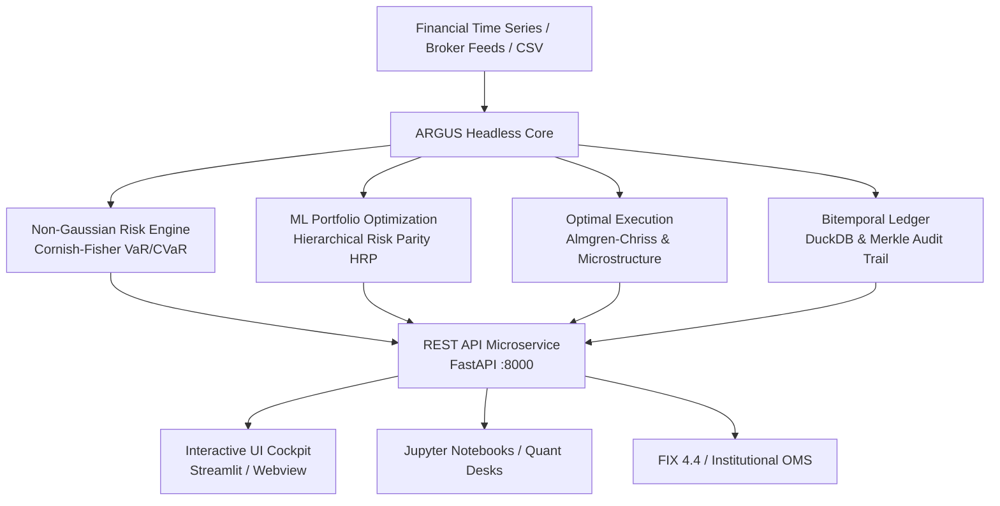

# ARGUS Quantitative Risk Engine & Analytics

  <strong>Tier-1 Institutional Quantitative Risk, Machine-Learning Portfolio Optimization & Bitemporal Audit Engine</strong>

---

## Executive Overview

**ARGUS** is an institutional-grade quantitative finance ecosystem designed for **Family Offices**, **Asset Management Companies (SGR)**, and **Quantitative Research Desks**. 

Engineered with a **Headless-First architecture**, ARGUS decouples heavy vectorized mathematical models from presentation layers, allowing quantitative analysts to consume core algorithms either as:
- A standalone Python library (`pip install argus-risk`)
- A high-throughput REST API microservice (`fastapi` / `uvicorn`)
- A rich interactive analytical cockpit powered by Streamlit and DuckDB

---

## Core Analytical Pillars

### 1. Non-Gaussian Tail Risk & Cornish-Fisher Expansion
Standard Gaussian models critically underestimate fat-tail events in volatile regimes. ARGUS models empirical higher statistical moments (skewness $\mathcal{S}$ and excess kurtosis $\mathcal{K}$) using the **Cornish-Fisher expansion** and the **Boudt-Peterson-Croux (2008)** Modified Expected Shortfall (CVaR).

### 2. Hierarchical Risk Parity (HRP)
Addressing Markowitz CLA's extreme sensitivity to covariance estimation errors, ARGUS implements Marcos López de Prado's machine-learning algorithm combining graph-theory correlation tree clustering, quasi-diagonalization, and top-down recursive bisection.

### 3. Institutional Algorithmic Execution
Microstructure order router implementing the **Square-Root Law** of market impact, **Almgren-Chriss (2000)** optimal liquidation trajectories, and TWAP/VWAP scheduling with anti-frontrunning stochastic jitter and FIX 4.4 protocol blotters.

### 4. Bitemporal Audit Trail & Merkle Ledger
Compliant with **ISO/IEC 9075:2011**, **MiFID II**, and **GIPS**, ARGUS tracks time along two orthogonal dimensions:
- **Valid Time ($VT$)**: When an event actually occurred in the financial world.
- **Transaction Time ($TT$)**: When our system recorded or modified the record.
Every decision, override, and allocation shift is immutably signed using SHA-256 hash chaining and sealed via a Merkle Tree.

### 5. Extreme Value Theory (EVT) & Basel IV Backtesting
Peaks-Over-Threshold (POT) modeling with Generalized Pareto Distribution (GPD) for extreme tail quantiles (99.0% and 99.9% VaR/CVaR), coupled with the Basel IV Regulatory Traffic Light backtesting suite (Kupiec POF test, Christoffersen independence clustering test, conditional coverage test, and regulatory capital multipliers 3.00x–4.00x).

### 6. Advanced Optimizers: MDP & Min-CVaR Linear Programming
Maximum Diversification Portfolio (Choueifaty Diversification Ratio maximization via SLSQP) and exact Mean-CVaR portfolio optimization formulated as a linear program (Rockafellar & Uryasev 2000) solved via HiGHS in sub-5ms.

### 7. Consolidated Total Wealth Stress Testing (EBA & CCAR)
Holistic balance-sheet stress engine transmitting joint macroeconomic shocks (EBA Adverse 2026, Fed CCAR Severe, Stagflation, Geopolitical Risk-Off) across liquid assets, real estate, pension funds, luxury caveau, and fixed liabilities with Debt-to-Assets leverage effect modeling.

### 8. Real Kenneth French (Dartmouth College) Factor Econometrics
Multi-factor risk attribution powered by empirical factor time-series directly sourced from Kenneth French's Dartmouth Data Library (Mkt-RF, SMB, HML, RMW, CMA, MOM) with multivariate OLS regression, t-statistics, p-values, adjusted $R^2$, and systematic vs. idiosyncratic variance decomposition.

### 9. Portfolio Fixed Income ALM & Endogenous Liquidity Risk
Dynamic bond and bond-ETF aggregation computing Macaulay and Effective Modified Duration, Portfolio Convexity, DV01 (€/bps), Key Rate Durations (2Y, 5Y, 10Y, 30Y), non-parallel curve twist scenarios (Bull/Bear Steepeners & Flatteners), Average Daily Volume (ADV 30d/90d), Days to Liquidate (DTL 10% & 20%), Amihud illiquidity ratio, and Endogenous L-VaR.

### 10. Spinu (2013) Convex Risk Budgeting & Pure Risk Parity (ERC)
Florian Spinu's strictly convex potential formulation $\min_{x > 0} \frac{1}{2} x^T \Sigma x - \sum b_i \ln(x_i)$ with exact analytical gradient, guaranteed global convergence via L-BFGS-B / SLSQP, supporting arbitrary risk budget vectors $b_i$ or uniform Equal Risk Contribution (1/N).

### 11. Regulatory Reverse Stress Testing (EBA/BCE) & Gatheral SVI
Inverse stress testing identifying the minimum Mahalanobis distance macroeconomic shock causing a predetermined loss threshold $\mathcal{L}^*$, complete with Chi-squared plausibility p-values and causal factor attribution; paired with Jim Gatheral's (2004) Raw SVI Arbitrage-Free Volatility Surface with Roger Lee moment bounds and Durrleman risk-neutral density non-negativity checks.

### 12. Walk-Forward Multi-Strategy Rolling Out-of-Sample Engine (WFO)
Realistic rolling Out-of-Sample backtesting across quantitative allocation strategies (Equal Weight, HRP, Spinu ERC, Max Sharpe) with user-configurable In-Sample training windows and Out-of-Sample test windows, incorporating real transaction costs, execution slippage, and bid-ask spread drag.

### 13. Regime-Conditional Adaptive Allocation & HMM Overlay
Unsupervised Hidden Markov Model (HMM) and Gaussian Mixture classification of latent market regimes (Bull, Neutral, Crisis) with dynamic risk budget modulation: asymmetrical risk-on haircuts during systemic crises and reallocation to defensive safe-haven anchors.

### 14. Mixed-Integer Programming (MIP) Rebalancer & Async REST Queue
SciPy HiGHS Mixed-Integer Linear Programming (MILP) solving discrete share rebalancing subject to maximum cardinality constraints ($\sum z_i \le K$), minimum lot sizes ($L_i$), and capital gains tax budgets; complemented by an asynchronous job queue (`BackgroundTasks`) and WebSocket tick streaming gateway for enterprise scale.

### 15. Barra-Style Structural Multi-Asset Risk Model
Structural multi-factor covariance decomposition $\boldsymbol{\Sigma} = \mathbf{X}\boldsymbol{\Sigma}_F\mathbf{X}^T + \boldsymbol{\Delta}_\epsilon$ across 6 style factors (Size, Value, Momentum, Quality, Low Volatility, Liquidity), 11 GICS sectors, and macro factors (Term, Credit, Breakeven Inflation, FX USD) with Euler Marginal/Percent Contribution to Total Risk (MCTR/PCTR) and Active Tracking Error.

### 16. Solvency II Standard Formula & SCR Engine
EIOPA Delegated Regulation (EU) 2015/35 Solvency Capital Requirement engine: Market risk sub-modules (Interest Rate up/down, Equity Type 1/2, Property 25%, Spread CQS 0-6, Concentration, Currency), correlation aggregation $\boldsymbol{\Omega}_{\text{mkt}}$, Basic SCR (BSCR), Operational Risk, Loss-Absorbing Capacity, Solvency Ratio, and QRT S.25.01 / S.26.01 reporting.

### 17. DCC-GARCH & Regular Vine Copula Dynamic Tail Risk
Two-stage econometric modeling: univariate GARCH(1,1) volatility filtering, Engle (2002) time-varying Dynamic Conditional Correlation $R_t$, and Regular Vine Copula pair decomposition (Clayton, Gumbel, Student-t) capturing non-linear tail dependence and forecasting dynamic 1-day/5-day VaR/CVaR.

### 18. Mock FIX 4.4 Engine & L2 Depth-of-Market (DOM) Simulator
Tag-value FIX 4.4 parser/serializer with 3-digit modulo-256 CheckSum verification, 10-level synthetic order book matching engine with liquidity depletion and queue fill modeling, and post-trade Transaction Cost Analysis (Arrival Price, Execution VWAP, Implementation Shortfall in EUR and bps).

### 19. Family Office Generational Succession Optimizer
30-year multi-generational stochastic Monte Carlo engine comparing 5 succession architectures under Italian/EU law: Holding Familiare (PEX 95% Art. 87 TUIR / Patto di Famiglia Art. 768-bis c.c. & Art. 3 c. 4-ter D.Lgs. 346/1990) vs. Trust Fiduciario (AdE 34/E/2022) vs. Polizze Vita PPLI (Art. 12 D.Lgs. 346/1990) vs. Regime Ordinario, calculating Generational Tax Alpha (€ and %) and capital preservation probabilities.

### 20. Event-Driven Risk Watchdog & Multi-Channel Notification Hub
Autonomous real-time monitor against institutional Risk Appetite Framework (RAF) thresholds (VaR 99%, Solvency Ratio, Max Drawdown, concentration limits) with multi-channel webhook dispatching to Telegram, Discord, Slack, and SMTP Email with testing mock mode and in-memory event audit log.

### 21. FRTB Standardized Approach Engine (BCBS 365 / Basel IV)
Full implementation of the Basel Committee on Banking Supervision (BCBS 365) Standardized Approach for market risk: Sensitivities-Based Method (SBM) Delta, Vega, and Curvature across GIRR, CSR non-securitisation, Equity, FX, and Commodity; multi-scenario correlation aggregation (Medium, High, Low); Default Risk Charge (DRC) Jump-to-Default; and Residual Risk Add-on (RRAO).

### 22. SABR Stochastic Volatility & Dupire Local Volatility Surface (3D)
Analytical calibration of Hagan et al. (2002) SABR model $(\alpha, \rho, \nu)$ for fixed beta (0.50 rates, 0.70 equity, 1.0 FX), finite-difference inversion of Dupire's (1994) PDE for the continuous local volatility surface $\sigma_{\text{loc}}(K, T)$, and dense 3D Volatility Cube generation with interactive WebGL rendering.

### 23. NGFS Phase IV Climate Transition & Physical Risk Stress Engine
Central bank climate stress testing aligned with Network for Greening the Financial System (NGFS Phase IV) scenarios (Orderly Net Zero 2050, Disorderly Delayed Transition, Current Policies / Hot House World), corporate Scope 1-2-3 emissions accounting, Weighted Average Carbon Intensity (WACI in $tCO_2e/M€$), carbon price margin transmission, physical flood/wildfire damage modeling, and aggregate Climate VaR.

### 24. Multi-Venue Smart Order Router & MiFID II RTS 28 Best Execution
Algorithmic SOR optimizing order execution across 5 fragmented liquidity pools (Primary Lit, Alt MTF, Systematic Internalizer, Dark Pool, Crossing Network) with real-time multi-criteria scoring (fees, latency, historical fill rate, spread) and mandatory MiFID II RTS 28 top 5 venue disclosure reporting.

### 25. Private Markets & Illiquid Asset Valuation Engine (Yale Endowment Model)
Takahashi-Alexander (2001) 10-year cash flow pacing model simulating Capital Calls, Distributions, NAV progression, J-Curve dynamics, Net IRR, and TVPI/DPI/RVPI multiples; Kaplan-Schoar Public Market Equivalent (PME) and Direct Alpha; coupled with Geltner-Fisher (1991/1994) econometric de-smoothing restoring true underlying volatility and cross-asset correlations.

### 26. Interactive Macro War Room & Correlation Breakdown Stress Engine
Multi-lever systemic macro scenario constructor (parallel yield shift, yield curve slope twist, inflation CPI surge, oil/energy spike, FX USD move, equity crash, and credit spread widening) combined with a systemic Correlation Breakdown Engine modeling the contagion collapse toward equicorrelation ($\mathbf{R}_{\text{panic}} \to 0.85$), volatility surges, diversification loss quantification, and variation margin liquidity drain projection.

### 27. Bilateral XVA & Counterparty Credit Risk Engine (CVA, DVA, FVA, MVA, KVA)
Comprehensive bilateral valuation adjustments stack for OTC derivatives portfolios under Credit Support Annex (CSA) netting agreements: Credit Valuation Adjustment (CVA), Debit Valuation Adjustment (DVA), Funding Valuation Adjustment (FVA), Margin Valuation Adjustment (MVA for ISDA SIMM initial margin), and Capital Valuation Adjustment (KVA for regulatory capital costs). Features Monte Carlo exposure profile simulation ($EE$, $PFE_{95\%}$, $PFE_{99\%}$, $ENE$, $EEPE$) and collateral dynamics (Threshold, MTA, MPOR).

### 28. Heston Stochastic Volatility FFT Calibration Engine (Carr-Madan 1999)
Analytical characteristic function formulation stabilized according to Lord-Kahl / Albrecher without branch cuts, Carr-Madan (1999) Fast Fourier Transform (FFT) option pricer for rapid multi-strike valuation, analytical Feller condition verification ($2\kappa\theta > \sigma_v^2$), and robust L-BFGS-B/SLSQP calibration against market implied volatilities.

### 29. Bayesian Black-Litterman Portfolio Optimization (Idzorek 2005)
Reverse optimization extracting market implied equilibrium expected returns $\boldsymbol{\Pi} = \lambda \boldsymbol{\Sigma}\mathbf{w}_{\text{mkt}}$, combined with subjective absolute and relative investor views weighted by Idzorek's (2005) percentage confidence mapping to the view uncertainty matrix $\boldsymbol{\Omega}$. Computes posterior expected returns $\mathbf{E}[R]$, posterior covariance $\mathbf{M}$, and optimal constrained SLSQP weights with active tilt analytics.

### 30. Basel III Liquidity Standards (LCR, NSFR & Dynamic Cash Flow Stress Ladder)
Full implementation of Basel Committee on Banking Supervision (BCBS 238) liquidity rules: 30-day Liquidity Coverage Ratio (LCR $\ge 100\%$) with Level 1, 2A, 2B HQLA classification, regulatory haircuts (0%, 15%, 50%), 40%/15% asset caps, and 75% inflow cap; Net Stable Funding Ratio (NSFR $\ge 100\%$); and dynamic multi-horizon cash flow stress ladder (1d to 360d) with survival horizon estimation.

### 31. Exotic Derivatives & Worst-Of Structured Products Engine (Phoenix Autocallables)
Correlated multi-asset Monte Carlo valuation engine for Worst-Of structured notes: Phoenix Autocallables (memory coupons, autocall early redemption barriers, European knock-in protection barriers at maturity) and Reverse Convertibles. Computes analytical/numerical Greeks ($\Delta$, $\Gamma$, $\nu$, $\theta$, $\rho$, barrier sensitivity), early redemption probabilities, and expected duration.

### 32. Regulatory PRIIPs KID (SRI 1-7) & SFDR ESG Reporting Engine (Annex I 14 PAI)
Regulatory disclosure and compliance automation: Packaged Retail and Insurance-based Investment Products (PRIIPs RTS) Summary Risk Indicator (SRI 1 to 7) combining Market Risk Measure (MRM from Cornish-Fisher VEV) and Credit Risk Measure (CRM from issuer rating), 4 regulatory performance scenarios (Favourable, Moderate, Unfavourable, Stress) at 1Y, Half-RHP, and RHP; alongside Sustainable Finance Disclosure Regulation (SFDR) Article 6/8/9 classification and the complete Annex I 14 mandatory Principal Adverse Impacts (PAI) table.

### 33. Multi-Curve OIS Discounting (€STR / SOFR) & Dual-Curve EURIBOR 6M IRS Pricing
Post-2008 dual-curve bootstrapping separating risk-free OIS discounting $P_{\text{OIS}}(0, T)$ from 6M IBOR forward rate projection $F_{6M}(0; T_{i-1}, T_i)$, Par Swap Rate stripping, Key-Rate DV01 bucketed sensitivity ladder, and analytical Gamma convexity.

### 34. Hull-White 1-Factor Short-Rate Trinomial Lattice & Bermudan Swaption OAS
Exact initial term-structure calibration $\theta(t)$ on a recombining trinomial lattice for Bermudan Swaptions and Callable Bonds, decomposing total valuation into European Co-Terminal value (Jamshidian 1989) and the Bellman Early-Exercise Switch Premium with implied Option-Adjusted Spread (OAS).

### 35. Rough Volatility (rBergomi $H \approx 0.10$) & Gatheral SVI Arbitrage-Free Surface
Fractional Brownian motion volatility modeling with Hurst exponent $H \approx 0.10$ capturing the power-law explosion of short-dated ATM skew $\mathcal{S}(T) \propto T^{H - 1/2}$, paired with Durrleman's (2014) butterfly arbitrage density verification $g(k) \ge 0$.

### 36. ISDA Single-Name CDS Bootstrapping & Synthetic CDO Tranches (iTraxx / CDX)
Piecewise-constant hazard-rate $\lambda(t)$ and survival probability $Q(0, t)$ bootstrapping under ISDA Big Bang standard coupons (100/500 bps), Upfront valuation, CS01, Jump-to-Default (JTD), and Large Homogeneous Portfolio (LHP) 1-Factor Gaussian Copula pricing across $[0\text{-}3\%]$ to $[12\text{-}22\%]$ tranches.

### 37. CreditMetrics™ S&P 8-State Migration & Basel III IRB Vasicek Portfolio Credit Risk
Multi-obligor credit migration and default engine using S&P 8-state transition matrices, latent Gaussian factor correlation, Basel III ASRF Vasicek (2002) regulatory capital $K_{\text{IRB}}$, Risk-Weighted Assets (RWA), Credit VaR 99.9%, and Incremental Risk Charge (IRC).

### 38. Fed CCAR / EBA 9-Quarter Supervisory CET1 Capital Stress Engine
9-quarter forward projection ($Q_1 \dots Q_9$) across Baseline, Adverse, and Severely Adverse supervisory scenarios modeling Pre-Provision Net Revenue (PPNR), IFRS 9 / CECL Stage 1/2/3 credit provisions, RWA inflation, OCR/MDA dividend restriction triggers, and Stress Capital Buffer (SCB).

### 39. ISDA SIMM™ v2.6 Initial Margin & BCBS-IOSCO UMR Compliance
Standard Initial Margin Model v2.6 across all 6 ISDA risk classes (IR, Credit Qualifying, Credit Non-Qualifying, Equity, Commodity, FX) with concentration thresholds $CR_k$, cross-class correlation aggregation $\psi_{r,s}$, €50M UMR Phase 6 threshold utilization, and bilateral CSA vs. CCP (LCH/Eurex) MVA savings.

### 40. Gibson-Schwartz (1997) 2-Factor Commodity Futures & Kirk (1995) Spread Options
Joint stochastic modeling of spot price $S_t$ and mean-reverting convenience yield $\delta_t$ for energy and metals futures curves, Contango/Backwardation regime detection, Roll Yield analytics, and Kirk's (1995) Calendar/Storage Spread Option pricing.

### 41. Almgren-Chriss Intraday Optimal Liquidation & Avellaneda-Stoikov / VPIN Microstructure
Intraday execution optimizer balancing Square-Root temporary market impact against timing risk across Almgren-Chriss, Dynamic POV-Capped VWAP, and TWAP; integrated with Avellaneda-Stoikov (2008) inventory-skewed market-making quotes, VPIN order-flow toxicity, and Hawkes self-exciting branching ratios.

### 42. Redington ALM / LDI Immunization & Cash-Flow Matching Linear Programming
Pension and Total Wealth Asset-Liability Management verifying Redington's (1952) three immunization conditions, Surplus-at-Risk 99%, 20Y Receiver IRS LDI overlay sizing, and exact minimum-cost dedicated bond portfolio construction via Linear Programming (`scipy.optimize.linprog`).

---

## Quick Navigation

- [🚀 Quickstart in 5 Lines](getting-started/quickstart.md) — From raw CSV returns to optimal HRP allocation.
- [📦 Installation Guide](getting-started/installation.md) — Headless core, REST API, or full UI suite.
- [📐 Quantitative Methodology](methodology/risk_engine.md) — Complete mathematical formulations with LaTeX proofs.
- [📜 Institutional Whitepaper](compliance/whitepaper.md) — Institutional whitepaper and compliance governance.
