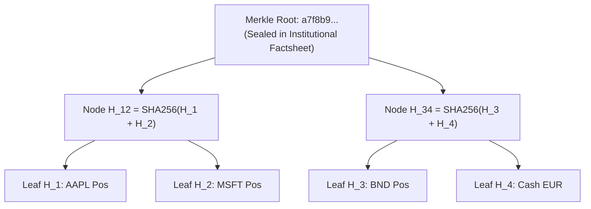

# Bitemporal Persistence & Merkle Audit Trail

Family Offices, Private Banking desks, and SGRs operating under **MiFID II**, **AIFMD**, and **GIPS** face a fundamental audit challenge:

> *"Can you prove what the exact portfolio valuation was on March 31st, based solely on what the system knew on April 2nd, before a retroactive dividend adjustment arrived on April 10th?"*

Traditional relational databases overwrite records with `UPDATE`, destroying historical states. ARGUS implements an **ISO/IEC 9075:2011 SQL Temporal** engine powered by **DuckDB** and **SHA-256 Cryptographic Chaining** (`core/bitemporal_engine.py`).

---

## Two-Dimensional Bitemporal Model

Time in financial reality is two-dimensional and orthogonal:

```
                  SYSTEM / TRANSACTION TIME (TT)
                  "When did the system learn about it?"
                                ▲
                                │
                                │   State Known at T_sys2
                                │   (Includes retroactive dividend)
                                │   ┌──────────────────────┐
                                │   │ Holding: 1,050 sh    │
                                │   └──────────────────────┘
                                │
                                │   State Known at T_sys1
                                │   (Original trade confirm)
                                │   ┌──────────────────────┐
                                │   │ Holding: 1,000 sh    │
                                │   └──────────────────────┘
                                │
  ──────────────────────────────┼──────────────────────────────►
                                │                               VALID TIME (VT)
                           T_valid1                            "When did it happen
                                                                in the real world?"
```

### 1. Valid Time ($VT$ / Business Time)
The interval $[VT_{\text{from}}, VT_{\text{to}})$ during which a financial event is true in the real economic world (e.g. trade execution date, dividend record date).

### 2. System Time ($TT$ / Transaction Time)
The immutable interval $[TT_{\text{from}}, TT_{\text{to}})$ during which a record was active in the database knowledge base. When a transaction is amended, the old record is never deleted; its $TT_{\text{to}}$ is closed at current timestamp, and a new record is inserted with $TT_{\text{from}} = \text{now}$.

---

## Bitemporal Point-in-Time Query

To execute a point-in-time reconstruction at valid time $T_V$ and system knowledge time $T_S$, DuckDB evaluates the interval intersection predicate:

$$\begin{aligned}
VT_{\text{from}} &\le T_V < VT_{\text{to}} \\
TT_{\text{from}} &\le T_S < TT_{\text{to}}
\end{aligned}$$

```sql
SELECT asset_id, SUM(quantity) as shares, SUM(net_amount_eur) as cost
FROM bitemporal_transactions
WHERE portfolio_id = ?
  AND valid_from <= ? AND ? < valid_to
  AND sys_from   <= ? AND ? < sys_to
GROUP BY asset_id;
```

---

## Cryptographic Hash Chaining (Append-Only Log)

Every user override, target allocation change, risk threshold tweak, and AI decision is recorded into an append-only cryptographic ledger (`audit_decision_log`).

Each entry $E_i$ computes a SHA-256 hash chaining back to the previous entry $E_{i-1}$:

$$H_i = \text{SHA256}\Big( E_i.\text{seq} \,\|\, E_i.\text{timestamp} \,\|\, E_i.\text{actor} \,\|\, H_{i-1} \,\|\, \text{CanonicalJSON}(E_i.\text{payload}) \Big)$$

If any malicious or accidental modification is made to past records, the hash chain breaks instantly, flagging the exact sequence index and tampered block during integrity verification.

---

## Merkle Tree Report Certification

When exporting quarterly or annual factsheets for SGR risk committees or Family Office principals, ARGUS generates a **SHA-256 Merkle Tree** over all portfolio positions:



Any investor or independent auditor can verify in logarithmic time $\mathcal{O}(\log N)$ that an exported report perfectly matches the immutable bitemporal state of the fund without needing access to the entire proprietary database.
