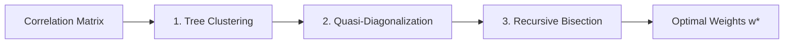

# Hierarchical Risk Parity (HRP)

The **Hierarchical Risk Parity (HRP)** portfolio optimization algorithm was formulated by **Dr. Marcos López de Prado (2016)** to overcome the fundamental flaws of Harry Markowitz's classical Mean-Variance Optimization (CLA).

---

## The Markowitz Curse: Ill-Conditioned Matrix Inversion

Markowitz portfolio optimization requires inverting the sample covariance matrix:

$$w^* = \frac{\Sigma^{-1} \mathbf{1}}{\mathbf{1}^T \Sigma^{-1} \mathbf{1}}$$

When assets are correlated or the number of assets $N$ approaches the sample size $T$, the condition number of the covariance matrix explodes:

$$\kappa(\Sigma) = \frac{\lambda_{\max}}{\lambda_{\min}} \gg 10^3$$

Under high condition numbers, matrix inversion acts as an **error amplifier**: minor statistical noise in return correlations causes extreme, unstable swings in portfolio weights, often concentrating risk into pseudo-arbitrage bets on estimation noise.

---

## The Three Stages of HRP

Instead of treating the asset universe as an unstructured vector space, HRP recognizes that financial markets have a **hierarchical tree structure** (e.g. sectors $\rightarrow$ industries $\rightarrow$ companies). HRP solves the allocation problem in three graph-theoretic steps:

### 1. Tree Clustering

First, the correlation coefficient $\rho_{i,j} \in [-1, 1]$ is converted into a true mathematical metric distance $D_{i,j} \in [0, 1]$ satisfying triangle inequality:

$$D_{i,j} = \sqrt{\frac{1 - \rho_{i,j}}{2}}$$

Agglomerative hierarchical clustering is applied to the distance matrix using chosen linkage methods (Single, Complete, Average, or Ward):

$$d(u, v) = \min \{ \text{dist}(u[i], v[j]) \}$$

---

### 2. Quasi-Diagonalization

Quasi-diagonalization reorders the rows and columns of the covariance matrix $\Sigma$ according to the hierarchical tree dendrogram. This places strongly correlated assets adjacent to each other along the main diagonal, preserving topological clusters without inverting $\Sigma$.

The leaf ordering is obtained recursively:

$$\mathcal{O} = \text{TreeTraverse}(\text{LinkageMatrix})$$

---

### 3. Recursive Bisection

Given the quasi-diagonalized sequence of assets $\mathcal{A}$, the algorithm recursively bisects the ordered list into two contiguous sub-clusters $\mathcal{A}_1$ and $\mathcal{A}_2$:

$$\mathcal{A} = \mathcal{A}_1 \cup \mathcal{A}_2, \quad \mathcal{A}_1 \cap \mathcal{A}_2 = \emptyset$$

For each sub-cluster $k \in \{1, 2\}$, the intra-cluster variance $V_k$ is computed using **Inverse-Variance Portfolio (IVP)** weighting:

$$w_k^{\text{IVP}} = \frac{\text{diag}(\Sigma_k)^{-1}}{\mathbf{1}^T \text{diag}(\Sigma_k)^{-1} \mathbf{1}}$$

$$V_k = (w_k^{\text{IVP}})^T \Sigma_k w_k^{\text{IVP}}$$

The allocation split factor $\alpha_1$ between the two clusters is inversely proportional to their variances:

$$\alpha_1 = 1 - \frac{V_1}{V_1 + V_2} = \frac{V_2}{V_1 + V_2}, \qquad \alpha_2 = 1 - \alpha_1$$

The sub-cluster weights are updated recursively:

$$w_{\mathcal{A}_1} \leftarrow w_{\mathcal{A}_1} \cdot \alpha_1, \qquad w_{\mathcal{A}_2} \leftarrow w_{\mathcal{A}_2} \cdot \alpha_2$$

This bisection continues until every individual asset constitutes a leaf node.

---

## Key Mathematical Advantages

| Feature | Markowitz CLA | Risk Parity (ERC) | ARGUS HRP |
|---|---|---|---|
| **Requires Inversion $\Sigma^{-1}$** | Yes (Mandatory) | Yes (Iterative) | **No (Zero inversion)** |
| **Robust to Collinear Assets** | No (Fails or Singular) | Poor | **Exceptional** |
| **Positive Semi-Definite strictly required** | Yes | Yes | **No (Dendrogram based)** |
| **Out-of-Sample Stability** | Low (overfits noise) | Moderate | **High (López de Prado 2016)** |
